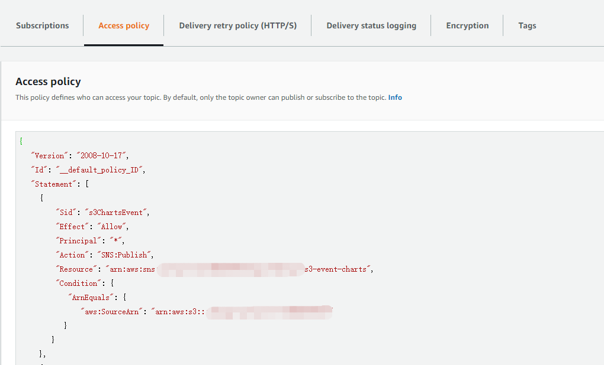

---

title: AWS实战--Lambda+SNS+S3实现自动生成统计图表工具
date: 2020-02-23 22:37:00
slug: aws-lambda-sns-s3-auto-gen-chart-tool
tags:
  - Lambda
  - AWS
categories:
  - AWS

---

## 需求概述
通过一个种标准的数据结构。生成相应的数据统计图(线形图，柱状图，饼状图等)。

## 实现方案
基于AWS服务，将S3的存储桶作为事件触发源，用户只要上传数据到该存储桶，就广播通知，订阅该通知的消息队列则触发到具体的Lambda函数。Lambda函数完成绘图逻辑，并生成统计图上传到S3的存储桶。

具体设计图如下：


## 具体流程
Step1、创建一个S3存储桶，选择 Properties ->Advanced settings -> Events。


然后，Add notification。我们选择 Events为PUT。指定前缀和后缀。选择发送通知到SNS Topic。

Step2、在创建Events之前，我们需要先创建一个SNS Topic。并给S3存储桶授予访问权限。否则无法保存Events。




Step3、新建一个SQS，并给上一步创建的SNS增加权限。这样我们就可以在SNS上进行订阅。


Step4、新建Lambda。将其添加到SQS的Triggers。


到这里，我们的整个流程已经基本完成。由S3监听用户上传的数据文件，然后由SNS通知到SQS，SQS触发到Lambda。最后就是具体编码实现了。

## 编码实现

定义数据结构：
```json
{
  "title": {
    "name": "", // 图例名称
    "loc": "top, bottom, left, right" // 显示位置
  },
  "name": "图表保存到S3的名称。",
  "size": [6, 7], // 图表的大小
  "chart_kind": "pie, line, bar...", // 图表的类型
  "data": {
    "colors": [], 
    "labels": [],
    "values": []
  },
  "config": {
	 // 特殊的配置信息
  },
  "s3": {
    "bucket": "需要存放的S3存储桶",
    "key": "存储的Key",
    "acl": "存储的访问权限"
  }
}
```

关于Lambda的实现，我们可以采用Lambda支持的任意编程语言。本例使用Python编程。
由于Lambda自带运行时环境不包含matplotlib，numpy等功能包。我们可以将matplotlib等包做一个lambda layer。然后lambda引用该lambda layer就可以引用到matplotlib包。Lambda Layer的制作请查看我的同事Boyce的分享。


```python
# lambda_function.py 

import json
import boto3
import io
from charts.bar import Bar
from charts.line import Line
from charts.pie import Pie
from datetime import datetime


def lambda_handler(event, context):
    record = event['Records'][0]
    body = json.loads(record.get('body'))
    message = json.loads(body.get("Message"))
    s3 = message['Records'][0]['s3']   
  
    bucket_name = s3['bucket']['name']
    object_key = s3['object']['key']
    print(bucket_name, object_key)
    object_content = get_aws_s3_object(bucket_name, object_key)
    
    data = json.loads(object_content)
    chart_kind = data.get('chart_kind', '').lower()
    
    chart = None
    if chart_kind == 'pie':
        chart = Pie(data)
    elif chart_kind == 'line':
        chart = Line(data)
    elif chart_kind == 'bar':
        chart = Bar(data)
    else:
        print('Invalid chart kind.')
        return
    img_data = chart.draw()
    upload_s3(bucket_name, data['name'], img_data)

def get_aws_s3_object(bucket_name, object_key):
    s3 = boto3.client('s3')
    try:
        response = s3.get_object(Bucket=bucket_name, Key=object_key)
    except ClientError as e:
        # AllAccessDisabled error == bucket or object not found
        print('Get AWS S3 object ({}) error - {}'.format(object_key, e))
        return None
    stream = response['Body']
    if not stream:
        print('AWS S3 Stream is null - {}'.format(object_key))
        return None
    return stream.read()
    
    
def upload_s3(bucket_name, img_name, img_data):
    now = datetime.utcnow()
    year = now.year
    month = now.month if now.month > 9 else '0{}'.format(now.month)
    day = now.day if now.day > 9 else '0{}'.format(now.day)
    date_string = "{}/{}/{}".format(year, month, day)
    object_key = 'files/charts/test/{}/{}'.format(date_string, '{}.png'.format(img_name))
    print(object_key)
    try:
        s3 = boto3.resource('s3')
        bucket = s3.Bucket(bucket_name)
        bucket.put_object(Body=img_data, ContentType='image/png', Key=object_key, ACL='public-read')
    except FileNotFoundError:
        print("The file was not found")
    except Exception as e:
        print("Upload s3 failed - {}".format(e))

```

```python
#!usr/bin/env python3
# -*- coding:utf-8 _*-
import io
import matplotlib.pyplot as plt


class Pie(object):
    def __init__(self, data):
        self._title = data.get('title')
        self._data = data.get('data')
        self._config = data.get('config')
        self._size = data.get('size')

        self._init_plots()
        self._init_title()

    def _init_title(self):
        self._ax.set_title(self._title.get('name'))

    def _init_plots(self):
        props = {}
        if self._size:
            props['figsize'] = self._size

        fig, ax = plt.subplots(**props)
        self._ax = ax

    def draw(self):
        labels = self._data.get('labels')
        values = self._data.get('values')

        self._ax.pie(values, labels=labels, autopct='%1.1f%%', shadow=True, startangle=90)
        self._ax.axis('equal')

        plt.legend(loc='best')
        
        image_data = io.BytesIO()
        plt.savefig(image_data)
        image_data.seek(0)

        return image_data
```

```json

// pie-chart-simple-demo.json
{
    "name": "pie-chart-simple-demo",
    "title": {
      "name": "A pie chart demo",
      "loc": "top"
    },
    "chart_kind": "pie",
    "data": {
      "labels": ['Frogs', 'Hogs', 'Dogs', 'Logs'],
      "values": [15, 30, 45, 10]
    }
}

// bar-chart-simple-demo.json
{
      "name": "bar-chart-simple-demo",
      "title": {
        "name": "A bar chart demo",
        "loc": "top"
      },
      "chart_kind": "bar",
      "data": {
        "labels": ['Frogs', 'Hogs', 'Dogs', 'Logs'],
        "values": [15, 30, 45, 10]
      }
  }
  
  // line-chart-simple-demo.json
  {
      "name": "line-chart-simple-demo",
      "title": {
        "name": "A line chart demo",
        "loc": "top"
      },
      "chart_kind": "line",
      "data": {
        "labels": ['x', 'y', 'z'],
        "values": [[2, 3, 4, 5, 7, 9, 13, 15, 17], [1, 2, 4, 5, 6, 9, 17, 13, 20], [5, 6, 9, 8, 3, 9, 12, 14, 18]]
      }
  }
```
最后，我们上传JSON文件进行测试。


