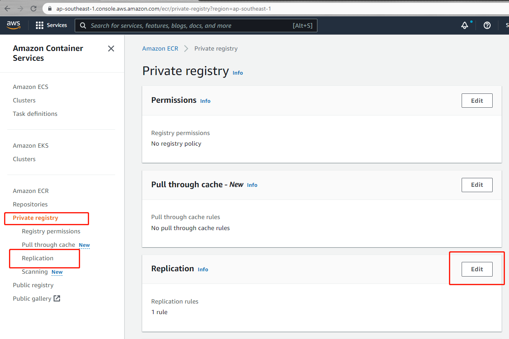

---

title: AWS实战--配置ECR Replication
date: 2022-01-17 10:51:00
slug: aws-setting-ecr-replication
tags:
  - ECR
  - AWS
categories:
  - AWS
---

Amazon ECR 可以配置跨区域(region)或跨账号(account)复制。配置复制后，推送(Push)到源存储库的镜像会自动复制到目标存储库(ECR)。

本例以跨区域复制为例：源ECR（ap-southeast-1）==> 目标ECR （us-east-1）


## 配置源 ECR
1. 登录到 AWS ap-southeast-1 region的ECR页面。选择 Private registry --> Replication菜单。点击 Edit 按钮.



2. 进入到Replication configuration页面后，点击 Add rule。


3. 选择复制的目标类型，我们选择允许跨区域复制(Cross-region)，点击Next。


4. 选择目标region(us-east-1)。添加镜像名字过滤条件(本例为hello前缀的镜像仓库)。默认为前缀匹配。最后Submit rule。


配置完成后可以查看 JSON格式的内容
```json
{
  "rules": [
    {
      "destinations": [
        {
          "region": "us-east-1",
          "registryId": "<your-aws-account-id>"
        }
      ],
      "repositoryFilters": [
        {
          "filter": "hello",
          "filterType": "PREFIX_MATCH"
        }
      ]
    }
  ]
}
```
## 配置目标ECR

1. 创建一个和源名字一样的私有镜像仓库(本例为hello-app)

2. 选择Private registry菜单。点击 Permissions 的 Edit按钮

   

3.  点击 Generate statement按钮。

   

4.  按提示填完表单字段，最后 Save statement.


```json
{
  "Sid": "finger-test-ecr-replication",
  "Effect": "Allow",
  "Principal": {
    "AWS": "arn:aws:iam::<your-aws-account-id>:root"
  },
  "Action": [
    "ecr:CreateRepository",
    "ecr:ReplicateImage"
  ],
  "Resource": "arn:aws:ecr:us-east-1:<your-aws-account-id>:repository/*"
}
```

## 测试

推送hello-app:v3 到 ap-southeast-1区域。我们可以查看 Image replication status，看是否有us-east-1区域同步信息。


登录到us-east-1区域查看镜像仓库是否有同步的镜像

