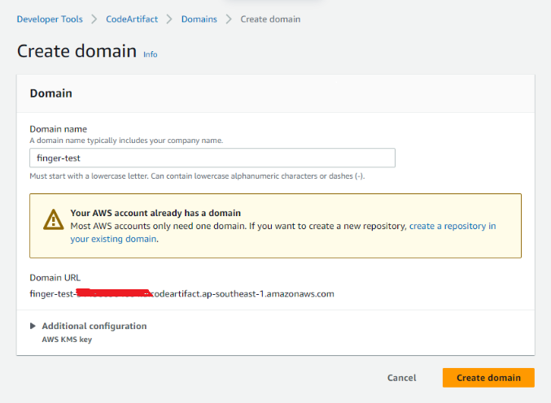
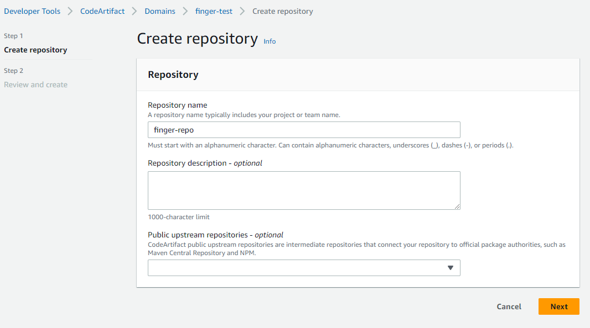
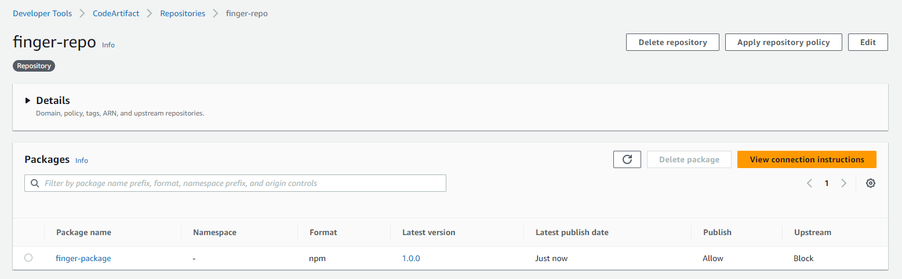
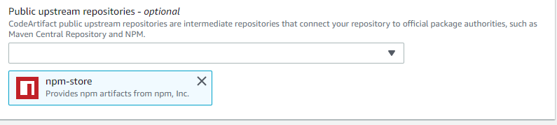
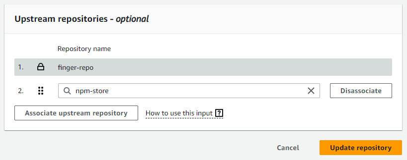

## 前提条件

- IAM具有CodeArtifact权限
- 安装了Node和NPM


## 1. 创建CodeArtifact的domain和repository





## 2. 创建私有的npm package

```bash
# 初始化一个npm package
npm init --scode=@finger -y
```

```json
# package.json
{
  "name": "finger-package",
  "version": "1.0.0",
  "description": "",
  "main": "index.js",
  "scripts": {
    "test": "echo \"Error: no test specified\" && exit 1"
  },
  "keywords": [],
  "author": "",
  "license": "ISC"
}
```

新建index.js文件。添加helloworld函数

```js
# index.js
module.exports.helloWorld = function() {
  console.log('Hello world!');
}
```

在package.json中创建一个名为co:login的脚本。package.json包含以下代码:

```json
"co:login": "aws codeartifact login --tool npm --repository finger-repo --domain finger-test --region ap-southeast-1"
```


向package.json添加一个prepare脚本。来运行我们的登录命令:

```json
"prepare": "npm run co:login"
```

完整的package.json

```json
{
  "name": "finger-package",
  "version": "1.0.0",
  "description": "",
  "main": "index.js",
  "scripts": {
    "prepare": "npm run co:login",
    "co:login": "aws codeartifact login --tool npm --repository finger-repo --domain finger-test --region ap-southeast-1",
    "test": "echo \"Error: no test specified\" && exit 1"
  },
  "keywords": [],
  "author": "",
  "license": "ISC"
}
```

## 3. 发布私有的npm package

```bash
npm install
> finger-package@1.0.0 prepare
> npm run co:login
> finger-package@1.0.0 co:login
> aws codeartifact login --tool npm --repository finger-repo --domain finger-test --region ap-southeast-1
Successfully configured npm to use AWS CodeArtifact repository https://finger-test-<your-account-id>.d.codeartifact.ap-southeast-1.amazonaws.com/npm/finger-repo/ 
Login expires in 12 hours at 2024-01-04 22:36:34+08:00
up to date, audited 1 package in 5s
found 0 vulnerabilities
```

```bash
npm publish
npm notice 
npm notice 📦  finger-package@1.0.0
npm notice === Tarball Contents ===
npm notice 75B  index.js
npm notice 386B package.json
npm notice === Tarball Details ===
npm notice name:          finger-package
npm notice version:       1.0.0
npm notice filename:      finger-package-1.0.0.tgz
npm notice package size:  420 B
npm notice unpacked size: 461 B
npm notice shasum:        255ad84eb6489a860512e40952567b485324c525
npm notice integrity:     sha512-ByOhjMZB5JmMi[...]78Hx+bPhnFFzA==
npm notice total files:   2
npm notice
npm notice Publishing to https://finger-test-<your-account-id>.d.codeartifact.ap-southeast-1.amazonaws.com/npm/finger-repo/ with tag latest and default access
+ finger-package@1.0.0
```




## 4. 安装私有的npm package

创建一个新的应用finger-app。然后安装私有的npm package。

```bash
npm init -y
```

```json
# package.json
{
  "name": "finger-app",
  "version": "1.0.0",
  "description": "",
  "main": "index.js",
  "scripts": {
    "test": "echo \"Error: no test specified\" && exit 1"
  },
  "keywords": [],
  "author": "",
  "license": "ISC"
}
```

向package.json文件中添加CodeArtifact配置

```json
{
  "name": "finger-app",
  "version": "1.0.0",
  "description": "",
  "main": "index.js",
  "scripts": {
    "preinstall": "npm run co:login",
    "co:login": "aws codeartifact login --tool npm --repository finger-repo --domain finger-test --region ap-southeast-1",
    "test": "echo \"Error: no test specified\" && exit 1"
  },
  "keywords": [],
  "author": "",
  "license": "ISC",
  "dependencies": {
    "finger-package": "^1.0.0"
  }
}
```

安装私有的npm package

```bash
> npm install finger-package
up to date in 969ms
```

## 5. 使用私有npm package

```js
const { helloWorld } = require('finger-package');
helloWorld();
```

在终端中运行`node index.js`，可以看到控制台从`@myorg/my-package helloWorld`函数打印消息。

## 6. 配置Public upstream reposiories

没有配置public upstream repos 则安装package会报错：

```bash
npm install cross-env
npm ERR! code E404
npm ERR! 404 Not Found - GET https://finger-test-<your-account-id>.d.codeartifact.ap-southeast-1.amazonaws.com/npm/finger-repo/cross-env - Package, 'cross-env', not found.
npm ERR! 404
npm ERR! 404  'cross-env@^7.0.3' is not in this registry.
npm ERR! 404
npm ERR! 404 Note that you can also install from a
npm ERR! 404 tarball, folder, http url, or git url.
npm ERR! A complete log of this run can be found in: C:\Users\finger.zhou\AppData\Local\npm-cache\_logs\2024-01-04T03_02_33_842Z-debug-0.log
```

可以在创建或编辑时配置上游存储库。



## 7. 配置跨账号访问CodeArtifact repo IAM权限

```json
{
    "Version": "2012-10-17",
    "Statement": [
        {
            "Sid": "BasicDomainPolicy",
            "Action": [
                "codeartifact:GetDomainPermissionsPolicy",
                "codeartifact:ListRepositoriesInDomain",
                "codeartifact:GetAuthorizationToken",
                "codeartifact:DescribeDomain",
                "codeartifact:CreateRepository"
            ],
            "Effect": "Allow",
            "Resource": "*",
            "Principal": {
                "AWS": "arn:aws:iam::<OTHER_AWS_ACCCOUNT_ID>:root"
            }
        }
    ]
}
```

## 参考
- [1] https://aws.amazon.com/blogs/devops/publishing-private-npm-packages-aws-codeartifact/
- [2] https://stackoverflow.com/questions/64137860/move-all-packages-from-private-npm-verdaccio-to-aws-codeartifact
- [3] https://docs.aws.amazon.com/codeartifact/latest/ug/domain-policies.html