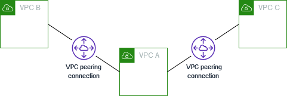
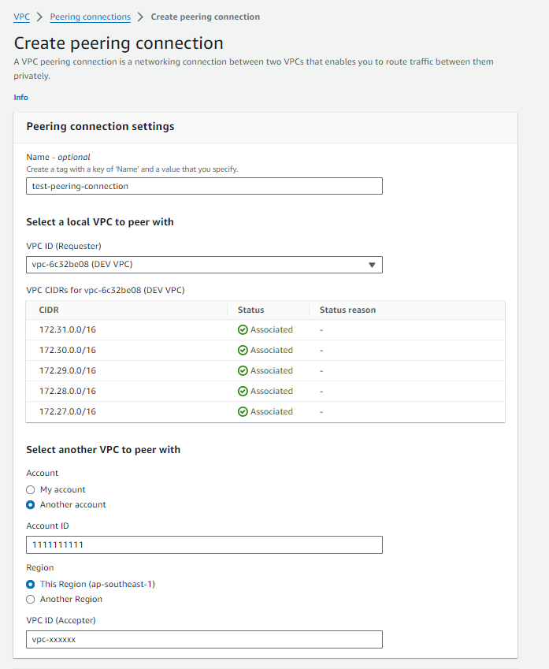
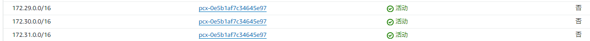
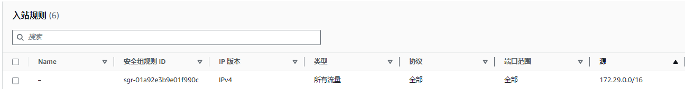
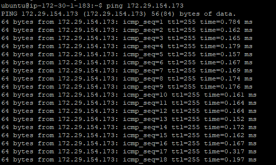

## 什么是VPC对等连接

VPC对等连接是一项联网功能，支持AWS中两个VPC之间进行安全、直接的通信。这种私有连接使资源能够在对等VPC网络中相互交互，如同资源属于同一个网络一样，而无需遍历公网访问。

VPC对等连接，可以连接相同或不同AWS区域中的两个VPC。在连接的VPC之间发送的流量不会通过互联网、VPC连接或AWS Direct Connect传输。


## 对等连接主要限制

- 两个 VPC 之间不能同时创建多个 VPC 对等连接
- 对等连接中 两个VPC 的 IPv4 CIDR 块不能重叠
- VPC 对等连接是两个 VPC 之间的一对一关系, 多个 VPC 对等连接中不支持传递的对等关系



## 创建对等连接

### 创建

- 名称（可选）：VPC对等连接的名字。可以随时修改。
- VPC ID(请求者)：需要用于创建VPC对等连接的源VPC
- Account(接受方)：目标AWS账号ID
- Region(接受方)：目标AWS区域
- VPC ID(接受方)：用于创建VPC对等连接的目标VPC



### 接受

创建完VPC对等连接后，状态会处于 `pending-acceptance`。必须等待接受者VPC的拥有者接受后才能激活。

### 更新路由表

要在对等 VPC 中的实例之间启用私有 IPv4 流量，必须向与两个实例的子网关联的路由表添加路由。路由目的地为对等 VPC 的 CIDR 块，目标为 VPC 对等连接的 ID。



### 更新安全组

允许流量流入和流出与对等的 VPC。需要在安全组的入站和出站规则中添加CIDR块。

将 `172.29.0.0/16` 网段加入到目标VPC的安全组中



### 测试对等网络

`ping` 一下 172.29.x.x内外EC2的IP地址

```bash
ping 172.29.154.173
```



## 参考

- [1] https://docs.aws.amazon.com/vpc/latest/peering/working-with-vpc-peering.html