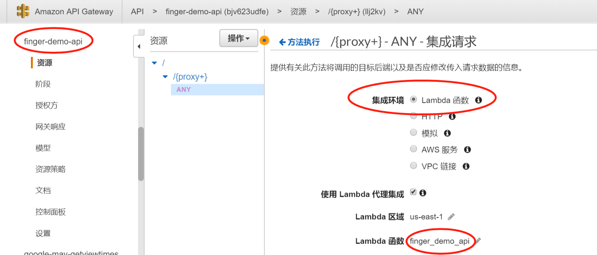
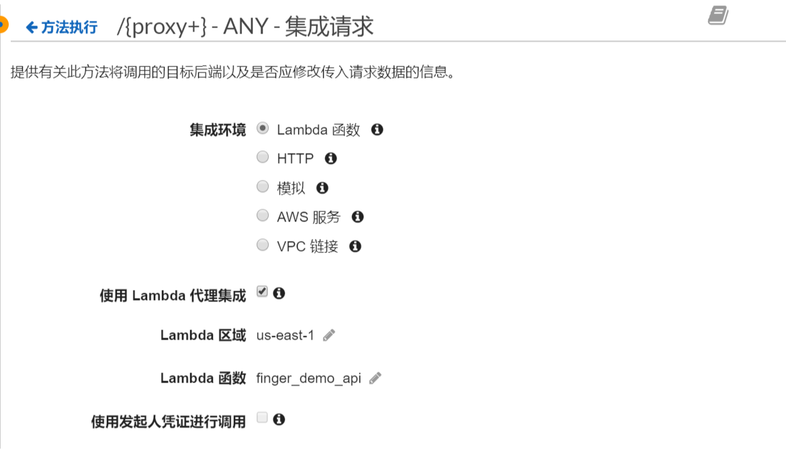
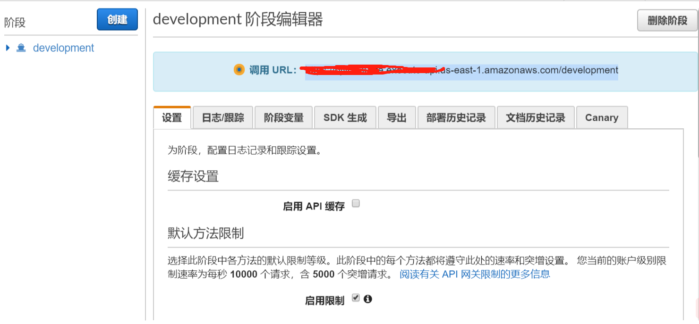
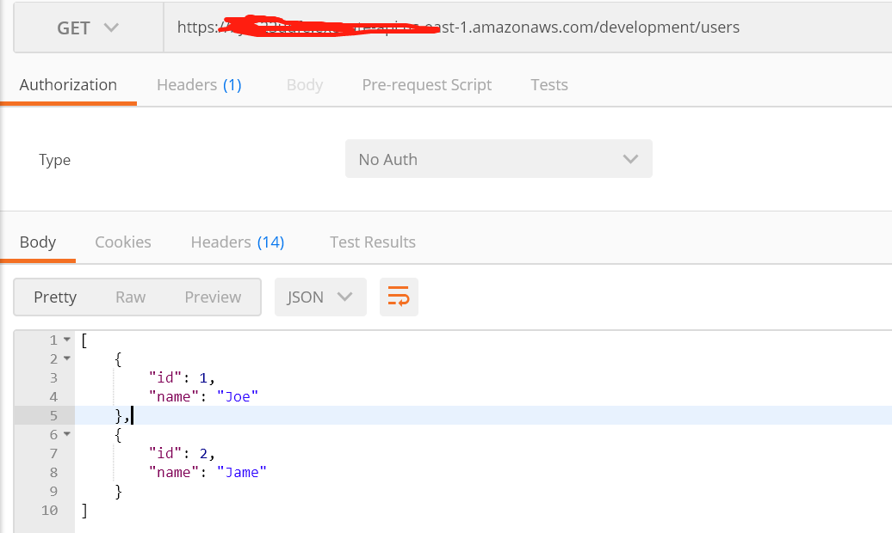

---

title: AWS Serverless - NodeJs实践
tags:

  - Serverless
  - NodeJs
  - AWS
categories:
  - AWS
author: Finger
date: 2018-09-15 11:37:00
---

### 一、Serverless简介

Serverless是一种无服务的架构，如AWS Lambda。Serverless与传统架构不同，由开发者实现的服务端逻辑运行在无状态的计算容器中，它是由事件触发，短暂的(可能只存在于一次请求过程中)，完全被第三方管理。

以亚马逊的AWS Lambda为案例，Lambda能让不用思考任何服务器，也就是说，不用你处理服务器上的部署、服务器容量和服务器的扩展和失败容错，还有服务器上选择什么OS操作系统，语言的更新，日志等等问题。你的应用程序只需要和多个第三方的API或服务打交道，也可以自我创建一个无服务器的API。

### 二、Amazon API Gateway
Amazon API Gateway 是一种完全托管的服务，可以帮助开发者轻松创建、发布、维护、监控和保护任意规模的 API。只需在 AWS 管理控制台中点击几下，您便可以创建可充当应用程序“前门”的 API，从后端服务访问数据、业务逻辑或功能，例如基于 Amazon Elastic Compute Cloud (Amazon EC2) 运行的工作负载、基于 AWS Lambda 运行的代码或任意 Web 应用。

Amazon API Gateway 负责管理所有任务，涉及接受和处理成千上万个并发 API 调用，包括流量管理、授权和访问控制、监控，以及 API 版本管理。Amazon API Gateway 没有最低费用和启动成本。您只需为收到的 API 调用以及传出的数据量付费。

### 三、使用NodeJs创建Serverless API

#### aws-serverless-express —— 基于Express的Serverless中间件
https://github.com/fingerchou/aws-serverless-express

Run serverless applications and REST APIs using your existing Node.js application framework, on top of AWS Lambda and Amazon API Gateway. The sample provided allows you to easily build serverless web applications/services and RESTful APIs using the Express framework.


```
// lambda.js

'use strict';
const awsServerlessExpress = require('aws-serverless-express');
const app = require('./app');

// NOTE: If you get ERR_CONTENT_DECODING_FAILED in your browser, this is likely
// due to a compressed response (e.g. gzip) which has not been handled correctly
// by aws-serverless-express and/or API Gateway. Add the necessary MIME types to
// binaryMimeTypes below, then redeploy (`npm run package-deploy`)

const binaryMimeTypes = [
  'application/javascript',
  'application/json',
  'application/octet-stream',
  'application/xml',
  'font/eot',
  'font/opentype',
  'font/otf',
  'image/jpeg',
  'image/png',
  'image/svg+xml',
  'text/comma-separated-values',
  'text/css',
  'text/html',
  'text/javascript',
  'text/plain',
  'text/text',
  'text/xml'
];

const server = awsServerlessExpress.createServer(app, null, binaryMimeTypes);

exports.handler = (event, context) => awsServerlessExpress.proxy(server, event, context);
```


```
// app.js

'use strict';

const express = require('express');
const bodyParser = require('body-parser');
const cors = require('cors');
const compression = require('compression');
const awsServerlessExpressMiddleware = require('aws-serverless-express/middleware'); 
const app = express();
const router = express.Router();

// gzip compression
app.use(compression());

// enable CORS - Cross Origin Resource Sharing
app.use(cors());
app.use(bodyParser.json());
app.use(bodyParser.urlencoded({ extended: true }));
app.use(awsServerlessExpressMiddleware.eventContext());

router.get('/hello', (req, res) => {
    res.json({"say": "Hello World"})
});

router.get('/users', (req, res) => {
    res.json(users);
});

router.get('/users/:userId', (req, res) => {
    const user = getUser(req.params.userId);
    if(!user) {
        return res.status(404).json({});
    }
    return res.json(user);
});

router.post('/users', (req, res) => {
    const user = {
        id: ++userIdCounter,
        name: req.body.name
    };
    users.push(user);
    res.status(201).json(user);
});

router.put('/users/:userId', (req, res) => {
    const user = getUser(req.params.userId);
    console.log(req.params.userId, user);
    if (!user) {
        return res.status(404).json({});
    }
    user.name = req.body.name;
    res.json(user);
});

router.delete('/users/:userId', (req, res) => {
    const userIndex = getUserIndex(req.params.userId);
    if (userIndex === -1) {
        return res.status(404).json({});
    }
    users.splice(userIndex, 1);
    res.json(users);
});

const users = [{
    id: 1,
    name: 'Joe'
}, {
    id: 2,
    name: 'Jame'
}];

let userIdCounter = users.length;

const getUser = (userId) => users.find(u => u.id === parseInt(userId));
const getUserIndex = (userId) => users.findIndex(u => u.id === parseInt(userId));

app.use('/', router);

module.exports = app;
```


```
// app.local.js

const app = require('./app');
const port = 5000;

app.listen(port);
console.log(`listening on http://localhost:${port}`);
```

#### Apex —— 发布程序到AWS Lambda

http://apex.run/

```
// project.development.json

{
  "name": "finger_demo",
  "description": "this is finger demo",
  "memory": 128,
  "timeout": 300,
  "role": "xxx",
  "handler": "lambda.handler",
  "runtime": "nodejs8.10",
  "region": "us-east-1",
  "retainedVersions": 5,
  "hooks": {
    "build": "npm install"
  },
  "environment": {

  }
}
```

```
// 发布development环境
apex deploy -e development

// 使用development别名
apex alias development
```

### 四、创建AWS API-Gateway测试

#### 新建API-Gateway，创建Proxy



#### proxy指向Lambda




#### 发布API，别名为development



#### 测试

