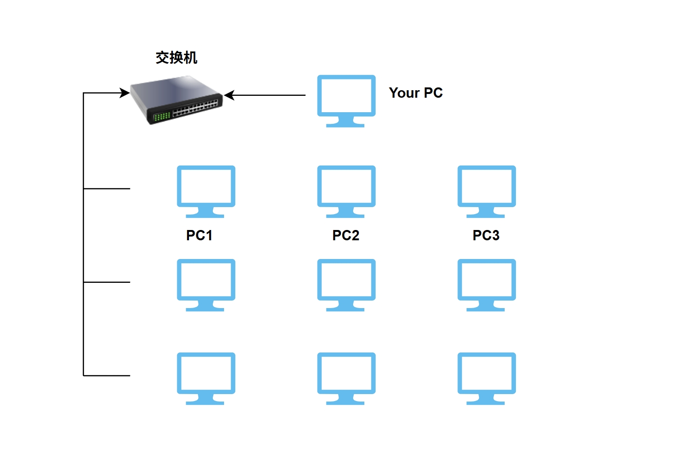
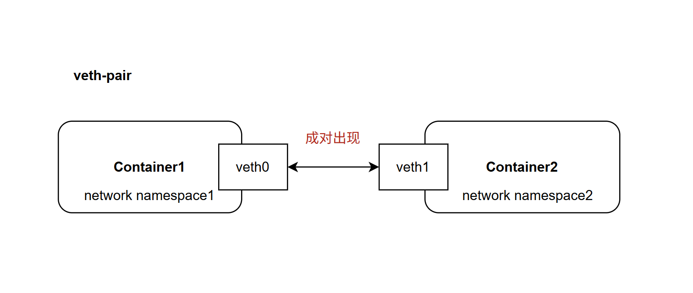
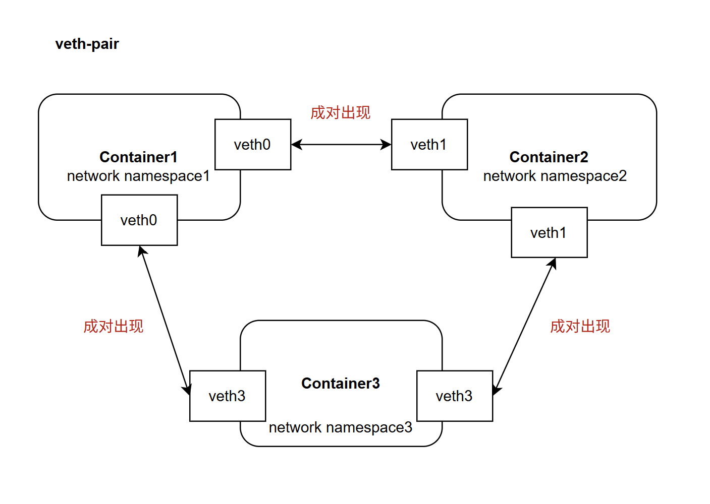
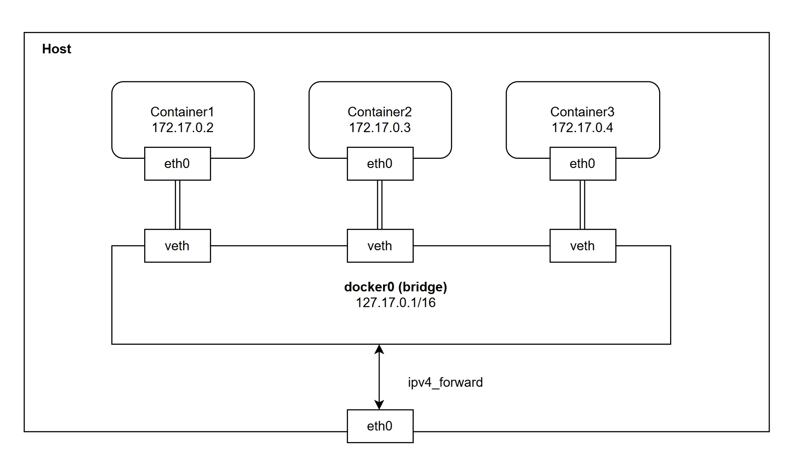
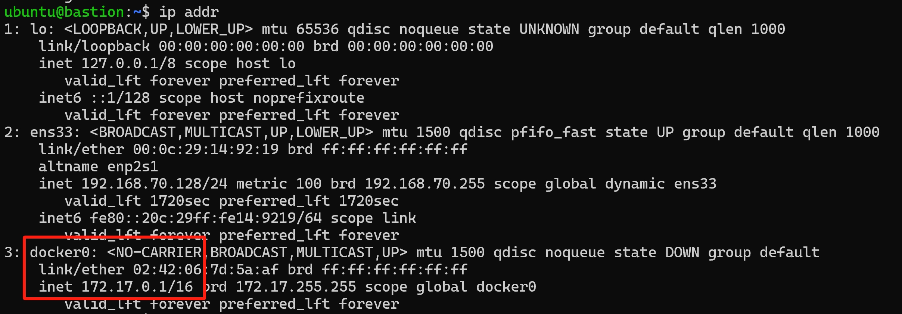
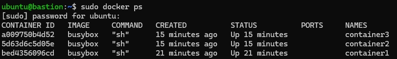
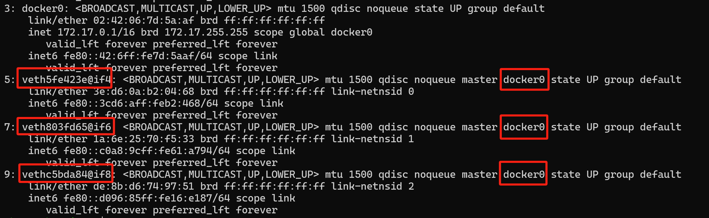
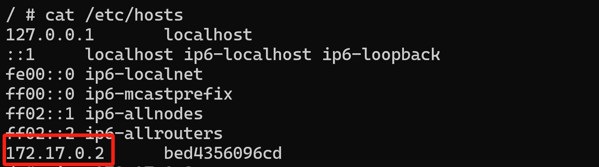
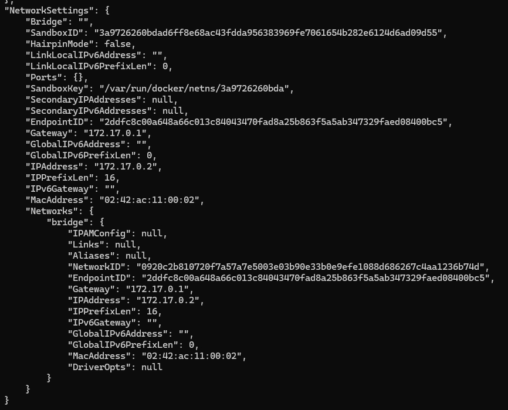
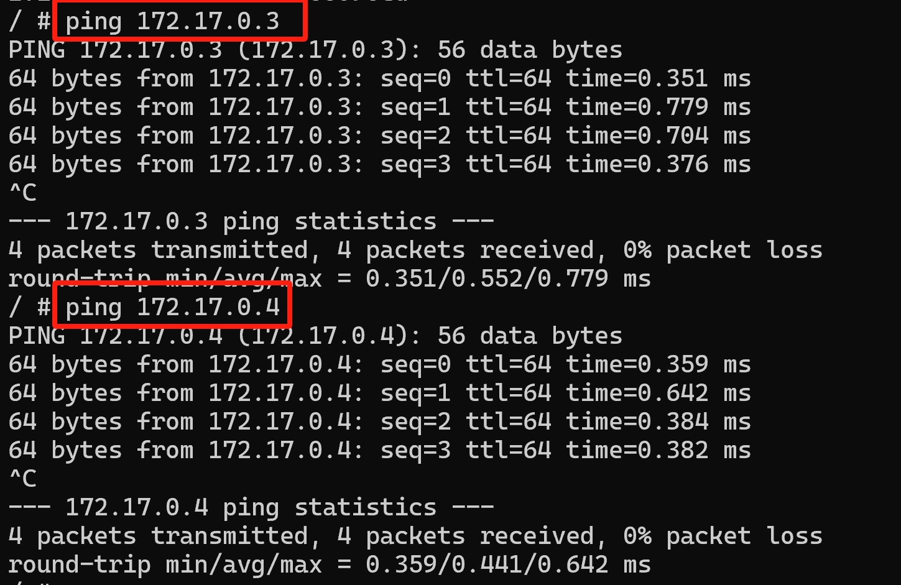

### 基本原理

Docker网络默认是Bridge驱动模式。当Docker启动时，它就会在Host上创建一个名为`docker0`的虚拟网桥。Host上所有的Docker容器都会连接`docker0`这个虚拟网桥。通过`docker0`虚拟网桥，该Host上的容器可以互相通信。这种工作方式类似于物理交换机，使局域网中的所有PC通过交换机连接到同一个网络互相可以访问。



在Bridge驱动模式下，Docker会为每个容器创建独立的Network Namespace和IP等。每个容器会有一个虚拟网卡eth0。容器之间通过eth0和IP地址进行通信。`docker0`的默认IP为`172.17.0.1/16`，其他的容器则会在`172.17.0.1/16`这个IP范围内分配一个未使用的IP。并设置docker0的IP地址作为容器的默认网关。

另外Docker创建容器的同时也会创建`veth-pair`(虚拟设备对)。`veth-pair`将容器与`docker0`连接起来。对于`172.17.0.0/16`网段的数据包，Docker会在Host上创建一条iptables NAT的规则将这个IP地址进行转换。然后通过Host的真实网络接口发送出去。


### Veth Pair 

veth pair 全称是：virtual ethernet pair 虚拟以太网设备对。是linux内核提供的一种虚拟化网络设备，通常用于连接不同网络命名空间(Network Namespace)，实现跨网络命名空间的通信。它的作用类似 于一根物理网线。`veth-pair`总是成对出现。例如`veth-pair`由两个虚拟网卡(veth0和veth1)组成，一端发送的数据会直接由另一端接受，类似于管道的两端。



多个容器



容器越多，veth-pair规模就越大，那么也就越来越复杂。不过有了`docker0`就变得简单了。最终Docker Bridge网络架构如下：



### 测试容器网络连接

```shell
# 查询本地IP
ip addr
```



启动三个示例容器。

```shell
docker run -it --name container1 busybox
docker run -it --name container2 busybox
docker run -it --name container3 busybox
```



容器启动后，我们看到多了三个veth虚拟设备。同时它们默认都连接到了docker0。



在容器内查看容器的IP地址

```shell
# 查看Container1
cat /etc/hosts
```



也可以通过 `dokcer inspect`命令查看

```shell
sudo docker inspect bed4356096cd
```


```
# 三个容器的IP
Container1 172.17.0.2
Container2 172.17.0.3
Container2 172.17.0.4
```

在Container1中Ping `Container2`和`Container3`测试网络访问



Bridge模式下的容器，因为默认都连接到docker0，又在同一个网段`172.17.0.0/16`，因此可以互相访问。