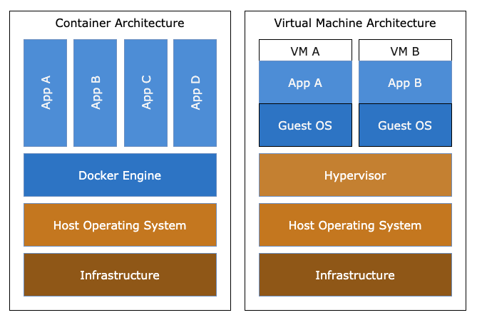

## 一、 容器概述 

容器（Container）是一种虚拟化技术，用于在计算机上运行应用程序和服务。与传统的虚拟机不同，容器不需要为每个应用创建独立的操作系统实例。相反，容器共享主机操作系统的内核，但它们有自己的文件系统、进程空间和网络接口。这使得容器能够在一个主机上运行多个隔离的应用程序，并且每个容器之间互不干扰。

### 1.1、容器架构

容器的架构涉及多个组件和概念，它们共同协作来提供一个高效、隔离和可移植的应用程序运行环境。以下是容器架构的主要组成部分：
- 主机操作系统 (Host Operating System)
- 容器引擎 (Container Engine)
- 容器镜像 (Container Image)
- 容器 (Container)
- 容器编排 (Container Orchestration)
- 网络 (Networking)
- 存储 (Storage)

### 1.2、容器的本质

容器的本质是一个特殊的进程，它是由Namespaces，Cgroups和 rootfs 构成。我们可以将它一分为二来看待，Namespace和Cgroups为动态资源，rootfs 为静态资源。

## 二、什么是容器安全?

容器安全是指使用安全工具和策略来保护容器化应用程序的各个方面免受潜在风险的过程。容器化环境不仅包含容器和在其中运行的应用程序，还包括容器运行时、内核和主机操作系统等底层基础设施。

## 三、容器安全架构组件 

- 编译流水线 (Build Pipeline)

- 容器镜像 (Container images and  registries)

- 容器宿主机 (Container host machines)

- 容器运行时 (Container runtime)，如 docker, containerd

- 容器编排工具 Container platforms and orchestrations) 如 kubernetes

- 应用程序(Applications)

  

## 四、容器安全挑战

### 4.1、容器配置错误

- 暴露应用程序不需要或不安全端口

- 泄露秘钥和凭据，例如密码和身份验证令牌

- 过于宽容的容器运行时权限，例如以Root身份运行容器

- 开启特权模式 (privileged)

- 挂载宿主机目录

### 4.2、容器基础设施中的漏洞

容器通常由应用程序代码、配置、库和包组成，最后编译成镜像，通过容器运行时运行在宿主机操作系统内核中。容器生命周期的每个阶段都可能将安全漏洞引入到容器基础设施中，从而增加运行时可能被利用的攻击面。漏洞还可以从容器镜像内置的外部依赖项继承、甚至存在于堆栈内的主机和容器运行时中。

作为应用程序的一部分，容器镜像还可以从开源库和包继承安全漏洞，从而使其容易受到攻击。开发人员可能会使用来自第三方容器注册表(Registry)的基础镜像来构建容器镜像，这些镜像可能无意中包含安全漏洞，或者可能已被黑客故意替换为受损的镜像。

最后，容器和主机可能包含漏洞，当容器在宿主机操作系统内核上运行时，这些漏洞可通过网络、主机和端点被利用。特别是主机内核和容器运行时中的容器逃逸漏洞可能会为攻击媒介打开大门，利用本地权限升级来损害整个基础设施。e.g. CVE-2019-5736

### 4.3、容器工作负载的可见性

容器安全性的主要挑战是容器工作负载的可见性。由于容器工作负载高度动态且通常短暂，因此很难监控和跟踪容器活动中的异常情况。

由于容器安全问题可以在容器和应用程序之间快速传播，因此了解容器和主机上的运行时信息至关重要，以便我们可以快速识别和缓解容器化环境中的漏洞。

### 4.4、CI/CD 管道安全问题检测

容器安全性需要考虑CI/CD管道的所有阶段，从应用程序代码到容器工作负载和基础设施。我们最容易忽略的是安全测试，因为我们总是为了满足紧迫的应用程序交付的时间表。

## 五、容器安全最佳实践和建议方案

### 5.1、Host 

- 保持内核及时更新，定期更新安全补丁、防止已知漏洞被利用 
- 增强主机安全保护，只允许VPC内访问，设置安全组，限制入站和出站的端口及协议，开启防火墙

### 5.2、Docker (Container Engine)

- 保持Docker Engine更新，只允许授信用户控制Docker守护进程 。
- 使用TLS证书加密通信

### 5.3、Images (Registry)

- 在Dockerfile中为容器创建非root用户
- 选择官方镜像和可信赖的软件供应商或组织的镜像。建立本地镜像仓库。
- 仅安装必要的依赖包，尽可能使用轻量级的镜像。例如：Alpine Linux，Ubuntu Minimal，BusyBox等
- 自动化扫描镜像漏洞(Code, Dependency, Base Image等)
- 保持镜像更新，重新构建镜像时需要包含安全补丁，防止黑客利用漏洞实施攻击

### 5.4、Container Runtime

 - 以非root用户运行容器进程，最大程度控制用户权限范围，遵循最小权限原则
 - 限制容器对系统文件的访问和资源的使用
 - 禁止使用特权模式(Privileged)启动容器
 - 实施网络安全，限制容器间的访问
 - 监控容器活动，使用可观察性工具实时记录，监控和测试容器环境中的异常情况。
 - 实施访问控制，使用身份验证和授权机制，确保只有授权用户才能访问容器

## 参考文献

- https://docs.docker.com/develop/security-best-practices/
- https://spacelift.io/blog/container-security
- https://www.crowdstrike.com/cybersecurity-101/cloud-security/container-security-best-practices/
- https://blog.waterstrong.me/docker-security/
