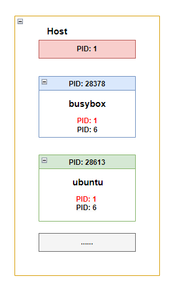
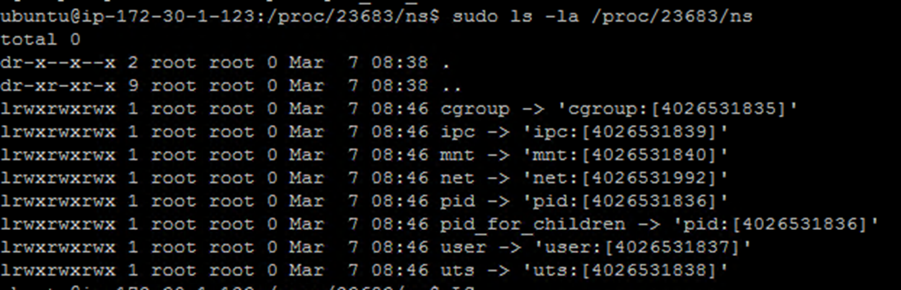
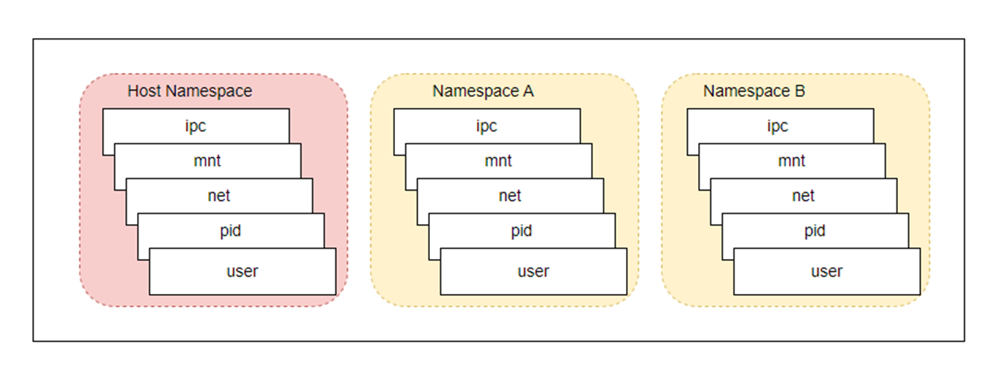
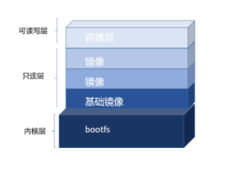

## 容器实现原理

容器到底是什么一回事？它有什么样的特性？又是如何运行起来的呢？下面我们简单介绍一下以Docker容器为主的Linux容器的实现原理。

容器其实是一种沙盒技术。沙盒就是能够像集装箱一样把你的应用“装”起来。这样，应用与应用之间就有了边界而不至于互相干扰；同时也可以很方便地搬来搬去。

而容器技术的核心功能，就是通过约束和修改进程的动态表现，从而为其创造一个“边界”。

对于Docker等大多数Linux容器来说，**Cgroups** 技术是用来**创造约束**的主要手段，而 **Namespace** 技术则是用来**修改进程视图**的主要方法。

创造约束，换一种说话就是限制资源的使用量，设置资源的配额上限。

修改进程视图，换一种说话就是把进程隔离起来，让其他进程看不见。


### 隔离技术（Namepsace）

容器对资源的隔离主要是通过Namespace技术实现。Namespace是Linux Kernel提供的一种资源隔离方案，不同的Namespace下的资源是独立的，系统可以为容器进程分配不同的Namespace，从而保证各个进程之间对彼此是透明。

听起来比较抽象，我们以进程资源举个例子，看Namespace是如何实现容器进程间PID的隔离。

我们用Docker启动一个busybox容器并进入，运行ps指令：

```bash
~$ docker run -it busybox /bin/sh

/ # ps -ef  
 PID   USER     TIME  COMMAND  
 1 	   root      0:00 /bin/sh  
 6 	   root      0:00 ps -ef  
```

我们再启动一个ubuntu容器并进入，运行ps指令：

```bash
~$ docker run -it ubuntu /bin/sh

# ps -ef  
PID  PPID  C STIME TTY          TIME CMD  
1     0  0 10:19 pts/0    00:00:00 /bin/sh  
6     1  0 10:19 pts/0    00:00:00 ps -ef  
```

我们在宿主机上运行ps指令：

```bash
~$ ps -ef  

UID        PID  PPID  	C STIME TTY          TIME CMD 
root         1     0  	0 May13 ?        00:00:00 /init  
root        15     1  	0 May13 ?        00:00:00 /init 
ubuntu      1404  1069  0 18:15 pts/1    00:00:00 docker run -it busybox /bin/sh 
root      	28378  1426  0 18:15 ?        00:00:00 /bin/sh  
ubuntu      1711  1491  0 18:19 pts/3    00:00:00 docker run -it ubuntu /bin/sh
root      	28613  1732  0 18:19 ?        00:00:00 /bin/sh  
...
```

我们可以看到，busybox、ubuntu和宿主机上的进程，看到的PID都是不一样的，这就是所谓的进程资源的视图隔离；而且我们看到，busybox和ubuntu两个容器进程的初始化PID都是**1**，但是在宿主机进程中，我们发现他们真正的PID分别是**28378**和**28613**。这种机制其实就是对被隔离的应用进程做了“障眼法”，使得我们在容器中看到容器进程本身是1号进程（PID=1），而实际在宿主机上还是原来的进程PID。



另外，除了PID Namespace之外，Linux Kernel 还提供了Network、Mount和User等其他类型的隔离，用来对进程各种上下文进行资源隔离。

我们可以在 /proc 目录下找到刚刚启动的busybox进程中的所有Namespace：

```bash
/proc/xxx$ sudo ls -la /proc/<pid>/ns
```



由此可见，容器实际上是一种特殊的进程，就是在创建的时候指定了一组Namespace参数，使容器拥有了自己独特的文件系统、网络信息、用户和存储等，并保证容器内只能“看到”自己的资源。从而实现容器间资源的隔离。容器的本质就是一个加了限定参数的进程。



### 资源限制（Cgroups）

虽然通过Namespace修改了进程的视图，使用“障眼法”让容器进程只能看到自己Namespace下的各种资源，但Namespace只是限定了进程的“视线”，它和其他进程一样共享宿主机的资源，这意味它所能够使用的资源(如CPU，内存)，随时可以被宿主机上的其他进程占用。同样它也能用光宿主机的所有资源，让其他进程无资源可用。

因此，我们需要使用另一种技术对资源进行限制。而Cgroups技术就是Linux下用于对一个或一组进程进行资源(CPU、内存、磁盘I/O、网络宽带)控制和监控的机制。简单点说它的主要作用就是限制一个进程能够使用CPU、内存、磁盘、网络带宽等资源的上限。

```bash
~$ mount -t cgroup
...
```

Cgroups有十几个子系统，这些子系统就是用来控制每一种类型的资源。如cpu就是用来限制进程的cpu使用率。这些子系统是一系列文件系统目录，他们在 /sys/fs/cgroup目录下。针对不同的资源限制，只要将限制策略在不同的子系统目录中进行配置即可。

我们用一个例子来看一下，如何限制进程的cpu使用率的。

```bash
# 1. 在 /sys/fs/cgroup/cpu目录下创建一个子目录 mydocker
	
	mkdir /sys/fs/cgroup/cpu/mydocker
	ls -l /sys/fs/cgroup/cpu/mydocker   # 可以看到mydocker目录下，自动生成了子系统对应的资源限制文件。

# cpu.cfs_quota_us文件就是用来限制cpu使用时间的
# cpu.cfs_quota_us的初始值为-1，表示还没有任何cpu时间的限制

# 2. 把当前运行的shell进程PID写入到mydocker cgroup的tasks文件

	cd /sys/fs/cgroup/cpu/mydocker
	echo $$ > tasks
	echo $$

# 3. 在当前shell运行CPU耗时任务
	while : ; do : ; done&	# 查看cpu占用率: top， 可以看到CPU的使用率已经达到100%了。

# 4. 设置mydocker进程只能使用20%的CPU
	echo  20000 > /sys/fs/cgroup/cpu/mydocker/cpu.cfs_quota_us

# 5. 再次查看cpu占用率: top，可以看到，该进程的cpu使用率立即降到了20%左右
```

通过上述例子我们了解到 Cgropus 控制进程的方法，简而言之，它就是一个子系统目录（mydocker）加上一组资源限制文件的组合。然后在启动容器进程之后，再把这个进程的PID写到对应的tasks文件。这样就达到了限制进程资源的效果。

回到Docker容器本身，Docker会将上述示例的操作自动完成。自动在 Cgroups 每个子系统中创建相应的目录，目录名会以container id为名，同时将容器进程的PID写入到tasks文件，从而完成对容器进程的各种资源限制。

到现在为止，我们知道了Namespace的作用是“隔离”，它让应用进程只能看到自己Namespace内的“世界”；而 Cgroups 的作用是“限制”，它给这个“世界”围上了一圈看不见的墙。这么一折腾，进程就真的被“装”在了一个与世隔绝的房间里，而这些房间就是我们一开始讲的“沙盒”。容器技术就是一种沙盒技术。


### 镜像原理（Union FS）

通过对Namespace和Cgroups技术的了解，我们知道了容器是怎么运行的。回过头来，我们再看一下容器的镜像是如何生成的。

Docker镜像实际上是由一层一层的文件系统组成，这种层级的文件系统就是Union FS。

Union FS（Union File System，联合文件系统），是一种分层、轻量级并且高性能的文件系统，它支持对文件系统的修改作为一次提交来一层层的叠加，同时可以将不同目录挂载到同一个虚拟文件系统下，简单来说就是将不同位置的目录联合挂载到同一个目录下。

例如，我现在有两个目录A和B，它们分别有两个文件：

```bash
~$ tree
.
|---A
|	|---a
|	|---x
|---B
	|---b
	|---x
```

然后，我使用联合挂载的方式，将这两个目录挂载到了一个公共的目录C上：

```bash
~$ mkdir C
~$ mount -t aufs -o dirs=./A:./B none ./C
```

这时，我再查看目录C的内容，就能看到目录A和B下的文件被合并到了一起：

```bash
~$ tree ./C
./C
|---a
|---b
|---x	
```

我们可以看到，在这个合并后的目录C里，有a、b、x三个文件，并且 x 文件只有一份。这就是“合并”的含义。此外，如果你在目录C里对

a、b、x文件做了修改，也会在对应的目录A、B中生效。

容器镜像就是通过这种分层和联合挂载机制进行制作的。一个容器镜像包含应用程序可用的文件系统和其他元数据，如代码，工具包、代理、可执行文件等，这些镜像信息都是以不同的层级堆叠到一起，这些增量的层最后合并生成一个容器镜像。

最直观的体现就是我们下载docker镜像时输出的一层一层的pull complete信息。

```bash
~$ docker pull redis

Using default tag: latest
latest: Pulling from library/redis
33847f680f63: Pull complete
1a847f6b0f32: Pull complete
...
```

我们可以通过 inspect 命令查看到镜像的具体分层信息。

```bash
~$ docker image inspect redis:latest

 "RootFS": {  
    "Type": "layers",  
    "Layers": [  
        "sha256:2edcec3590a4ec7f40cf0743c15d78fb39d8326bc029073b41ef9727da6c851f",  
        "sha256:e379e8aedd4d72bb4c529a4ca07a4e4d230b5a1d3f7a61bc80179e8f02421ad8",  
        "sha256:b8d6e692a25e11b0d32c5c3dd544b71b1085ddc1fddad08e68cbd7fda7f70221",  
        "sha256:f1db227348d0a5e0b99b15a096d930d1a69db7474a1847acbc31f05e4ef8df8c",  
        "sha256:32ce5f6a5106cc637d09a98289782edf47c32cb082dc475dd47cbf19a4f866da",  
        "sha256:d874fd2bc83bb3322b566df739681fbd2248c58d3369cb25908d68e7ed6040a6"  
    ]  
}
```

从上面我们可以看到 redis镜像由6个镜像层组成。一层一层叠加，组合成为一个整体。

为什么要分层？最大的一个好处就是 - 共享资源

比如：有多个镜像都从相同的 Base镜像构建而来，那么宿主机只需在磁盘上保存一份Base镜像，同时内存中也只需加载一份Base镜像，就可以为宿主机上所有容器服务了。并且镜像的每一层都是可以被共享的。

另外一个问题，如果在容器运行的时候，修改了基础层的文件内容，那么势必会影响其他镜像引用。如何在基础层不被修改的前提下，实现容器修改的需求，从而保证Base镜像的一致性呢？

我们要知道Docker获取某个文件，会从容器层自上而下往下一层的镜像层去获取文件，如果该层文件不存在，那么就会继续往下一镜像层去寻找，直到最后一层。



如上图所示，当容器启动时，被加载到镜像的顶部的这层就是容器层，这一层是可读可写的。而容器层之下的叫做镜像层。所有的镜像层都是只读的。最底部的是系统内核层。当我们要对基础镜像做修改时，Docker则会先将此文件从镜像层Copy到容器层，然后再修改。这种修改方式叫**Copy-on-Write**(写时复制)。根据上述Union FS合并原理，上层文件覆盖下层文件，因此修改的仅仅只是该文件在容器层的拷贝。


**Docker 镜像加载原理**

启动一个Linux 容器一般需要运行两个文件系统，bootfs + rootfs

bootfs 主要包含 bootloader 和 kernel，bootloader就是我们windows系统开机所看到的引导系统，当bootloader 加载完后，我们就能登录到系统，此时系统使用权就都交到kernel。同时系统也会卸载掉bootloader。

进入系统后，我们看到的文件系统就是 rootfs，Linux系统中所看到的是/dev, /bin, /etc等目录和文件。


## 结论

综上所述，一个容器，实际上是由Linux Namespace、Linux Cgroups和Union FS三种技术构建出来的进程的隔离环境。

**局限性**

首先，我们知道容器只是运行在宿主机的一种特殊的进程，多个容器之间使用的还是同一个宿主机的操作系统内核。

正是因为这样一个事实，我们在x86内核的服务器上，制作的镜像，无法运行在 arm内核的服务器。

其次，在Linux内核中，有一些资源和对象是不能被隔离的，最典型的就是：时间。如果你在容器中修改了系统时间，那么整个宿主机的时间都会被修改。这显然不符合我们的预期。