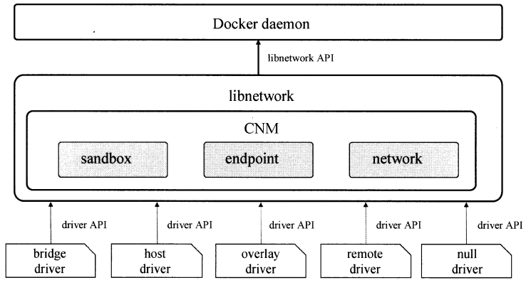
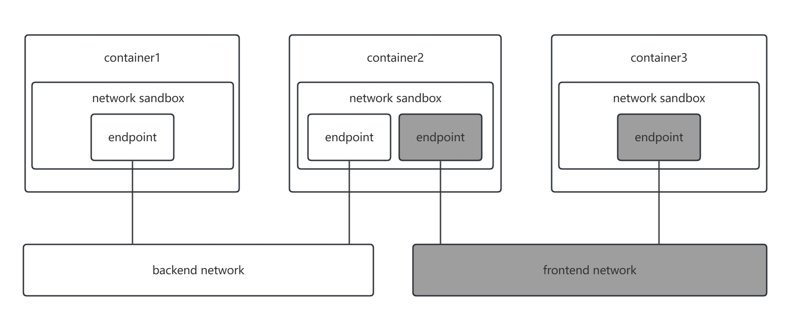
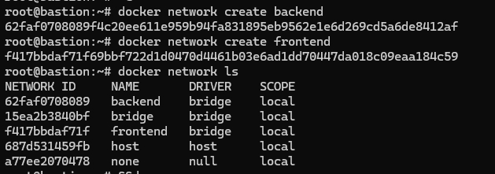
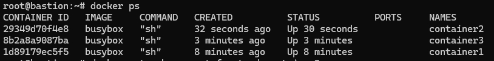
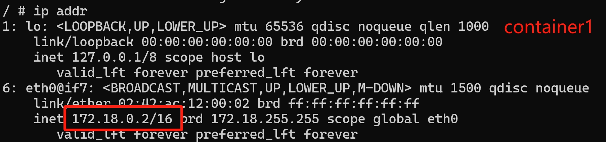
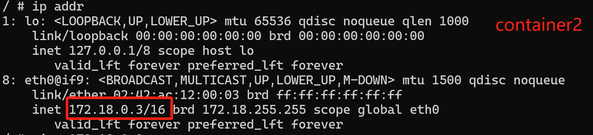
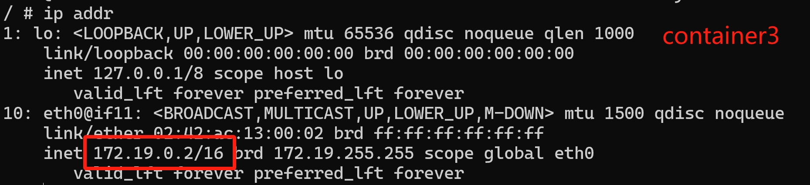
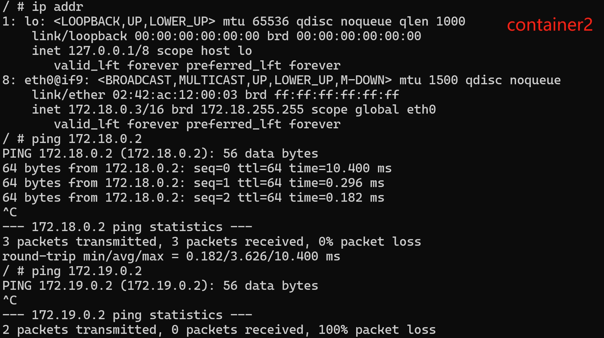
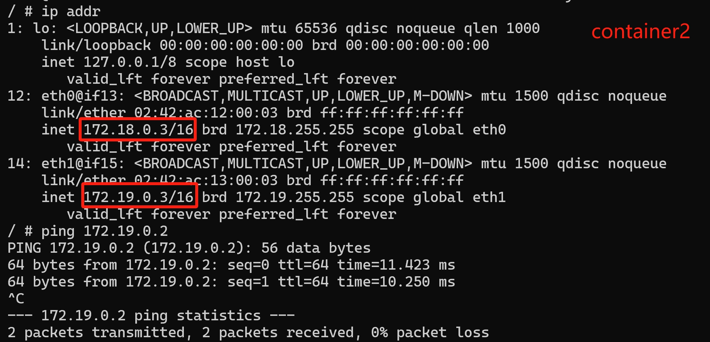

## Docker 网络架构



Docker的网络功能主要封装在 `libnetwork` 组件。Docker daemon 通过调用 `libnetwork api` 完成网络的创建和管理等功能。

`libnetwork` 主要使用`CNM (Container Network Model)`模型来构建容器虚拟化网络，同时提供可以开发多种网络驱动的标准化接口和组件。

`CNM`主要包含以下3个组件：
- 沙盒 (Sandbox)： 一个沙盒包含了一个容器网络栈的信息。沙盒对里边的接口等进行设置并管理。沙盒的实现可以是Linux network namespace或者类似的机制。一个沙盒可以有多个端点和多个网络。
- 端点 (Endpoint)：一个端点可以同时加入一个沙盒和一个网络。端点的实现可以是veth pair或者相似的设备。
- 网络 (Network)：一个网络是一组可以直接互相联通的端点。可以包含多个端点，网络的实现可以是Linux bridge、VLAN等。

`libnetwork`中内置了5种的驱动类型来提供不同的网络服务。

| 驱动    | 简介                                                         |
| :------ | ------------------------------------------------------------ |
| bridge  | 这是 docker 设置的默认驱动。当使用 bridge 驱动时，libnetwork 将创建出来的 docker 容器连接到 docker0 网桥上。对于单机模式，bridge 驱动已经可以满足基本的需求了。但是这种模式下容器使用 NAT 方式与外界通信，这就增加了通信的复杂性。 |
| host    | 使用 host 驱动的时候，libnetwork 不会为容器创建网络协议栈，即不会创建独立的 network namespace。Docker 容器中的进程处于宿主机的网络环境中，相当于容器和宿主机共用同一个 network namespace，容器共享使用宿主机的网卡、IP 和端口等资源。Host 模式很好的解决了容器与外界通信的地址转换问题，可以直接使用宿主机的 IP 进行通信，不存在虚拟化网络带来的开销。但是 host 驱动也降低了容器与容器之间、容器与宿主机之间网络的隔离性，引起网络资源的竞争和冲突。因此可以认为 host 驱动适用于对容器集群规模不大的场景。 |
| null    | 使用这种驱动的时候，docker 容器拥有字段的 network namespace，但是并不为 docker 容器进行任何网络配置。也就是说，这个容器除了 network namespace 自带的 loopback 网卡外，没有任何其它网卡、IP、路由等信息，需要用户为该容器添加网卡、配置 IP 等。这种模式如果不进行特定的配置是无法正常使用网络的，但是优点也非常明显，它给了用户最大的自由度来自定义容器的网络环境。 |
| remote  | 这个驱动实际上并未做真正的网络服务实现，而是调用了用户自行实现的网络驱动插件，是 libnetwork 实现了驱动的插件化，更好地满足了用户的多样化需求。用户只要根据 libnetwork 提供的协议标准实现其接口并注册即可。 |
| overlay | 上面的驱动模式主要解决同一个主机上容器与容器的网络通信，overlay 可以实现跨主机的网络通信，overlay驱动采用 IETF 标准的 VXLAN 方式，并且是 VXLAN 中被普遍认为最适合大规模的云计算虚拟化环境的 SDN controller 模式。在使用的过程中，还需要一个额外的配置存储服务，比如 Consul、etcd 或 ZooKeeper 等。并且在启动 docker daemon 的时候需要添加额外的参数来指定所使用的配置存储服务地址。 |

使用命令`docker network ls`查看网络
```shell
root@bastion:~# docker network ls
NETWORK ID     NAME      DRIVER    SCOPE
15ea2b3840bf   bridge    bridge    local
687d531459fb   host      host      local
a77ee2070478   none      null      local
```

## Docker网络连通性示例

本示例创建了`backend`和`frontend`两个网络。两个网络互不连通。
创建3个容器，其中container1和container3各有一个端点，并且分别连接在`backend`和`frontend`网络中。而container2有两个端点，同时连接到`backend`和`frontend`网络中



```shell
docker network create backend
docker network create frontend
docker network ls
```


用busybox镜像分别创建3个容器container1, container2和container3。并且加入`backend`和`frontend`网络。
```shell
docker run -it --name container1 --net backend busybox
docker run -it --name container2 --net backend busybox
docker run -it --name container3 --net frontend busybox
```


分别查询container1, container2和container3的IP。可以看到，此时容器中都只有一块`eth0`网卡。container1和container2属于同一个网段 `127.18.0.1/16`。container3属于网段`127.19.0.1/16`。
```shell
ip addr

# container1 127.18.0.2
# container2 127.18.0.3
# container3 127.19.0.2
```






在container2中分别测试ping container1和container3的IP。显然container2可以ping 通container1，无法ping通container3。

**只有在同一个网络端点中的容器才能互相连接**



将container2加入到frontend网络端点中。
```shell
docker network connect frontend container2
```
再查看container2网络配置，发现有两个网卡eth0和eth1。分配了两个IP: `172.18.0.3`和`172.19.0.3`，用ping命令测试连接container3，此时可以连接成功。


## 常用命令

```shell
# 创建网络
docker network create <网络名字>

# 将容器添加到网络
docker network connect <网络名字> <容器名字>

# 将容器移除网络
docker network disconnect <网络名字> <容器名字>

# 删除网络
docker network rm <网络名字>

```