测试环境：Ubuntu 24.04

## 安装Java运行时

```
sudo apt-get update
sudo apt install openjdk-21-jdk -y
java -version
```

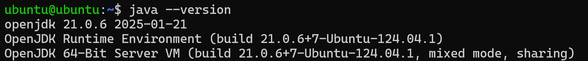

## 安装Jenkins

### 添加Jenkins Repository
```shell
sudo wget -O /usr/share/keyrings/jenkins-keyring.asc \
  https://pkg.jenkins.io/debian-stable/jenkins.io-2023.key
  
echo "deb [signed-by=/usr/share/keyrings/jenkins-keyring.asc]" \
  https://pkg.jenkins.io/debian-stable binary/ | sudo tee \
  /etc/apt/sources.list.d/jenkins.list > /dev/null
```

### 安装Jenkins
```shell
sudo apt-get update
sudo apt-get install jenkins
```

### 启动Jenkins服务
```shell
# 启动jenkins服务
sudo systemctl start jenkins

# 查看服务状态
sudo systemctl status jenkins
```

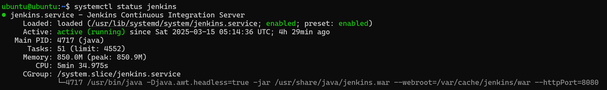

### 解锁Jenkins站点

打开浏览器输入http://<ip_address>:8080，第一次打开会出现解锁Jenkins页面。

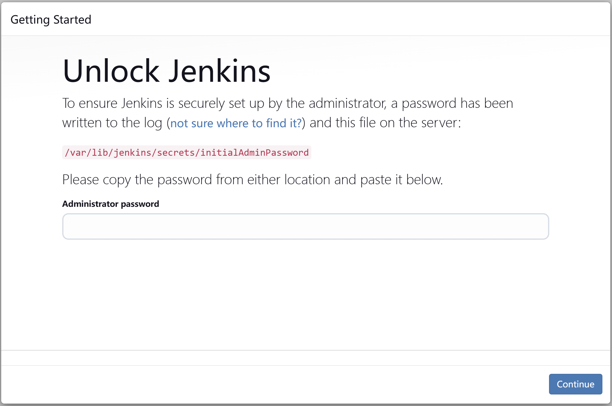

```shell
# 按照页面提示，查看初始化密码
sudo cat /var/lib/jenkins/secrets/initialAdminPassword
```
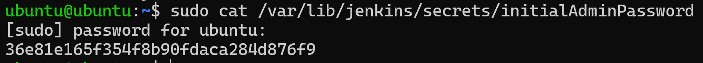

输入初始化密码后，进入到插件选择页面。

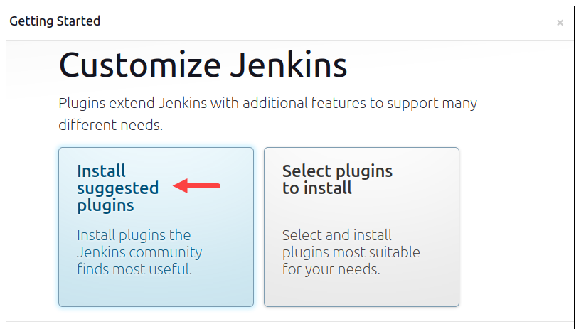

### 创建管理员账号

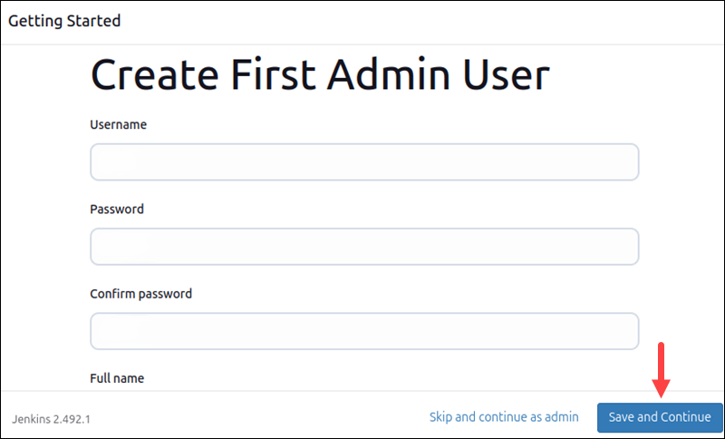

### 登录Jenkins站点

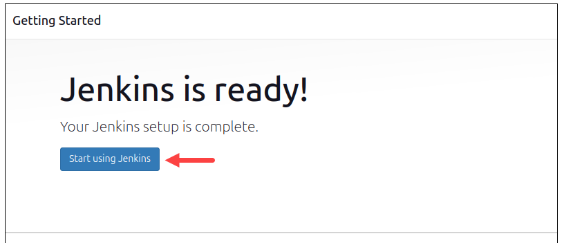

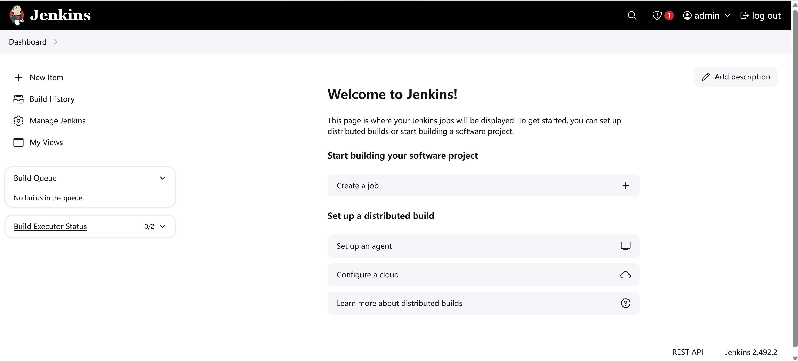

## 添加节点

### 创建Credentials
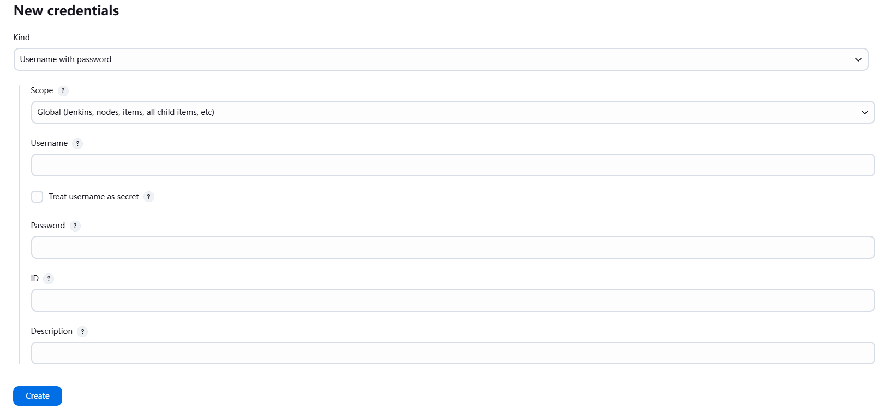

### 添加节点
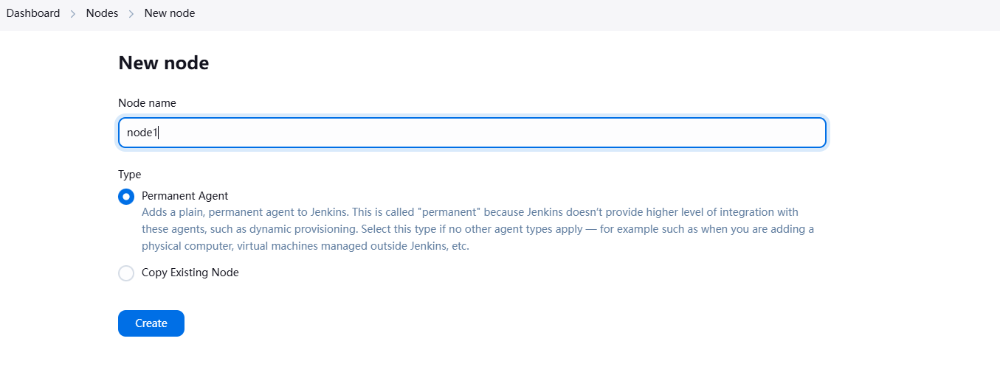

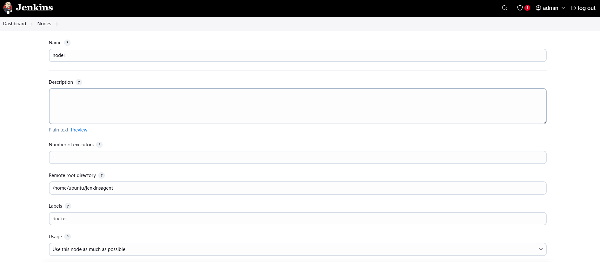

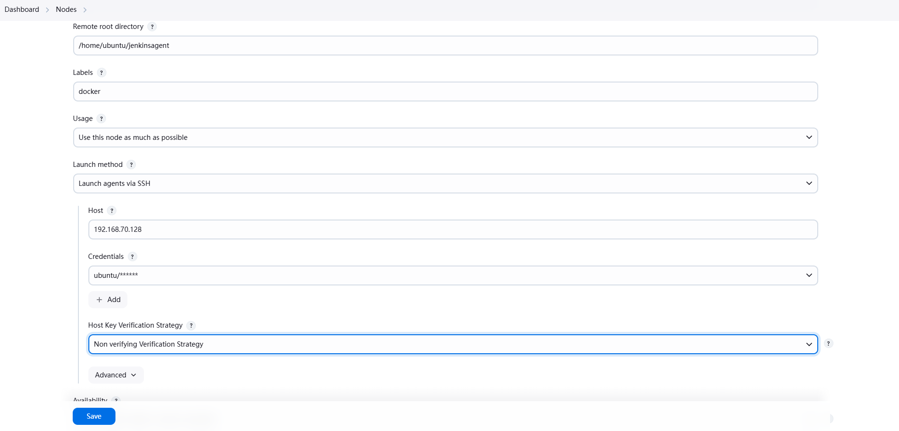

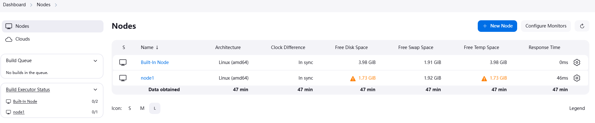

### 测试节点

创建一个Hello World Pipeline.
```shell
pipeline {
    agent {
        node {
            label 'docker'
        }
    }

    stages {
        stage('Hello') {
            steps {
                echo 'Hello World'
            }
        }
    }
}

```

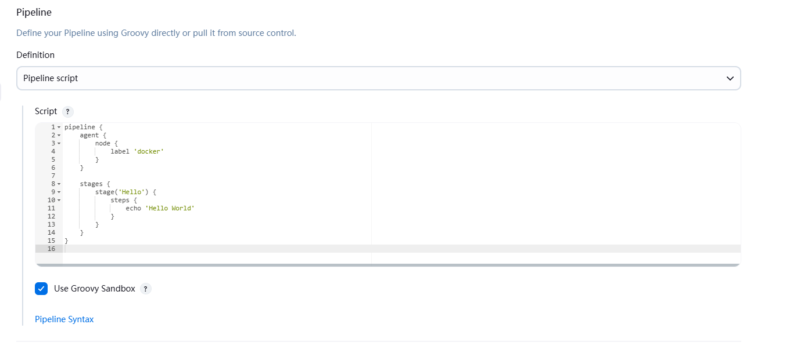

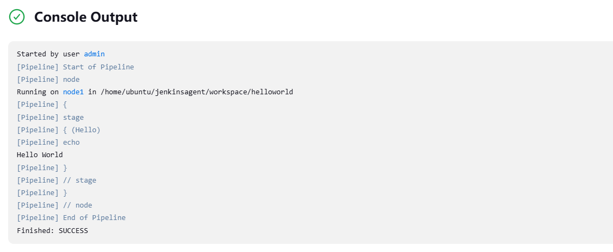