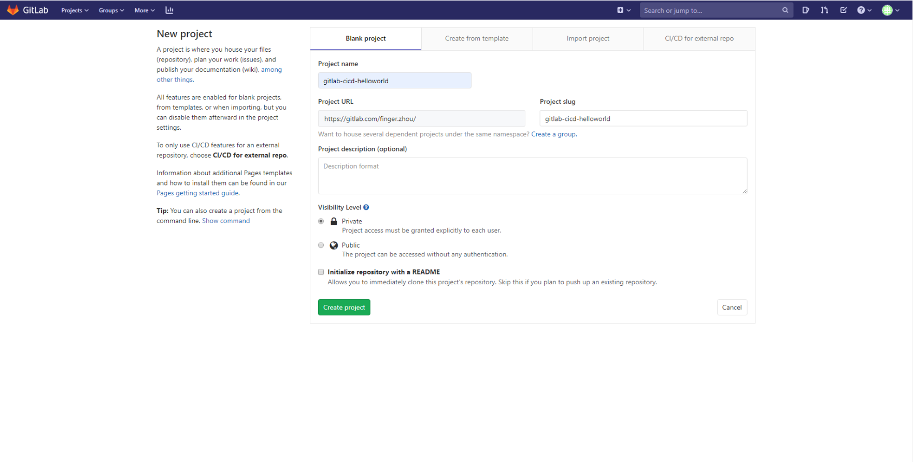
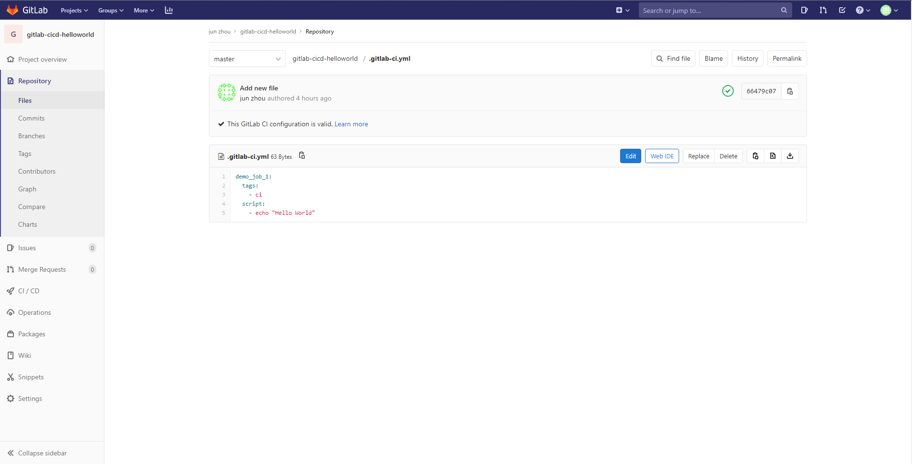
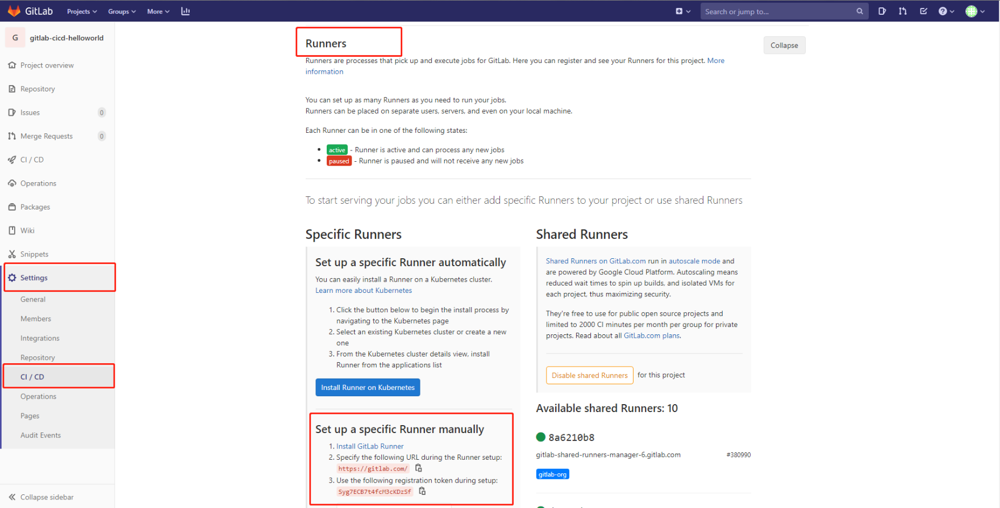
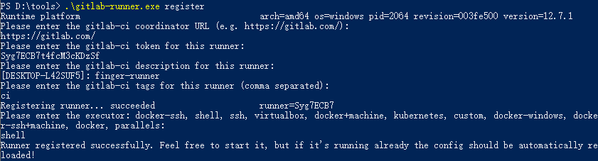
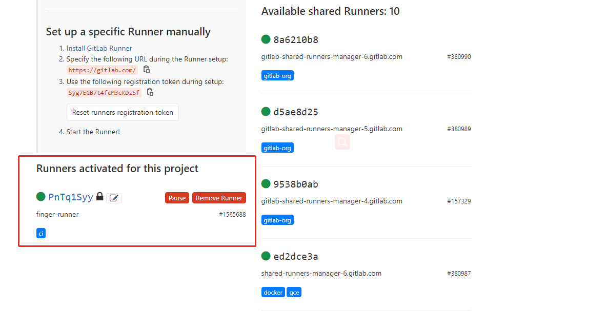
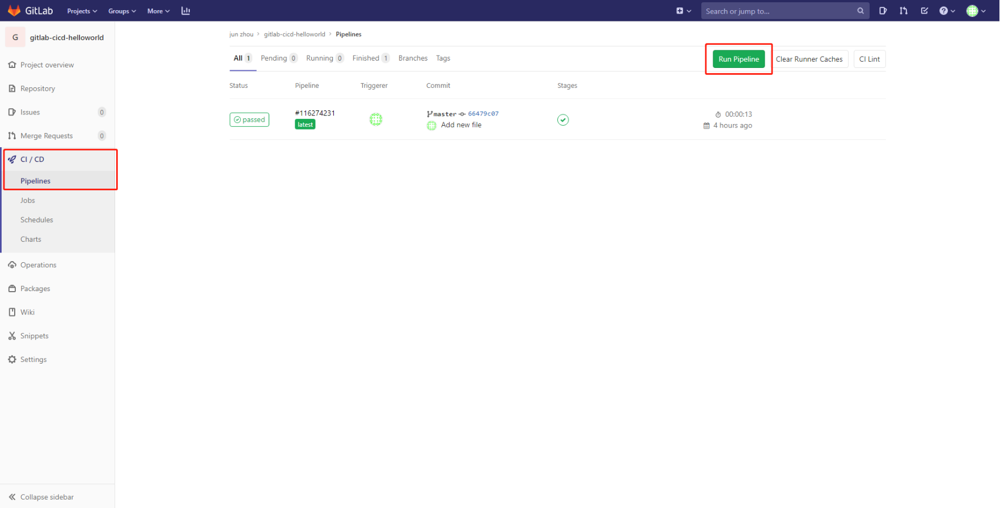
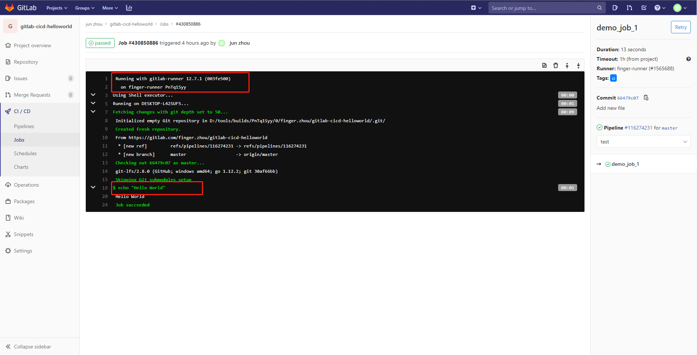

---

title: GitLab最佳实践--CI/CD之Hello World
date: 2020-02-15 18:11:52
slug: gitlab-install-and-maintance
tags:
  - GitLab
  - Git
  - IAC
categories:
  - IAC
  - CICD
  
---

## CI / CD 方法论简介
软件开发的连续方法基于自动化脚本，以最大程度地减少在开发应用程序时引入错误的机会。从开发新代码到部署新代码，甚至根本不需要干预。

它涉及到在每次小的迭代中就不断地构建，测试和部署代码更改，从而减少了基于错误或失败的先前版本开发新代码的机会。

此方法主要有三种，我们可以根据自己项目的实际情况进行应用。

### 持续集成
考虑一个应用程序，其代码存储在GitLab的Git存储库中。开发人员每天都要多次推送代码更改。对于每次向存储库的推送，您都可以创建一组脚本来自动构建和测试您的应用程序，从而减少了向应用程序引入错误的机会。

这种做法被称为持续集成；对于提交给应用程序（甚至是开发分支）的每个更改，它都会自动连续地构建和测试，以确保所引入的更改通过您为应用程序建立的所有测试，准则和代码合规性标准。

GitLab本身就是使用持续集成作为软件开发方法的一个示例。对于项目的每一次推送，都有一组检查代码的脚本。

### 持续交付
持续交付是超越持续集成的一步。您的应用程序不仅会在推送到代码库的每次代码更改时都进行构建和测试，而且，作为附加步骤，即使部署是手动触发的，它也可以连续部署。

此方法可确保自动检查代码，但需要人工干预才能从策略上手动触发更改的部署。

### 持续部署
类似于持续交付，持续部署也是超越持续集成的又一步。不同之处在于，您无需将其手动部署，而是将其设置为自动部署。部署您的应用程序完全不需要人工干预。


## GitLab CI / CD简介 
GitLab CI/CD是GitLab内置功能，它提供了强大的项目管理和集成功能，并且提供了可视化界面。可以很方便的实现持续集成，交付与部署。并且无需第三方应用程序。

### GitLab CI / CD 工作流简介
Step1、我们需要把项目源代码托管到GitLab仓库。
Step2、在项目根目录新建 .gitlab-ci.yml。在此文件，编写我们需要运行的脚本内容(例如：依赖项，执行顺序，触发方式等)。
Step3、将该项目注册到可以运行的GitLab Runner。

GitLab会自动检测 .gitlab-ci.yml文件，并根据该文件的内容进行触发，并执行脚本内容。

### 第一个例子 --  Hello World

在GitLab官网( [https://gitlab.com](https://gitlab.com/) )注册一个账号。当然我们也可以使用自己搭建的GitLab(参考上一篇文章《GitLab最佳实践 -- 安装与维护》)

Step1、新建一个项目gitlab-cicd-helloworld。




Step2、新建 .gitlab-ci.yml，增加以下内容：
```
demo_job_1:
  tags:
    - ci
  script:
    - echo "Hello World"
```



Step3、安装和注册GitLab Runner。本例使用的是Windows系统。 传送门：https://docs.gitlab.com/runner/install/windows.html 

进入项目Settings --> CD / CD菜单，找到Runners配置信息。



执行命令：.\gitlab-runner.exe register。Runnner注册成功后，回到设置界面刷新后，将会看到绿色圆点标记的可用Runnners。





Step4、验证我们的 .gitlab-ci.yml脚本。进入CI / CD菜单。点击 Run Pipeline按钮。开始执行脚本。最终我们将在页面上看到详细的执行过程输出。





### 参考
- https://docs.gitlab.com/ee/ci/introduction/
- https://docs.gitlab.com/runner/install/windows.html