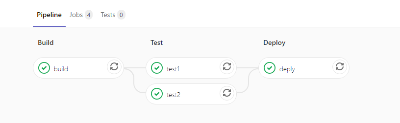
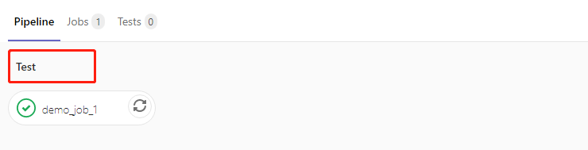

---

title: GitLab最佳实践--CI/CD之Pipeline(一)
date: 2020-02-16 18:11:52
slug: gitlab-cicd-pipeline-1
tags:
  - GitLab
  - Git
  - IAC
categories:
  - IAC
  - CICD
  
---


从CI / CD -- HelloWorld的例子中我们知道 .gitlab-ci.yml文件定义了Pipeline的结构和顺序。GitLab Runner根据Pipeline的结构和顺序执行任务。接下来我们看下面一个例子。

```
stages:
 - build
 - test
 - deploy

build:
  stage: build
  script:
    - echo "build job"
  tags:
    - docker

test1:
  stage: test
  script:
    - echo "test1 job"
  tags:
    - docker

test2:
  stage: test
  script:
    - echo "test2 job"
  tags:
    - docker

deply:
  stage: deploy
  script:
    - echo "deploy job"
  tags:
    - docker
```

### stages（阶段）
保留关键字，定义了Pipeline的全部阶段。同一阶段内的任务并行执行。全部执行成功后开始下一阶段任务。任何阶段内任意任务执行失败都会导致Pipeline失败。所有阶段内的任务都执行成功后Pipeline才会显示passed。否则显示failed。如果未定义stages，则默认有build、test、deploy三个阶段，如果未定义stage，则默认test阶段。

上述例子我们定义了标准的三个阶段：build, test, deploy。它们的执行顺序为：build => test => deploy。接着我们定义了每个阶段相应的任务。其中test阶段定义了两个任务test1和test2。那么它们将并行执行。


### jobs (任务)
任务名字必须是唯一的。可以自定义，但是不能使用保留关键字。如：
- stages
- stage
- script
- before_script
- after_script
- variables
- cache
- image
- tags

#### stage (阶段)
任务的stage属性值(可选)，必须是全局stages定义的值。该属性值决定该任务的执行顺序。如果未定义该属性。默认为test。这里我们回看一下Hello World的例子。
```
demo_job_1:
  tags:
    - ci
  script:
    - echo "Hello World"
```



#### script（脚本）
script是任务里面唯一必须的属性关键字。这里编写了Gitlab Runner执行的shell命令。
```
job:
  script: echo "This is test job"
```
如果需要执行多行命令：
```
job:
  script: 
    - echo "This is the first command"
    - echo "This is the second command"
```
注意：有时script命令将需要用单引号或双引号引起来。例如，包含冒号（:）的命令需要用引号引起来，以便YAML解析器知道将整个内容解释为字符串而不是“键：值”对。使用特殊字符时要小心： ":，{，}，[，]，,，&，*，#，?，|，-，<，>，=，!，%，@，`"。

如果任何脚本命令返回的退出代码都不为零，则该作业将失败，并且其他命令将不再执行。通过将退出代码存储在变量中，可以避免此行为：
```
job:
  script:
    - false && true; exit_code=$?
    - if [ $exit_code -ne 0 ]; then echo "Previous command failed"; fi;
```

### tags  (标签)
tags 定义了允许执行该任务的GitLab Runner。上述例子中 tags：docker。则会从所有注册的Runner列表中找到tags定义为docker的Runner来执行脚本。
```
Please enter the gitlab-ci tags for this runner (comma separated):
docker
Registering runner... succeeded                     runner=Hk2ao24y
```

tags也可以指定多个标签。例如我们希望job运行在 linux和docker两个标签的Runner执行。
```
job:
  tags:
    - linux
    - docker
```

以上，包括了GitLab CI/CD Pipeline的基本结构和流程。关于更多Pipeline的用法，我们将在接下的文章中继续分享。