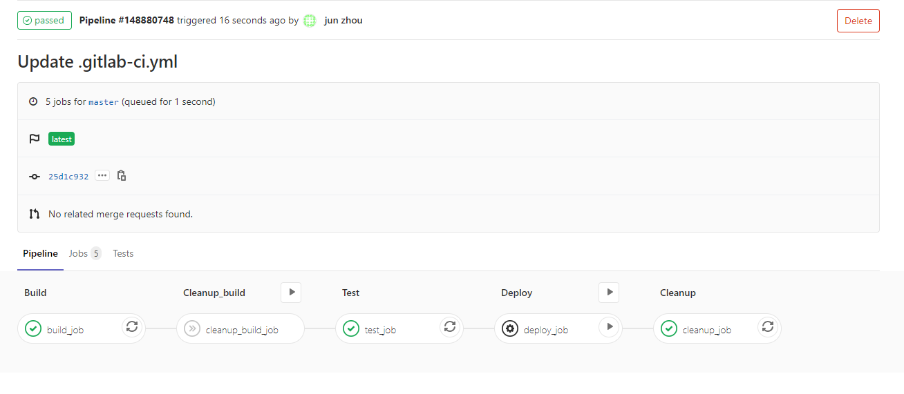
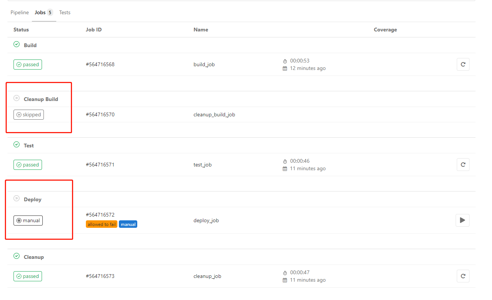
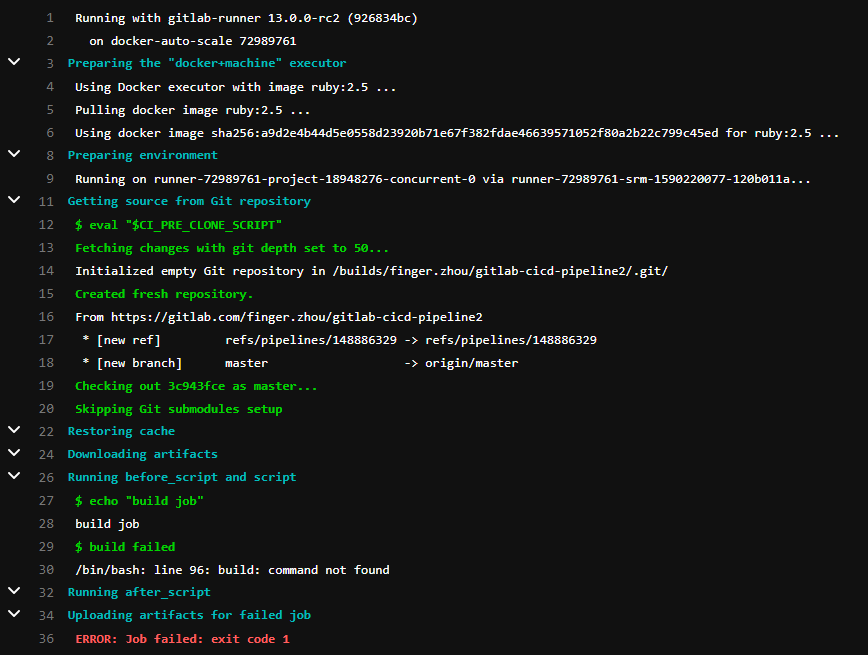
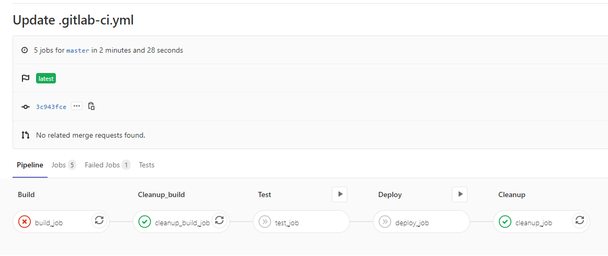
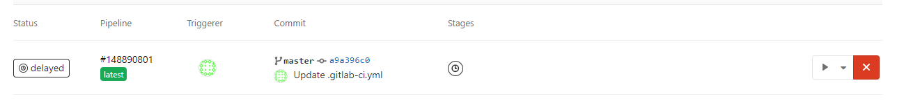
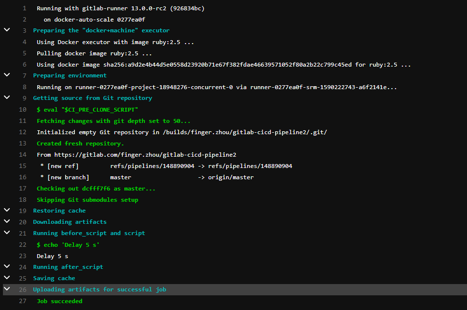

---

title: GitLab最佳实践--CI/CD之Pipeline(二)
date: 2020-02-17 18:11:52
slug: gitlab-cicd-pipeline-2
tags:
  - GitLab
  - Git
  - IAC
categories:
  - IAC
  - CICD
  
---

```
stages:
  - build
  - cleanup_build
  - test
  - deploy
  - cleanup
    
build_job:
  stage: build
  script:
    - echo "build job"

cleanup_build_job:
  stage: cleanup_build
  script:
    - echo "cleanup build job"
  when: on_failure

test_job:
  stage: test
  script:
    - echo "test job"

deploy_job:
  stage: deploy
  script:
    - echo "deploy job"
  when: manual

cleanup_job:
  stage: cleanup
  script:
    - echo "cleanup job"
  when: always
```

以上为Pipeline Job属性when 的例子。

##  When
When 用于定义目标Job在前面阶段Job执行完成后，根据其结果来选择是否执行。它可以配置属性值为：
- on_success 当该任务前面所有阶段任务都执行成功后，才执行该任务。为默认值。
- on_failure 当该任务前面至少有一个阶段任务失败时，才执行该任务。
- always 无论前面阶段任务执行结果如何。都会执行该任务。
- manual 手动执行该任务。
- delayed 延迟执行任务。

根据上面例子的Pipeline脚本定义。执行情况应该是：

Step1. 执行build_job。如果成功，则跳过clean_build_job。

Step2. test_job没有设定触发条件，默认是on_success。所以当build_job成功后，则会执行。

Step3.  deploy_job设定为手动执行。

Step4. cleanup_job 无论之前阶段的成功与失败，都会执行。





为了能触发cleanup_build_job。我们修改一下build_job脚本，让它失败。
```
build_job:
  stage: build
  script:
    - echo "build job"
    - build failed

```


从上图我们可以看到build_job执行失败了。我们再看一下整个Pipeline的执行情况。




### delayed
延迟任务，在指定某个时间后才执行。使用start_in属性来设置时间。默认时间单位为秒。start_in 的时间设定必须小于或者等于一星期。有效值为：
- '5'
- 10 seconds
- 30 minutes
- 1 day
- 1 week

```
test_when_delay_job:
  script: echo 'Delay 5 s'
  when: delayed
  start_in: 5 seconds

```



