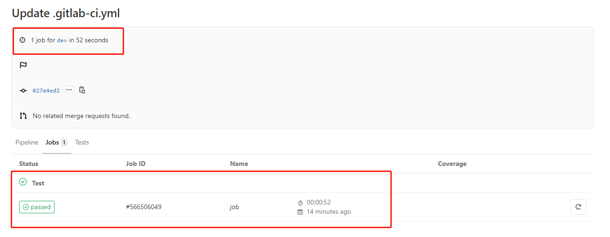

---

title: GitLab最佳实践--CI/CD之Pipeline(三)
date: 2020-02-18 18:11:52
slug: gitlab-cicd-pipeline-3
tags:
  - GitLab
  - Git
  - IAC
categories:
  - IAC
  - CICD
  
---


## Rules

Rules是用于定义Pipeline Job的触发规则。可用的属性有：
- if
- changes
- exists 

```
job:
  script: 
    - echo 'Hello, Rules'
  rules:
    - if: '$CI_MERGE_REQUEST_TARGET_BRANCH_NAME == "dev"'
      when: always
    - when: manual
```

在上述例子中，如果匹配 if 条件内容，则按照 when:always规则执行。即当分支为dev时，只要commit就会触发该任务。否则，按照when:manual规则执行，任务变成手动触发。

a、满足第一个条件，在dev分支，执行commit。pipeline任务正常执行。



b、不满足第一个条件，在master分支，执行commit。pipeline任务变成手动模式。


### rules:if 

语法类似于编程语言的if，else条件语句。
多个if语句为：

```
  rules:
    - if: Condition 1          
      when: always
    - if: Condition 2
      when: manual
    ...
    - when: on_success 
```

也可以使用逻辑运算符：逻辑与(&&) 和 逻辑或(||)
例如：
```
job:
  script: "echo Hello, Rules!"
  rules:
    - if: '$CI_MERGE_REQUEST_SOURCE_BRANCH_NAME =~ /^feature/ && $CI_MERGE_REQUEST_TARGET_BRANCH_NAME == "master"'
      when: always
    - if: '$CI_MERGE_REQUEST_SOURCE_BRANCH_NAME =~ /^feature/'
      when: manual
    - if: '$CI_MERGE_REQUEST_SOURCE_BRANCH_NAME'
```

### rules:changes
可以定义某一个文件或者多个文件数组中文件发生变化，则触发该任务执行。

```
job:
  script: 
    - echo 'Hello, Rules'
  rules:
    - changes:
      - README.md
      when: manual
    - when: always
```


```
job:
  script: 
    - echo 'Hello, Rules'
  rules:
    - changes:
      - README.md
      - test/*
      when: manual
    - when: always

```

### rules:exists

定义某一个文件存在或者路径中的任何一个文件存在，则触发该任务执行。
```
job:
  script: 
    - echo 'Hello, Rules'
  rules:
    - exists:
      - Dockerfile
```

添加文件Dockerfile。触发Job执行。


使用正则表达式，匹配路径下多个文件。
```
job:
  script: 
    - echo 'Hello, Rules'
  rules:
    - exists:
      - test/*
```
**注意：出于性能考虑，exists与正则模式匹配限制为10000个检查。第10000次检查后，将会始终匹配。**