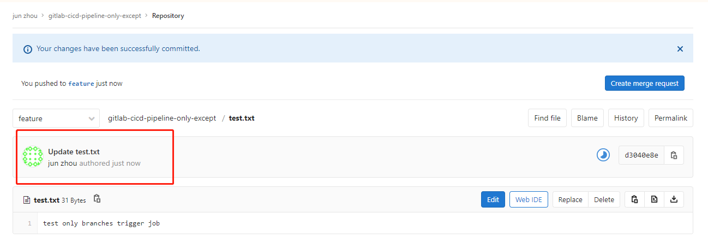
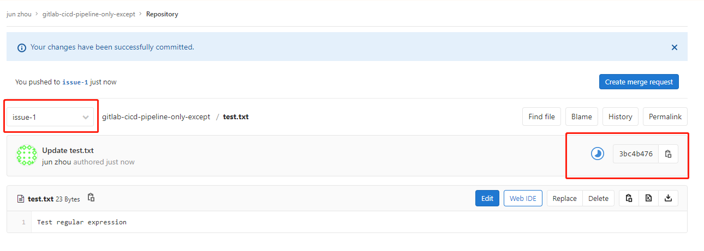

---

title: GitLab最佳实践--CI/CD之Pipeline(四)
date: 2020-02-20 18:11:52
slug: gitlab-cicd-pipeline-4
tags:
  - GitLab
  - Git
  - IAC
categories:
  - IAC
  - CICD
  
---


## Only / Except

only 和 except用于定义Pipeline Job应该什么时候执行或者不执行。

- only 定义需要执行的分支或标签
- except 定义不执行的分支或标签

以下为用法规则：
1. only和except如果都存在在一个Pipepline Job声明中，则所需引用(ref)将会被only和except所定义的分支过滤.
2. only和except允许使用正则表达式
3. only和except允许使用指定仓库地址，但是不forks仓库

only和except 允许使用的特殊关键字：

| 值             | 描述                                                         |
| -------------- | ------------------------------------------------------------ |
| branches       | 当目标分支执行push操作时                                     |
| tags           | 当目标分支打tag标记时                                        |
| api            | 当一个pipeline被另一个pipeline api所触发时                   |
| external       | 当使用了GitLab以外的外部CI服务，如Jenkins                    |
| pipelines      | 针对多项目触发器而言，当使用CI_JOB_TOKEN并使用gitlab所提供的api创建多个pipelines的时候 |
| pushes         | 当pipeline被用户的git push操作所触发的时候                   |
| schedules      | 针对预定好的pipline而言                                      |
| triggers       | 用token创建pipline的时候                                     |
| web            | 在GitLab页面上pipeline标签页下，点击Run Pileline按钮时       |
| merge_requests | 当用户发起合并请求时                                         |
| chat           | 对于使用GitLab ChatOps命令时                                 |

接下来看一个简单的例子，定义一个仅在feature分支才触发job，而其他分支都不执行。
```
job:
  script: 
    - echo 'Hello, Only / Except'
  only:
    - feature
```

添加test.txt文件后，可以看到job开始执行。



再来看一个使用正则表达式的例子。
```
job:
  script: 
    - echo 'Test regular expression'
  only:
    - /^issue-.*$/
```


默认情况，区分大小写。可以使用 i 忽略大小写。

```
job:
  script: 
    - echo 'Test regular expression'
  only:
    - /^issue-.*$/i
```

设置多个only触发关键字条件。仅在打Tags标记时，或者被API触发，或者任务构建时。
```
job:
  script: 
    - echo 'Test use multiple special keywords'
  only:
    - tags
    - triggers
    - schedules
```

再看一个 except 的例子。除了master和develop分支，其他分支触发Job

```
job:
  script: 
    - echo 'Test except'
  except:
    - master
    - develop
```

only和except结合的例子。在下面例子中job将只会运行以 issue- 开始的refs(分支)，然而except中指定分支不能执行，所以这个job将不会执行。
```
job:
  # use regexp
  only:
    - /^issue-.*$/
  # use special keyword
  except:
    - branches
```

注意：
- 当一个作业没有定义 only 规则时，其默认为 only: ['branches', 'tags'] 
- 如果一个作业没有定义 except 规则时，则默认 except 规则为空

下面这个两个例子是等价的:
```
job:
  script: echo 'test'
```
转换后:
```
job:
  script: echo 'test'
  only: ['branches', 'tags']
```

## 参考

- https://docs.gitlab.com/ee/ci/yaml/
- https://meigit.readthedocs.io/en/latest/gitlab_ci_.gitlab-ci.yml_detail.html#only-except
- https://www.webq.top/doc/ci