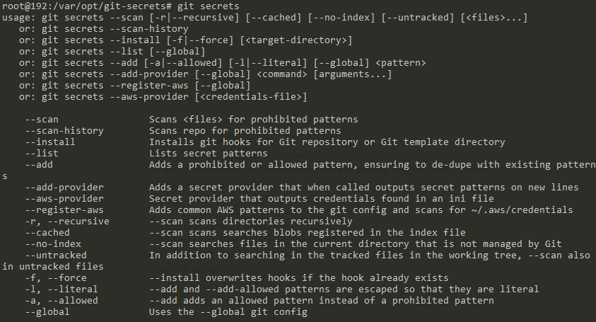
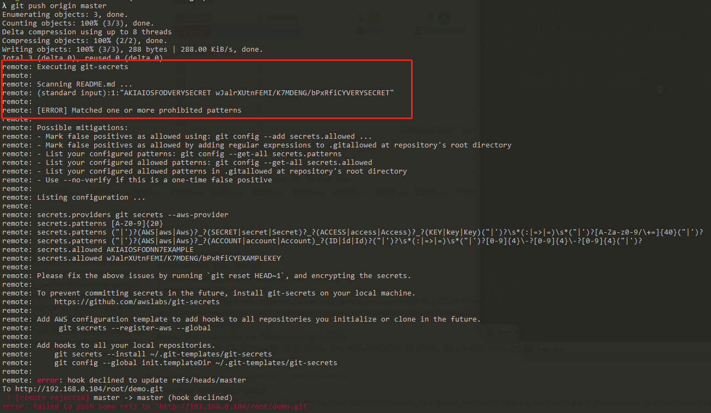

---

title: GitLab最佳实践--服务器端使用git-secrets
date: 2020-02-22 18:11:52
slug: gitlab-server-using-git-secrets
tags:
  - GitLab
  - Git
  - IAC
categories:
  - IAC
  - Security
  
---

## GitLab 服务器端使用git-secrets

随着互联网的快速发展，信息安全问题也变得越来越重要，对于代码仓库管理员来说，我们需要通过代码扫描工具防止开发者将企业系统中的账号密码和其他敏感信息提交到Git仓库。从而避免这些敏感信息泄露到互联网。

AWS的git-secrets（https://github.com/awslabs/git-secrets)。提供了一种扫描代码文件的方法。下面我分享一下我们项目组使用git-secrets的一些经验。

起初，我们要求所有开发在本地安装git-secrets工具，这样能使他们在commit/push代码的时候及时发现代码中是否存在敏感信息，若是存在则会阻止代码推送到Git服务器仓库。真的这样是一种很好的方式。但是在实施的过程中还是存在开发人员将敏感信息写在代码中，并且上传到GitHub（是的，最早我们没有自建代码仓库，使用了GitHub私有仓库）。

后来，我们搭建了私有GitLab，将GItHub代码仓库迁移到了GitLab。并且在GitLab服务器安装git-secrets。通过编写扫描脚本，定时扫描所有代码仓库，将扫描结果以邮件形式发送给所有开发人员。

```python
def scan_all_repository():
    root = "/var/opt/gitlab/git-data/repositories"
    cmd = "find {} -name '*.git'".format(root)
    status_code, output = subprocess.getstatusoutput(cmd)
    result = []
    if status_code == 0:
        files = output.split("\n")
        total = len(files)
        for idx, name in enumerate(files):
            if idx % 10 == 0:
                print("[{}] This is {}/{}".format(datetime.datetime.now(), idx, total))
            os.chdir(name)
            cmd = "git secrets --scan-history {}".format(name)
            status_code, output = subprocess.getstatusoutput(cmd)
            if status_code == 1:
	            result.append("****************************************************")
                result.append("name: {}".format(name))
                result.append(output)
        print("[{}] Total: {}".format(datetime.datetime.now(), total))
    return "\n".join(result)
```
这种方式也很好，但并不是最佳的做法，因为客户端始终可以将敏感信息提交到服务器的代码仓库。

最后，我们采用Git Hooks的方式，在GitLab服务器使用git-secrets。如果开发人员在客户端没有进行git-secrets扫描，我们在服务器进行git-secretes扫描。若是代码中存在敏感信息，将阻止客户端的push操作。

接下来我们详细介绍GitLab如何集成git-secretes。

### 1、进入服务器Gitlab Docker容器。安装git-secrets。
```bash
docker exec -it gitlab /bin/bash

apt-get -y update \
    && apt-get -y install build-essential \
    && git clone https://github.com/awslabs/git-secrets /var/opt/git-secrets \
    && cd /var/opt/git-secrets \
    && make install
```


### 2、编写Git Hooks脚本
```bash
# git-secrets.sh

#!/usr/bin/env bash

refname=$1
oldrev=$2
newrev=$3

echo "Executing git-secrets"
echo ""

# use git-secrets aws-provider git configuration
HOME=/opt/git-hooks

# add git-secrets to path
PATH=$PATH:/usr/local/bin

# handle empty repository
if [ "$oldrev" = "0000000000000000000000000000000000000000" ]; then
  oldrev=4b825dc642cb6eb9a060e54bf8d69288fbee4904
fi

for i in $(git show $newrev:.gitallowed 2>/dev/null); do
  git secrets --add --allowed $i;
done

exitcode='0'
FILES=`git diff --name-status $oldrev $newrev | awk '{print $2}'`
for filepath in $FILES; do
  if [ "$filepath" = ".gitallowed" ]; then
    echo "Skipping $filepath ..."
  else
    echo "Scanning $filepath ..."
  fi
  git show $newrev:$filepath | git secrets --scan -
  result=$?
  if [ "$result" != "0" ]; then
    exitcode=$result
  fi
done

if [ "$exitcode" != "0" ]; then
    echo ""
    echo "Listing configuration ..."
    echo ""
    git secrets --list
    echo ""
    echo "Please fix the above issues by running \`git reset HEAD~1\`, and encrypting the secrets."
    echo ""
    echo "To prevent committing secrets in the future, install git-secrets on your local machine."
    echo "    https://github.com/awslabs/git-secrets"
    echo ""
    echo "Add AWS configuration template to add hooks to all repositories you initialize or clone in the future."
    echo "     git secrets --register-aws --global"
    echo ""
    echo "Add hooks to all your local repositories."
    echo "    git secrets --install ~/.git-templates/git-secrets"
    echo "    git config --global init.templateDir ~/.git-templates/git-secrets"
    echo ""
    exit 1
fi
```

### 3、配置 gitconfig
```
# .gitconfig

[user]
        name = GitLab
        email = xxx
[core]
        autocrlf = input
[gc]
        auto = 0
[secrets]
	providers = git secrets --aws-provider
	patterns = [A-Z0-9]{20}
	patterns = (\"|')?(AWS|aws|Aws)?_?(SECRET|secret|Secret)?_?(ACCESS|access|Access)?_?(KEY|key|Key)(\"|')?\\s*(:|=>|=)\\s*(\"|')?[A-Za-z0-9/\\+=]{40}(\"|')?
	patterns = (\"|')?(AWS|aws|Aws)?_?(ACCOUNT|account|Account)_?(ID|id|Id)?(\"|')?\\s*(:|=>|=)\\s*(\"|')?[0-9]{4}\\-?[0-9]{4}\\-?[0-9]{4}(\"|')?
	allowed = <access-key-id>
	allowed = <access-key-secret>
```

### 4、将上述文件复制到指定目录
```bash
cp .gitconfig /opt/git-hooks/
cp git-secrets.sh /opt/git-hooks/update.d/
chown -R git:git /opt/git-hooks
```

### 5、修改gitlab配置文件。
```bash
vim /etc/gitlab/gitlab.rb

gitlab_shell['custom_hooks_dir'] = '/opt/git-hooks'
```

### 6，重启Gitlab。
```bash
docker restart gitlab
```

重启后，我们用示例敏感信息测试一下。
```bash
echo "<test-access-key-id> <test-access-key-secret>" > README.md
git add README.md
git commit -m "Test gitlab server side git-secrets"
git push origin master
```




### 参考：
- https://github.com/dhoer/gitlab-secrets