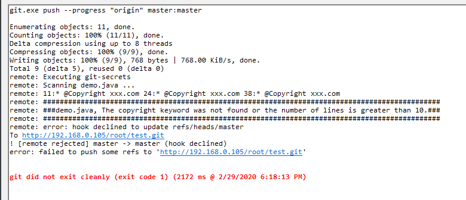

---

title: GitLab最佳实践--强制代码包含版本信息
date: 2020-02-25 18:11:52
slug: gitlab-code-header-include-copyright
tags:
  - GitLab
  - Git
  - IAC
categories:
  - IAC
  - Security
  
---

## 需求概述

要求开发人员上传的代码文件头部必须包含版权信息，否则阻止代码上传到Git仓库。

## 解决方案

还是基于Git Hooks的方式，在服务器端通过脚本控制Git Push的内容。

## 具体思路

1、获取到Git 提交的文件以及文件内容。

2、过滤文件后缀，检索文件内容，匹配关键字信息(如 Copyright)。并获取到关键字所在的文件行数。

3、具体逻辑判断，例如：Copyright必须在文件内容前10行以内。

## 代码实现

```bash
exitcode='0'
FILES=`git diff --name-status $oldrev $newrev | awk '{print $2}'`
# 遍历客户端Git Push的文件
for filepath in $FILES; do
  if [ "$filepath" = ".gitallowed" ]; then
    echo "Skipping $filepath ..."
  else
    echo "Scanning $filepath ..."
  fi
  # 获取文件后缀名
  suffix="${filepath##*.}"
  if [ "${suffix}" = "py" ] || [ "$suffix" = "java" ] || [ "$suffix" = "cs" ] || [ "$suffix" = "js" ]; then
    # 检索文件内容，匹配关键字信息
    linenum=`git show $newrev:$filepath | grep -n -i "Copyright" | head -1 | cut -d ":" -f 1`
    if [ $linenum -le 10 ]; then
      echo $linenum
    else
      echo `git show $newrev:$filepath | grep -n -i "Copyright"`
      echo "###############################################################################################"
      echo "###$filepath, The copyright keyword was not found or the number of lines is greater than 10.###"
      echo "###############################################################################################"
      exit 1
    fi
  fi
  # 通过 git secretes 扫描敏感信息
  git show $newrev:$filepath | git secrets --scan -
  result=$?
  if [ "$result" != "0" ]; then
    exitcode=$result
  fi
done
```

