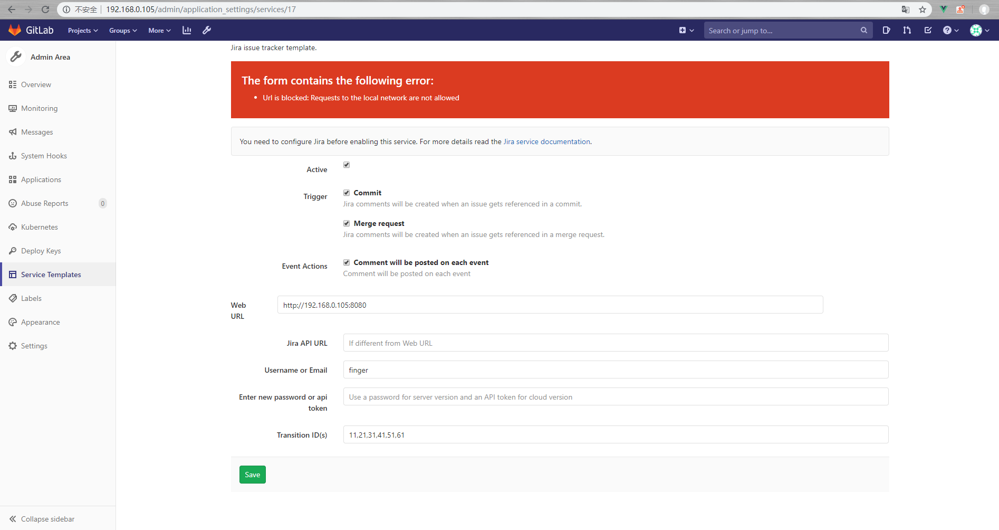

---

title: GitLab最佳实践--集成JIRA
date: 2020-02-28 18:11:52
slug: gitlab-integrate-jira
tags:
  - GitLab
  - Git
  - IAC
categories:
  - IAC

---

## 为什么要集成JIRA

JIRA是项目管理的工具，GitLab是代码的管理工具，将两者集成可以实现项目管理和开发的结合。开发人员的每一次代码变更都可以反应到JIRA ISSUE的comment中。并且生成相互关联的链接。大大方便了相关问题跟踪。另外开发人员也可以直接通过Git commit 关闭 JIRA ISSUE。 简化了在JIRA上的操作。

## 如何集成

### 配置JIRA

为GitLab创建一个拥有访问权限的JIRA账号或者是API Token。本文以API Token为例。

### 配置GitLab

找到项目菜单 Settings => Integrations => Project services => Jira。

勾选服务选项，填写JIRA的配置信息。然后点击保存，激活JIRA服务。

以上是在某一个具体项目配置JIRA。如果我们有几十，几百个项目，则可以在Admin菜单Service Templates配置JIRA ，这样以后新创建的代码仓库都会自动激活JIRA服务。不必要每个项目都重复操作一遍。(如果是已经存在的未激活JIRA服务的项目，则Service Template没有效果，需要重新在项目内激活)

如果JIRA是本地服务，会提示网络错误。

需要在管理员界面，配置允许本地访问，加上本地IP地址。

### 测试集成
在JIRA创建Project 和 Issue。

在GitLab提交一个新文件。comment 必须带有JIRA ISSUE的ID(GJI-1)。

我们回到JIRA ISSUE ID的详情页面。一切ok的情况下，comment会有GitLab的变更记录。

最后我们测试一下通过在提交和合并请求中使用触发词，直接关闭JIRA ISSUE。
目前支持三个触发词：
- Resolves PROJECT-1
- Closes PROJECT-1
- Fixes PROJECT-1

