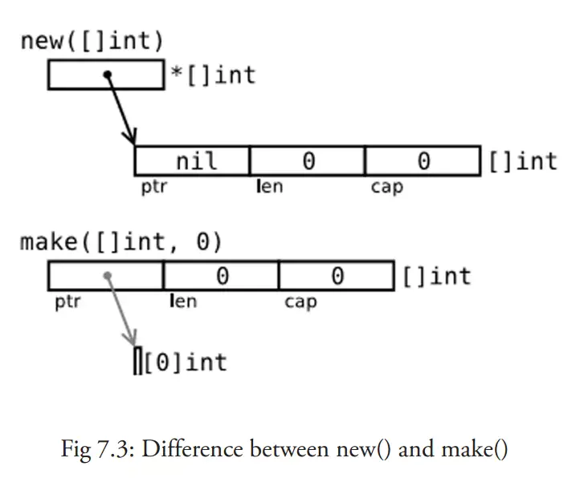

---

title: Go基础--Make和New
date: 2020-07-20 09:44:52
slug: go-basic-make-and-new
tags:
  - Go
categories:
  - Go

---

## make 和 new
make和new都是用于初始化，但是二者有很大差异：

-make 的作用是初始化内置的数据结构，例如切片，哈希和Channel
-new 的作用是根据传入的类型分配内存，并返回指向该内存的指针

重点：*make只用于map, slice, channel的内存分配，返回有初始值的类型本身，new用于所有类型的分配，new返回指针*

### make

```go
slice := make([]int, 0, 100)
hash := make(map[int]bool, 10)
ch := make(chan int, 5)
```

### new

```go
i := new(int)

# 等于

var v int
i := &v
```

new 和 make 内存分配图：

