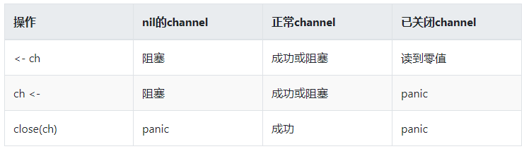
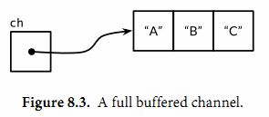
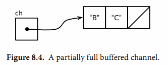

---

title: Go基础--管道Channel
date: 2021-02-26 17:27:52
slug: go-basic-channel
tags:
  - Go
categories:
  - Go

---

## Channel
Channel 是Goroutine之间的一种通信机制。这种通信机制有个专业名词叫CSP （ Communicating Sequential Process）即通信顺序进程，是一种并发编程模型。Goroutine 和 Channel 分别对应 CSP 中的实体和传递信息的媒介，Goroutine 之间会通过 Channel 传递数据。

### 设计原理
在很多主流的编程语言中，多个线程传递数据的方式一般都是共享内存，为了解决线程之间的资源竞争，我们需要限制同一时间能够获取资源的线程数量。


在Go语言中则设计成：不通过共享内存的方式进行通信，而是通过通信的方式共享内存。


上图中的两个 Goroutine，一个会向 Channel 中发送数据，另一个会从 Channel 中接收数据，它们两者能够独立运行并不存在直接关联，但是能通过 Channel 间接完成通信。

### 声明
```go
ch := make(chan int)

# 设置缓冲大小
ch := make(chan int, 100)
```

### 类型
它包括三种类型的定义。可选的<-代表channel的方向。如果没有指定方向，那么Channel就是双向的，既可以接收数据，也可以发送数据。
```go
ChannelType = ( "chan" | "chan" "<-" | "<-" "chan" )

chan T          // 可以接收和发送类型为 T 的数据
chan<- float64  // 只可以用来发送 float64 类型的数据
<-chan int      // 只可以用来接收 int 类型的数据
```

### 基本操作
channel 存在3种状态：
- nil，未初始化的状态，只进行了声明，或者手动赋值为nil。
- active，正常的channel，可读或者可写
- closed，已关闭，千万不要误认为关闭channel后，channel的值是nil

channel可进行的3种操作：
- 读
- 写
- 关闭

把这3种操作和3种channel状态可以组合出9种情况：




对于nil通道的情况，也并非完全遵循上表，有1个特殊场景：当nil的通道在select的某个case中时，这个case会阻塞，但不会造成死锁。

### 常用操作
#### 使用 for range 读取 channel
使用for-range读取channel，这样既安全又便利，当channel关闭时，for循环会自动退出，无需主动监测channel是否关闭，可以防止读取已经关闭的channel，造成读到数据为channel所存储的数据类型的零值。

```go
package main

import (
  "fmt"
  "time"
)

func main() {
	go func() {
		time.Sleep(1 * time.Hour)
	}()
	c := make(chan int)
	go func() {
		for i := 0; i < 10; i = i + 1 {
			c <- i
		}
		close(c)
	}()
	for i := range c {
		fmt.Println(i)
	}
	fmt.Println("Finished")
}

```

#### 使用_, ok 判断channel是否关闭
读取已关闭的channel会得到零值，如果不确定channel，需要使用ok进行监测。

- ok==true，读取数据，并且channel没有关闭
- ok==false，通道关闭，无数据可读

```go
if v, ok := <- ch; ok {
    fmt.Println(v)
}
```
#### 使用select处理多个channel

select语句选择一组可能的send操作和receive操作去处理。它类似switch,但是只是用来处理通讯(communication)操作。
它的case可以是send语句，也可以是receive语句，亦或者default。

receive语句可以将值赋值给一个或者两个变量。它必须是一个receive操作。

最多允许有一个default case,它可以放在case列表的任何位置，尽管我们大部分会将它放在最后。

```go
package main

import "fmt"
func fibonacci(c, quit chan int) {
	x, y := 0, 1
	for {
		select {
		case c <- x:
			x, y = y, x+y
		case <-quit:
			fmt.Println("quit")
			return
		}
	}
}
func main() {
	c := make(chan int)
	quit := make(chan int)
	go func() {
		for i := 0; i < 10; i++ {
			fmt.Println(<-c)
		}
		quit <- 0
	}()
	fibonacci(c, quit)
}

```

#### 使用channel的声明严格控制读写权限

```go
package main

import (
	"fmt"
	"time"
)

func send(c chan<- int) {
	for i := 0; i < 10; i++ {
		fmt.Println("send readey ", i)
		c <- i
		fmt.Println("send ", i)
	}
}

func recv(c <-chan int) {
	for i := range c {
		fmt.Println("received ", i)
	}
}

func main() {
	c := make(chan int, 10)
	go send(c)
	go recv(c)
	time.Sleep(3 * time.Second)
	close(c)
}

```

#### 使用缓存channel增强并发

缓存channel内部有一个元素队列，队列的容量在创建channel的时候指定。

```go
ch = make(chan string, 3)
```


向缓存channel的发送操作就是向内部缓存队列插入元素，接受操作则是从队列的头部删除元素。如果内部缓存队列是满的。那么发送操作将阻塞知道另一个goroutine执行接受操作而释放了新的队列空间。相反，如果channel是空的，接受操作将阻塞，直到有另一个goroutine执行发送操作而向队列插入元素。

```
ch <- "A"
ch <- "B"
ch <- "C"
```
连续向channel发送三个值后，channel的缓存队列已满，如果再发送第四个值则会发生阻塞。



当从channel中接收一个值后，则channel的缓存队列就有了新的存储空间。
```
fmt.Println(<-ch) // "A"
```


使用cap函数可以获取channel缓存队列大小
```
fmt.Println(cap(ch)) // "3"
```

使用len函数可以获取缓存队列有效元素的个数
```
fmt.Println(len(ch)) // "2"
```


## 总结

- 向关闭的 channel 发送数据，会导致panic
- v, ok <- ch ; ok 为bool值，true表示正常接收，false表示通道关闭
- 所有的channel接收者都会在channel关闭时，立刻从阻塞等待中返回且上述ok值为false。这个广播机制经常被利用，进行向多个订阅者同时发送信号。如：退出信号。

## 参考
- https://segmentfault.com/a/1190000017958702
