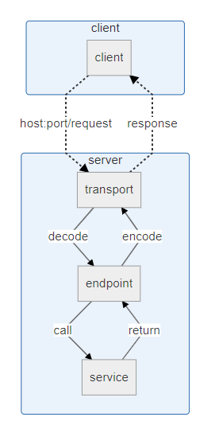
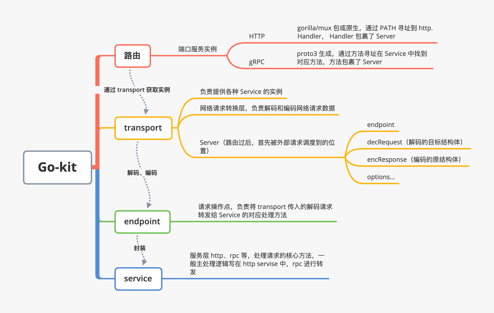

---

title: Go Package--gokit介绍
date: 2020-08-20 15:57:52
slug: go-package-gokit
tags:
  - Go
categories:
  - Go

---

## Go-kit介绍

Go kit 是用于在 Go 中构建微服务的编程工具包。用来解决了分布式系统和应用程序体系结构中的常见问题，让使用者可以专注于交付业务价值。

- 本身不是一个框架，而是一套微服务工具集，是框架的底层，用它的话来说，如果你希望构建一个框架，而Go-kit 就希望成为你的框架的一部分
- 可以用Go-kit 做适应自己平台的框架
- 它自身称为toolkit，并不是framework
- 它主要是为了满足5大原则，单一职责原则，开放原则，封闭原则，依赖倒置原则，接口隔离原则

### 三层模型

Go-kit最核心是提供了三层模型来解耦业务，这是我们用它的主要目的，模型由上到下分别是
transport -> endpoint -> service

- Transport 可以理解为是个拦截器，负责请求协议的实现和路由转发，请求和响应的序列化和反序列化

- Endpoint 负责功能逻辑转发，这一层会调用Service具体方法

- Service 服务功能具体实现，这样便于测试，只要 mock 传入的依赖参数即可

## 参考

- https://zhuanlan.zhihu.com/p/100226931?utm_source=wechat_session
- http://gokit.io/examples/stringsvc.html
- https://github.com/go-kit/kit