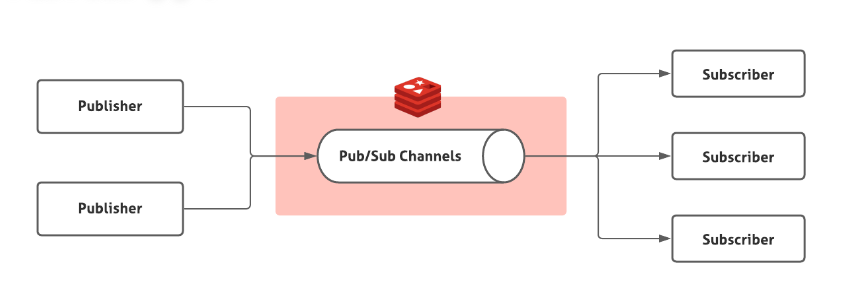

## 前言

发布/订阅是一种消息模式，其中发布者无需将消息发送给特定的接收者。这些消息由发布者发送到特定的频道(Channel)，接收者可以订阅一个或多个频道来使用这些消息。



今天我们用Go和Redis来实现Pub/Sub这样的消息模式。我们将创建两个服务。第一个服务是Pub，它是一个API，接受用户信息，并将用户信息发布到Redis。
第二个服务是Sub。它将订阅Redis的消息。并打印到控制台。


## 编码

主要使用到两个package

- [fiber](https://gofiber.io)  是一个基于Fasthttp（Go中最快的 HTTP 引擎）构建的 Go Web 框架。它旨在简化快速开发，无需分配内存，并且注重性能。用法和Nodejs Express类似。
- [go-redis](https://github.com/redis/go-redis) Go 语言实现的Redis客户端 SDK。

```bash
go get github.com/gofiber/fiber/v3
go get github.com/redis/go-redis/v9
```

### Pub

```go
package main

import (
	"context"
	"encoding/json"
	"github.com/gofiber/fiber/v3"
	"github.com/redis/go-redis/v9"
)

type User struct {
	Name  string `json:"name"`
	Email string `json:"email"`
}

var ctx = context.Background()

var redisClient = redis.NewClient(&redis.Options{
	Addr:     "localhost:6379",
	Password: "", // no password set
	DB:       0,  // use default DB
})

func main() {
	app := fiber.New()

	app.Post("/", func(c fiber.Ctx) error {
		user := new(User)

		if err := c.Bind().Body(user); err != nil {
			panic(err)
		}

		payload, err := json.Marshal(user)
		if err != nil {
			panic(err)
		}

		if err := redisClient.Publish(ctx, "send-user-data", payload).Err(); err != nil {
			panic(err)
		}

		return c.SendStatus(200)
	})

	app.Listen(":3000")
}

```

### Sub

```
package main

import (
	"context"
	"encoding/json"
	"fmt"

	"github.com/redis/go-redis/v9"
)

type User struct {
	Name  string `json:"name"`
	Email string `json:"email"`
}

var ctx = context.Background()

var redisClient = redis.NewClient(&redis.Options{
	Addr:     "localhost:6379",
	Password: "", // no password set
	DB:       0,  // use default DB
})

func main() {
	subscriber := redisClient.Subscribe(ctx, "send-user-data")

	user := User{}

	for {
		msg, err := subscriber.ReceiveMessage(ctx)
		if err != nil {
			panic(err)
		}

		if err := json.Unmarshal([]byte(msg.Payload), &user); err != nil {
			panic(err)
		}

		fmt.Println("Received message from " + msg.Channel + " channel.")
		fmt.Printf("%+v\n", user)
	}
}

```

## 测试

```bash
go run pub/main.go

    _______ __
   / ____(_) /_  ___  _____
  / /_  / / __ \/ _ \/ ___/
 / __/ / / /_/ /  __/ /    
/_/   /_/_.___/\___/_/          v3.0.0-beta.3
--------------------------------------------------
INFO Server started on:         http://127.0.0.1:3000 (bound on host 0.0.0.0 and port 3000)
INFO Total handlers count:      1
INFO Prefork:                   Disabled
INFO PID:                       27228
INFO Total process count:       1
```

```bash
curl --location 'localhost:3000' \
--header 'Content-Type: application/json' \
--data-raw '{
    "name":"finger",
    "email":"finger.zhou@gmail.com"
}'
```

```bash
go run sub/main.go
Received message from send-user-data channel.
{Name:finger Email:finger.zhou@gmail.com}
```

## 参考
- [1] https://dev.to/franciscomendes10866/using-redis-pub-sub-with-golang-mf9
