---

title: Testkube--介绍
date: 2024-01-11 07:30:04
slug: testkube-intro
tags:
  - k8s
  - Kubernetes
  - Testing
  - Testkube
categories:
  - Kubernetes
  - CloudNative

---

## Testkube是什么？

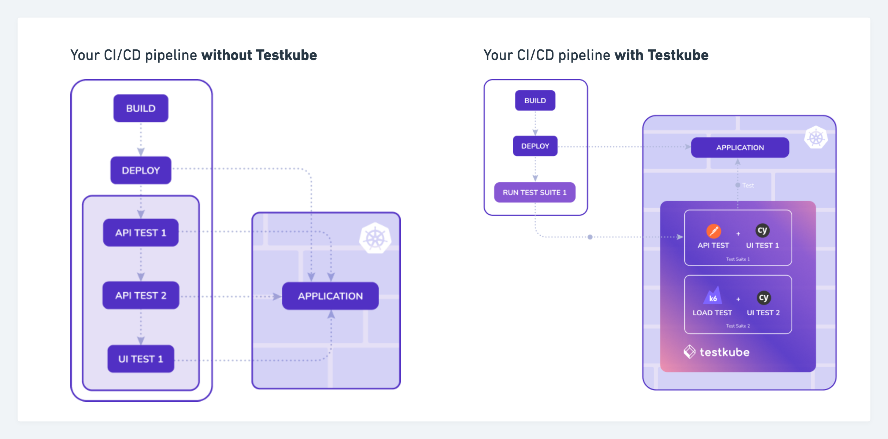

[Testkube](https://docs.testkube.io/) 是一个Kubernetes原生测试框架。它内置了当前主流的大多数测试工具，包括功能、性能、安全和合规性等。它可以直接在您的Kubernetes集群中运行这些测试工具。并且它很容易集成到你的CI/CD Pipeline中。另外它还提供了kubectl插件、UI和API的多种交互方式。

Testkube支持的测试工具和框架：

- cURL
- Cypress
- K6
- Maven
- Postman
- Gradle
- Pytest
- Prebuild Executor
- Container Executor
- ...

另外，Testkube支持创建自定义测试类型，称为Testkube容器执行器。它使您能够运行自己的容器映像来执行测试。

## 安装Testkube

使用Helm Chart安装

```bash

# Add the Kubeshop Helm repository.

helm repo add kubeshop https://kubeshop.github.io/helm-charts

# Install the testkube chart.

helm install --create-namespace my-testkube kubeshop/testkube -n testkube

```

## 创建测试 (Tests)

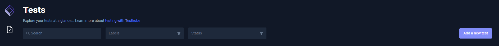


### 创建一个Curl测试

```bash
Type: curl/test
Source: String
```

```json
{
  "command": [
    "curl",
    "https://<your-domain>",
    "-H",
    "'Accept: application/json'"
  ],
  "expected_status": "200"
}
```

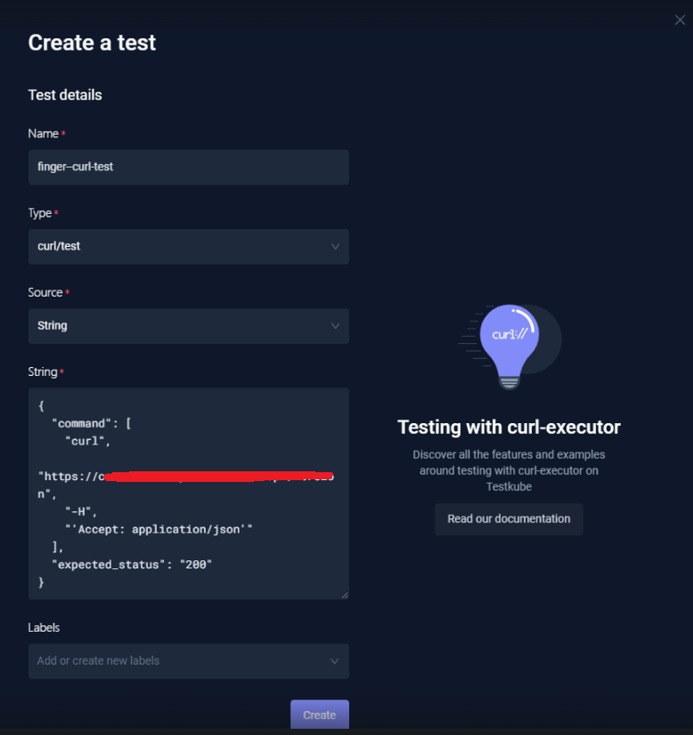

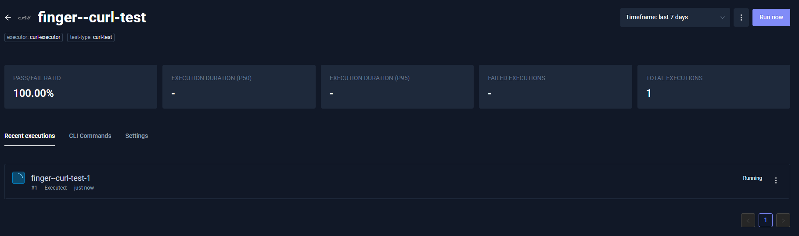

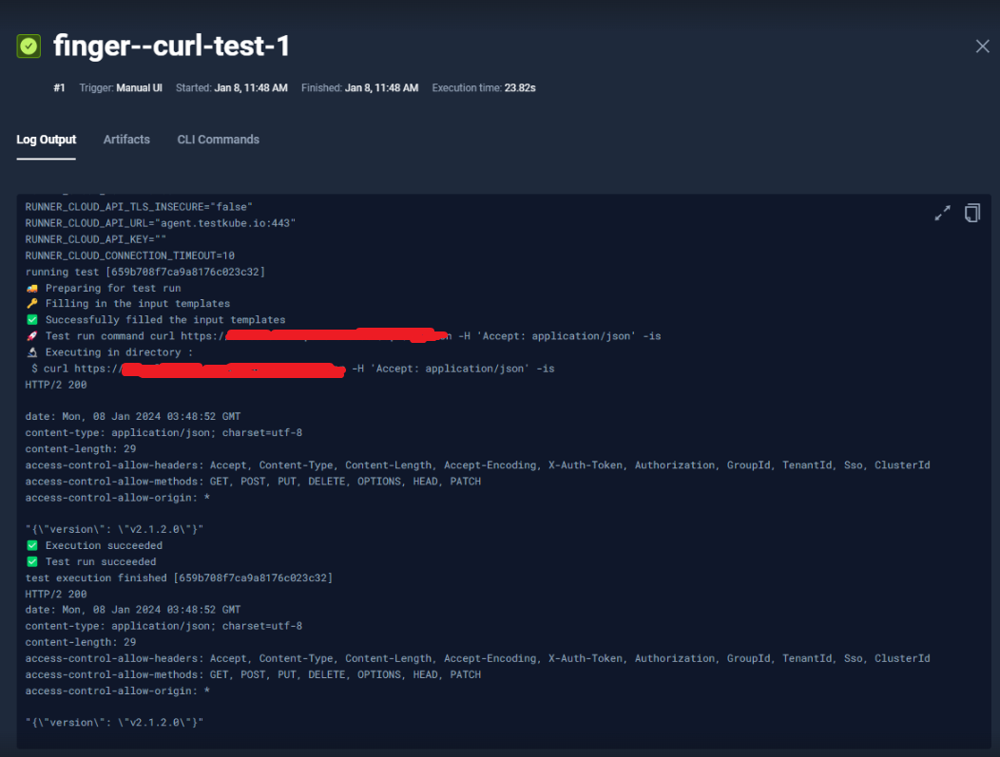


### 创建一个K6测试

```bash
Type: k6/script
Source: String
```

```js
import http from 'k6/http';
import { sleep } from 'k6';
export const options = {
  vus: 10,
  duration: '30s',
};
export default function () {
  http.get('http://test.k6.io');
  sleep(1);
}
```

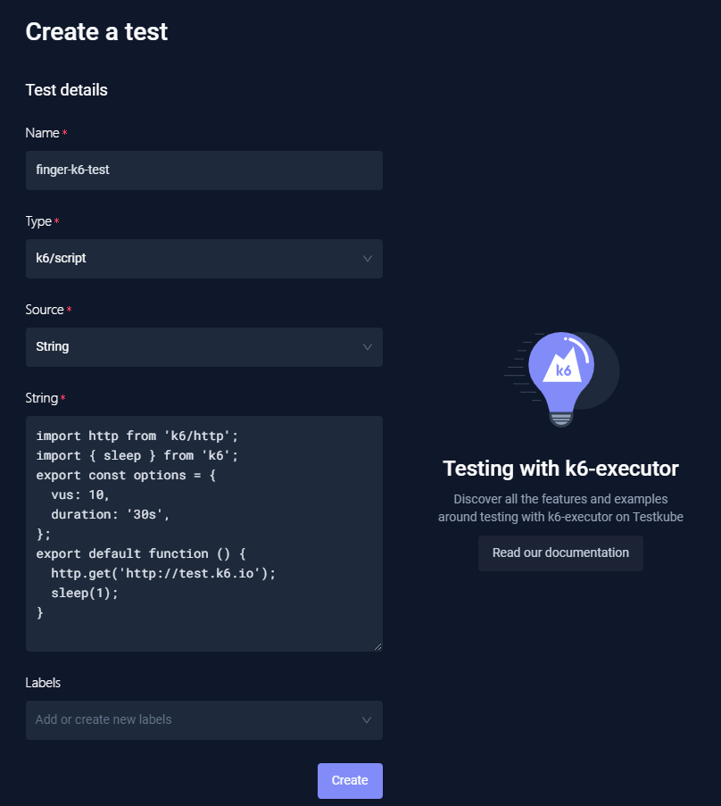

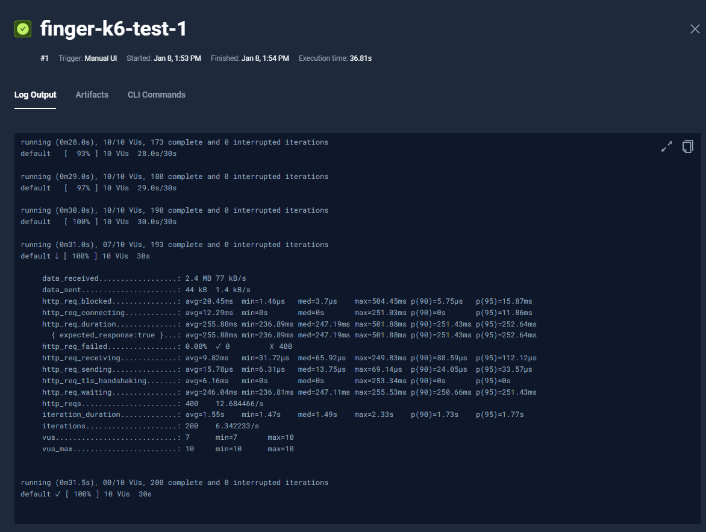

### 创建一个Cypress测试

```bash
Type: cypress/project
Source: Git
Git repository URI: https://github.com/kubeshop/testkube.git
Git Token: <Empty>
Git Username: <Empty>
Branch: main
Path: test/cypress/executor-tests/cypress-without-envs
```

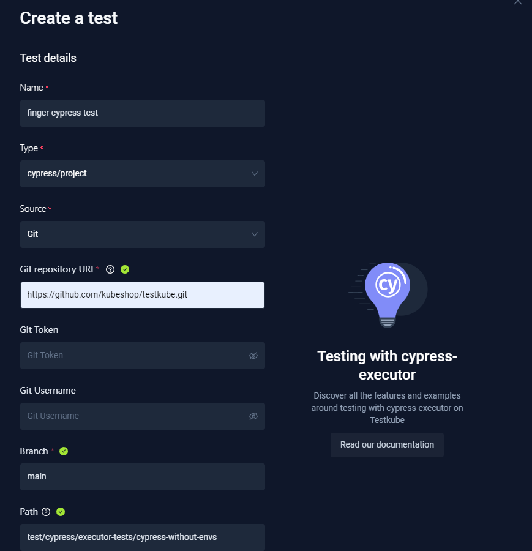

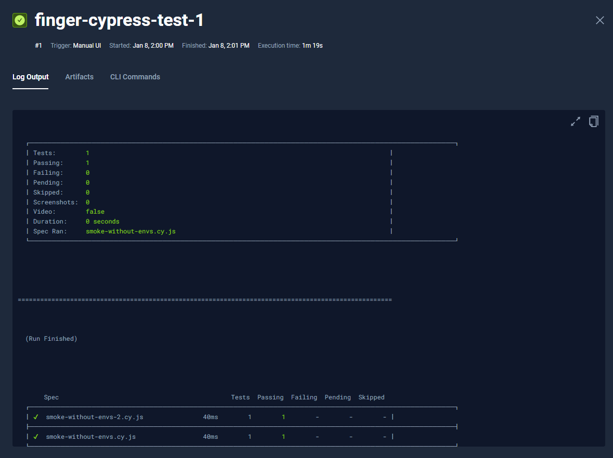

## 测试套件 (Test Suites)

测试套件 (Test Suites) 可以将测试用例按步骤进行编排，这些步骤可以顺序或者并行的运行，并且可以定义一个或者多个步骤。


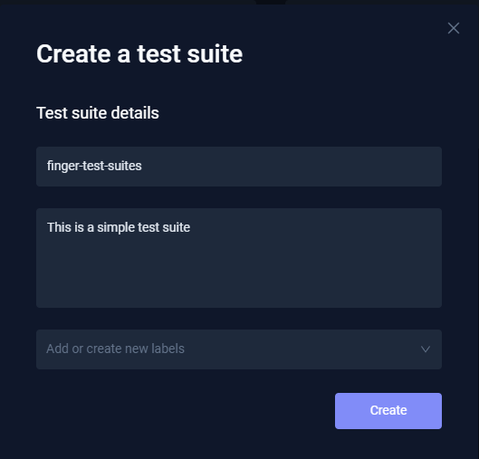

定义测试套件及其测试用例执行顺序。

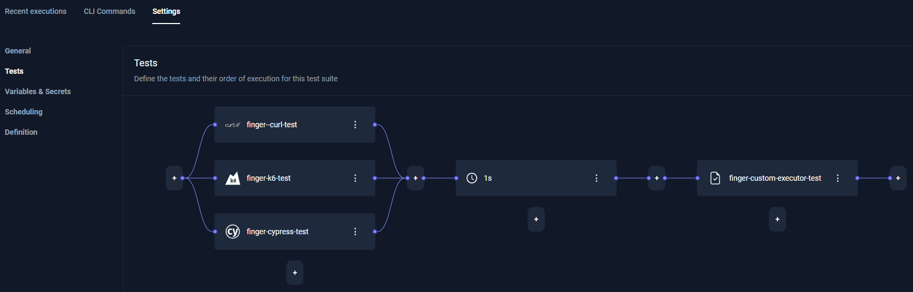

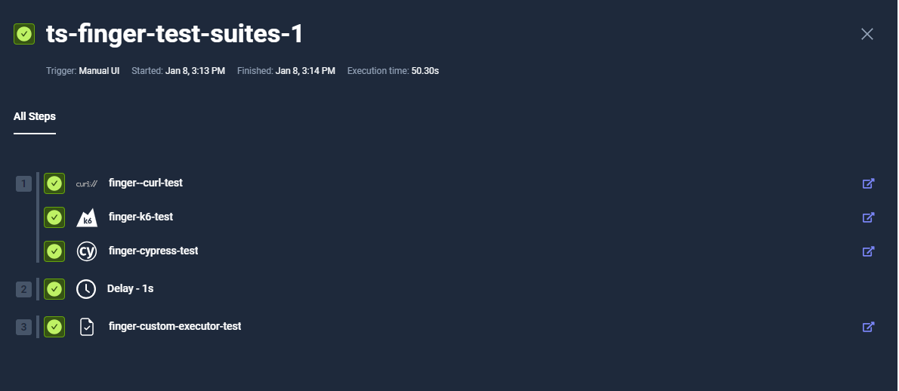


## API Endpoint

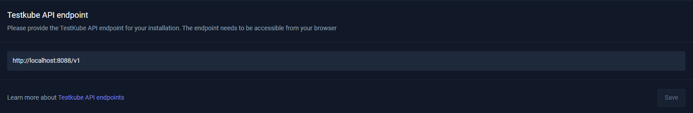

使用API创建一个测试

```bash

# POST http://localhost:8088/v1/tests

# Body
{
    "name": "test-api-create-new-test",
    "namespace":"testkube",
    "description":"this test is used for api",
    "type": "curl/test",
    "content": {
        "type": "string",
        "data": "{\n  \"command\": [\n    \"curl\",\n    \"https://<your-domain>\",\n    \"-H\",\n    \"'Accept: application/json'\"\n  ],\n  \"expected_status\": \"200\"\n}"
    },
    "labels": {
        "executor": "curl-executor",
        "test-type": "curl-test"
    }
}

```

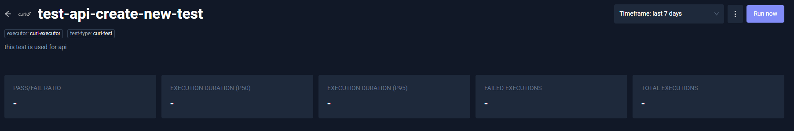


使用GitLab源创建测试

```bash
# POST http://localhost:8088/v1/tests

# Body
{
    "name": "test-api-create-new-test-gitlab",
    "namespace":"testkube",
    "description":"this test is used for api",
    "type": "k6/script",
    "content": {
        "type": "git",
        "repository": {
            "type": "git",
            "uri": "<your-gitlab-repos>",
            "branch": "master",
            "path": "script.js",
            "usernameSecret": {
                "name": "test-gitlab-k6-2-secrets",
                "key": "git-username"
            },
            "tokenSecret": {
                "name": "test-gitlab-k6-2-secrets",
                "key": "git-token"
            }
        }
    }
}

```

通过API获取一个测试用例

```bash
# GET localhost:8088/v1/tests/test-api-create-new-test

# Response
{
   "name":"test-api-create-new-test",
   "namespace":"testkube",
   "description":"this test is used for api",
   "type":"curl/test",
   "content":{
      "type":"string",
      "data":"{\n  \"command\": [\n    \"curl\",\n    \"<your-domain>\",\n    \"-H\",\n    \"'Accept: application/json'\"\n  ],\n  \"expected_status\": \"200\"\n}"
   },
   "created":"2023-12-11T05:51:53Z",
   "labels":{
      "executor":"curl-executor",
      "test-type":"curl-test"
   },
   "status":{
      "latestExecution":{
         "id":"3576a77f7ca9a8176c023be7",
         "number":9,
         "startTime":"2023-12-11T06:30:04Z",
         "endTime":"2023-12-11T06:30:08Z",
         "status":"passed"
      }
   }
}
```