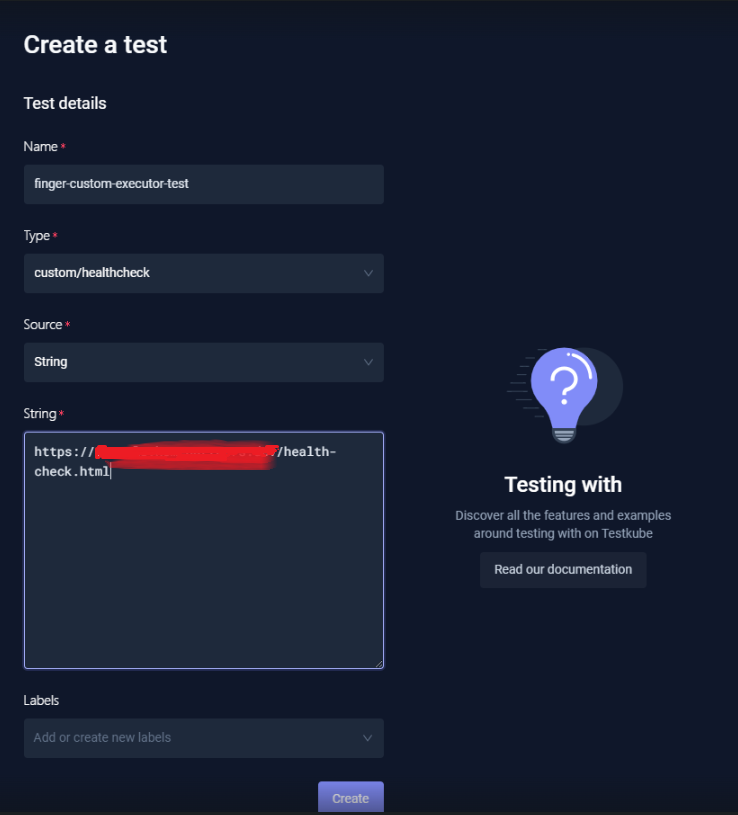
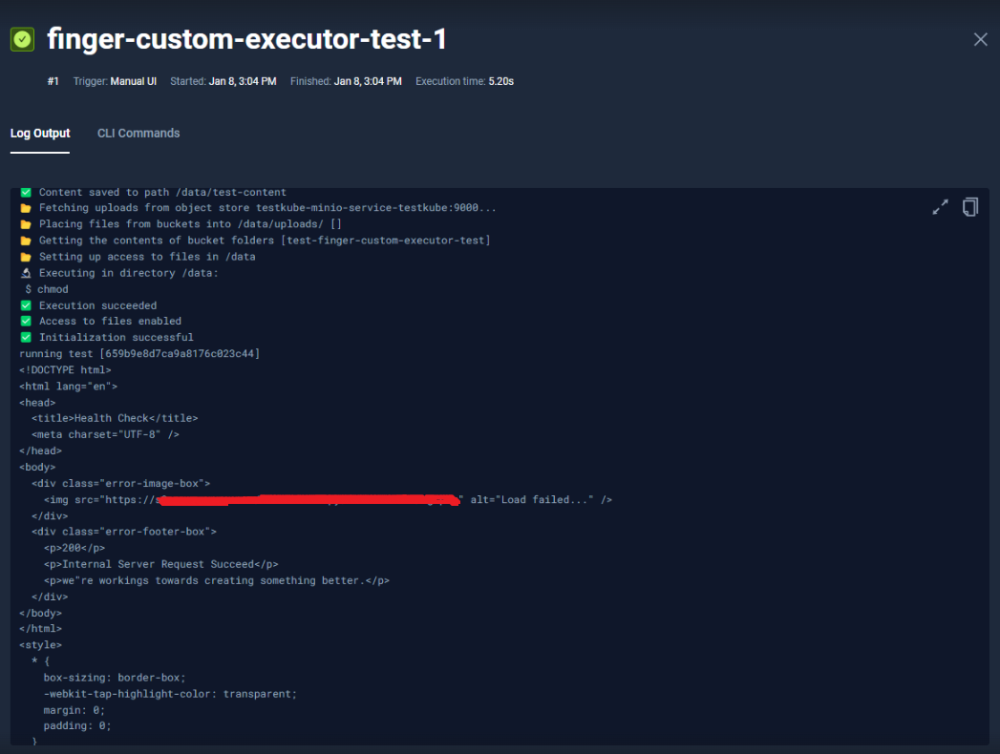

---

title: Testkube--创建自定义执行器
date: 2024-01-12 18:42:04
slug: testkube-custom-executor
tags:
  - k8s
  - Kubernetes
  - Testing
  - Testkube
categories:
  - Kubernetes
  - CloudNative

---

## 创建自定义执行器

`Testkube`自定义执行器可以自己创建或者使用模板创建.

```bash
git clone https://github.com/exu/testkube-executor-example
```

`Testkube`提供了帮助实现执行器的组件。 `Runner`接口是实现执行器的主要入口。

```go
type Runner interface {
 // Run takes Execution data and returns execution result
 Run(execution testkube.Execution) (result testkube.ExecutionResult, err error)
}
```

完整的`runner.go`文件

```go
package runner
import (
	"fmt"
	"io"
	"net/http"
	"github.com/kubeshop/testkube/pkg/api/v1/testkube"
	"github.com/kubeshop/testkube/pkg/executor/runner"
)
func NewRunner() *HealthcheckRunner {
	return &HealthcheckRunner{}
}
// Source: https://github.com/kubeshop/testkube-executor-example/blob/main/pkg/runner/runner.go
// ExampleRunner for template - change me to some valid runner
type HealthcheckRunner struct {
}
func (r *HealthcheckRunner) Run(execution testkube.Execution) (result testkube.ExecutionResult, err error) {
	// ScriptContent will have URI
	uri := ""
	if execution.Content != nil {
		uri = execution.Content.Data
	}
	resp, err := http.Get(uri)
	if err != nil {
		return result, err
	}
	defer resp.Body.Close()
	b, err := io.ReadAll(resp.Body)
	if err != nil {
		return result, err
	}
	// if get is successful return success result
	if resp.StatusCode == 200 {
		return testkube.ExecutionResult{
			Status: testkube.ExecutionStatusPassed,
			Output: string(b),
		}, nil
	}
	// else we'll return error to simplify example
	err = fmt.Errorf("invalid status code %d, (uri:%s)", resp.StatusCode, uri)
	return *result.Err(err), nil
}
// GetType returns runner type
func (r *HealthcheckRunner) GetType() runner.Type {
	return runner.TypeMain
}

```

## 部署自定义执行器

创建Dockerfile

```dockerfile
FROM golang:1.21
WORKDIR /build
COPY . .
ENV CGO_ENABLED=0 
ENV GOOS=linux
RUN cd cmd/agent;go build -o /runner -mod mod -a .
FROM alpine
RUN apk --no-cache add ca-certificates git
WORKDIR /root/
COPY --from=0 /runner /bin/runner
ENTRYPOINT ["/bin/runner"]
```

构建并推送镜像到仓库（这里用的是Amazon ECR）

```bash
docker build -t custom-testkube-executor . 
docker tag custom-testkube-executor:latest <your-ecr-uri>/custom-testkube-executor:latest
aws ecr get-login-password --region ap-southeast-1 | docker login --username AWS --password-stdin <your-ecr-uri>
docker push <your-ecr-uri>/custom-testkube-executor:latest
```

将运行器部署到 Kubernetes 集群中

```yaml
apiVersion: executor.testkube.io/v1
kind: Executor
metadata:
  name: custom-testkube-executor
  namespace: testkube
spec:
  executor_type: job
  image: <your-ecr-uri>/custom-testkube-executor:latest # pass your repository and tag
  types:
  - custom/healthcheck
```

## 创建并运行自定义执行器




