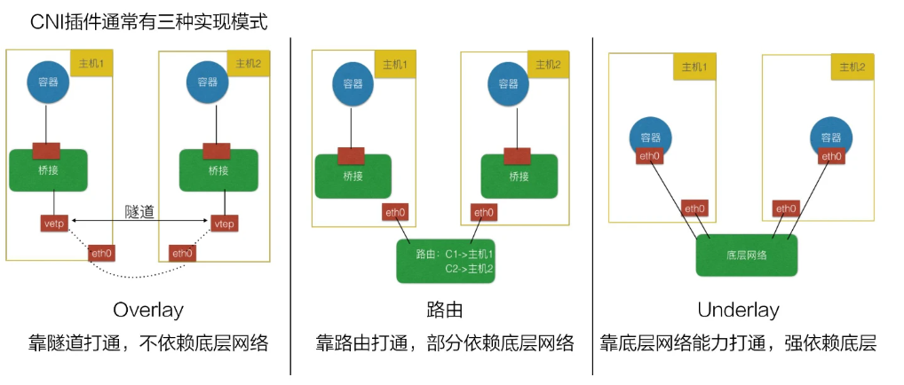
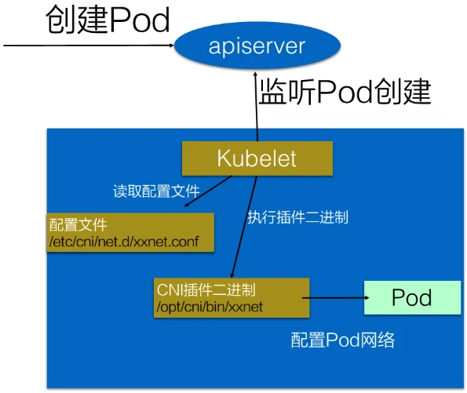

### 什么是CNI

CNI全程是Container Network Interface，它为容器提供了一种基于插件结构的标准化网络解决方案。以往，容器的网络层是和具体的底层网络环境高度相关的，不同的网络服务提供商有不同的实现。CNI从网络服务里抽象出了一套标准接口，从而屏蔽了上层网络和底层网络提供商的网络实现时间的差异。并且通过插件结构，它让容器在网络层的具体实现变的可插拔了，所以非常灵活。

通俗一点理解，我们可以将CNI看作是实现Kubernetes网络的一组规则，所有Kubernetes网络插件必须遵循这一组规则。

CNI的主要职责包括网络接口的创建和删除，IP地址的分配和回收，以及相关网络资源的配置和清理。

常见的CNI插件有：
- [Calico](https://www.tigera.io/project-calico/)
- [Flannel](https://github.com/flannel-io/flannel)
- [Cilium](https://cilium.io/)
- [Weave](https://www.weave.works/docs/net/latest/overview/)
- [更多](https://github.com/containernetworking/cni#3rd-party-plugins)

### 如何实现CNI

实现CNI插件，需要做那些事情呢？
- 创建 interfaces.
- 创建 veth pairs.
- 创建 networking namespace .
- 设置静态路由.
- 配置网桥.
- 分配IP.
- 创建 NAT 规则.

当删除和启动Pod时CNI必须支持四种操作：
- ADD -- 将容器添加到网络
- DEL -- 从网络中删除容器
- CHECK -- 如果容器的网络有问题，则返回错误
- VERSION -- 显示插件的版本

CNI插件主流的实现方案有三种

- **Overlay** 覆盖网络，指构建一个工作在真实底层网络之上的”逻辑网络“，把原始的Pod网络数据封包，再通过下层网络发送出去，到了目的地再拆包。因为这个特点，它对底层网络的要求低，适应性强，缺点就是有额外的传输成本，性能较低。（如：Flannel）
- **Route** 基于底层网络，但它没有封包和拆包，而是使用系统内置的路由功能来实现Pod 跨主机通信。它的好处是性能高，不过对底层网络的依赖性比较强，比如说要求底层网络有二层可达的一个能力。（如：Calico）
- **Underlay**  就是直接用底层网络来实现 CNI，也就是说 Pod 和宿主机都在一个网络里，Pod 和宿主机是平等的。它对底层的硬件和网络的依赖性是最强的，因而不够灵活，但性能最高。

### CNI的工作流程简述

#### 创建Pod

当一个新的 Pod 被创建时，kubelet 会调用 CNI 插件的 ADD 命令。CNI 插件会为 Pod 分配一个网络接口，并设置相关的网络配置，如 IP 地址和路由。这包括配置 Pod 的网络命名空间，使其能够与其他 Pod 进行通信。

#### 删除Pod

当 Pod 被删除时，kubelet 会调用 CNI 插件的 DEL 命令。CNI 插件会清理之前为该 Pod 分配的网络资源，如回收 IP 地址和删除网络接口。这一过程确保资源不会被浪费，并且系统能够持续高效地运行。

