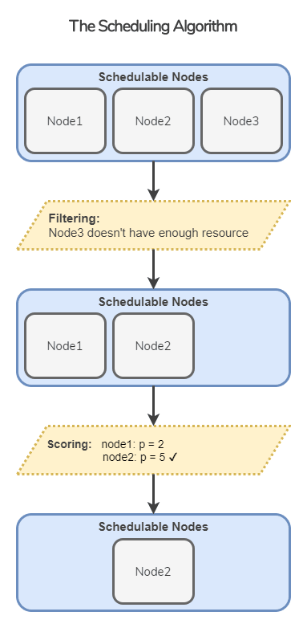
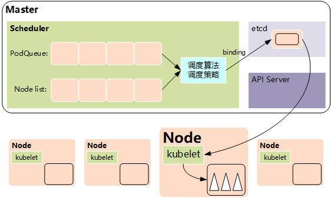

---

title: kube-scheduler介绍
slug: kube-scheduler-intro
date: 2021-10-29 17:13:00
tags:
  - k8s
  - kubernetes
categories:
  - kubernetes
---

## kube-scheduler 工作原理

scheduler工作流程基本上如下：

- scheduler维护待调度的`podQueue`并监听APIServer。

- 创建Pod时，我们首先通过APIServer将Pod元数据写入etcd。

- scheduler通过Informer监听Pod状态。添加新的Pod时，会将Pod添加到`podQueue`。

- 主程序不断从`podQueue`中提取Pods并按照一定的算法将节点分配给Pods。

- 节点上的kubelet也侦听ApiServer。如果发现有新的Pod已调度到该节点，则将通过CRI调用高级容器运行时来运行容器。

- 如果scheduler无法调度Pod，则如果启用了优先级和抢占功能，则首先进行抢占尝试，删除节点上具有低优先级的Pod，然后将要调度的Pod调度到该节点。如果未启用抢占或抢占尝试失败，则相关信息将记录在日志中，并且Pod将添加到`podQueue`的末尾。

  

## kube-scheduler 调度流程

kube-scheduler 给一个 pod 做调度选择包含两个步骤：

1. 过滤：将所有满足 Pod 调度需求的 Node 选出来。如果没有合适的Node，则 Pod  不可调度。
2. 打分：调度器会为 Pod 从所有可调度节点中选取一个最合适的Node。根据打分规则，调度器会给每一个可调度节点进行打分。

最后，kube-scheduler 会将 Pod 调度到得分最高的 Node 上。如果存在多个得分最高的 Node，kube-scheduler 会从中随机选取一个。

## 默认的kube-scheduler

默认的kube-scheduler有两个特点：

1. 以单个Pod为粒度
2. 调度的最优性只存在于调度完成的那一刻，后续随着新的节点增加，新的Pod增加或减少，当初的调度决策可能已经不是最优。

对于第一点，这决定了默认的调度器无法满足大数据，AI等领域的要求。因而社区涌现了诸多专门用于任务类的调度器。比如 [kube-batch](https://github.com/kubernetes-sigs/kube-batch)

## 参考

- [1] https://zhuanlan.zhihu.com/p/339762721

- [2] http://www.4k8k.xyz/article/u012798391/112414129