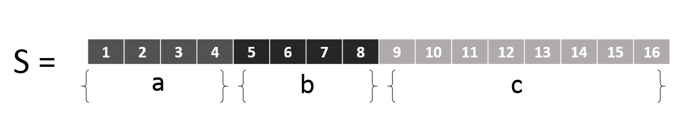

---

title: 位运算的最佳实践
author: Finger
date: 2018-07-15 14:30:00
tags:
  - Python
categories:
  - Python
---


问：假设 S由a, b, c三个数值组成, S的大小为2个字节(Byte)。已知S的值。求解a, b, c分别是多少？
其中a = 4 Bit, b = 4 Bit, c = 8 Bit。(a >= 0, b >= 0, c >= 0)

解：

如图所示：


- a 为前4 Bit，则a = S >> 12
- b 为a后4 Bit，则b = S >> 8 & 0b1111
- c 为最后8 Bit, 则c = S & 0b11111111

假定S = 10086，则：

```
>>> S = 10086
>>> a = S >> 12
>>> b = S >> 8 & 0b1111
>>> c = S & 0b11111111
>>> print(a, b, c)
2 7 102
```

验证一下：

```
>>> a = 2
>>> b = 7
>>> c = 102
>>> S = (a << 12) + (b << 8) + c
>>> S
10086
```


