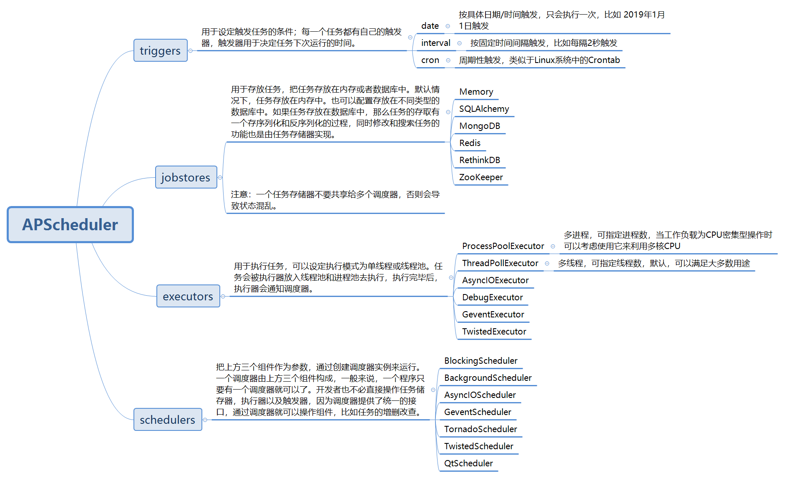

### 简介

 APScheduler是类似Quartz的一个Python定时任务框架，实现了Quartz的所有功能，使用起来十分方便。提供了基于日期、固定时间间隔以及crontab类型的任务，并且可以持久化任务。如果将任务持久化到数据库中，那么它们也将在调度程序在重新启动后继续运行并保持其状态。重启启动调度程序后，它将运行它在脱机时运行的所有任务。

 除此之外，APScheduler还可以用作特定于平台的调度程序（如cron守护程序或Windows任务调度程序）的跨平台，特定于应用程序的替代程序。但请注意，APScheduler本身不是守护程序或服务，也不附带任何命令行工具。它主要用于在现有应用程序中运行。也就是说，APScheduler确实为我们提供了一些构建块来构建调度程序服务或运行专用的调度程序进程。

 官方地址：https://github.com/agronholm/apscheduler



### 使用

#### 简单例子
```python
#!usr/bin/env python3
# -*- coding:utf-8 _*-

from datetime import datetime
import time
import os

from apscheduler.schedulers.background import BackgroundScheduler


def tick():
    print('Tick! The time is: %s' % datetime.now())


if __name__ == '__main__':
    # 1、创建后台执行的 schedulers
    scheduler = BackgroundScheduler()
    # 2、添加调度任务，触发器选择 interval(间隔)，每隔3秒执行一次
    scheduler.add_job(tick, 'interval', seconds=3)
    # 3、启动调度任务
    scheduler.start()
    print('Press Ctrl+{0} to exit'.format('Break' if os.name == 'nt' else 'C'))

    try:
        # This is here to simulate application activity (which keeps the main thread alive).
        while True:
            time.sleep(2)
    except (KeyboardInterrupt, SystemExit):
        # Not strictly necessary if daemonic mode is enabled but should be done if possible
        scheduler.shutdown()
```

**`jitter`**: 振动参数，给每次触发添加一个随机浮动秒数，一般适用于多服务器，避免同时运行造成服务拥堵。

```python
# 每小时（上下浮动120秒区间内）运行`tick`
sched.add_job(tick, 'interval', hours=1, jitter=120)
```


#### 自定义配置

方法一

```python
#!usr/bin/env python3
# -*- coding:utf-8 _*-

from pytz import utc
from datetime import datetime
from apscheduler.schedulers.background import BackgroundScheduler
from apscheduler.jobstores.mongodb import MongoDBJobStore
from apscheduler.jobstores.sqlalchemy import SQLAlchemyJobStore
from apscheduler.executors.pool import ThreadPoolExecutor, ProcessPoolExecutor


def tick():
    print('Tick! The time is: %s' % datetime.now())


# 选择MongoDB作为任务存储数据库
jobstores = {
    'mongo': MongoDBJobStore(),
    'default': SQLAlchemyJobStore(url='sqlite:///jobs.sqlite')
}

# 默认使用线程池
executors = {
    'default': ThreadPoolExecutor(20),
    'processpool': ProcessPoolExecutor(5)
}

# 默认参数配置
job_defaults = {
    'coalesce': False,  # 积攒的任务是否只跑一次，是否合并所有错过的Job
    'max_instances': 3,  # 默认同一时刻只能有一个实例运行，通过max_instances=3修改为3个。
    'misfire_grace_time': 30  # 30秒的任务超时容错
}

scheduler = BackgroundScheduler(jobstores=jobstores, executors=executors, job_defaults=job_defaults, timezone=utc)
scheduler.add_job(tick, 'interval', seconds=3)
scheduler.start()

```

方法二

```python
from apscheduler.schedulers.background import BackgroundScheduler


# The "apscheduler." prefix is hard coded
scheduler = BackgroundScheduler({
    'apscheduler.jobstores.mongo': {
         'type': 'mongodb'
    },
    'apscheduler.jobstores.default': {
        'type': 'sqlalchemy',
        'url': 'sqlite:///jobs.sqlite'
    },
    'apscheduler.executors.default': {
        'class': 'apscheduler.executors.pool:ThreadPoolExecutor',
        'max_workers': '20'
    },
    'apscheduler.executors.processpool': {
        'type': 'processpool',
        'max_workers': '5'
    },
    'apscheduler.job_defaults.coalesce': 'false',
    'apscheduler.job_defaults.max_instances': '3',
    'apscheduler.timezone': 'UTC',
})
```

方法三
```python
from pytz import utc

from apscheduler.schedulers.background import BackgroundScheduler
from apscheduler.jobstores.sqlalchemy import SQLAlchemyJobStore
from apscheduler.executors.pool import ProcessPoolExecutor


jobstores = {
    'mongo': {'type': 'mongodb'},
    'default': SQLAlchemyJobStore(url='sqlite:///jobs.sqlite')
}
executors = {
    'default': {'type': 'threadpool', 'max_workers': 20},
    'processpool': ProcessPoolExecutor(max_workers=5)
}
job_defaults = {
    'coalesce': False,
    'max_instances': 3
}
scheduler = BackgroundScheduler()

# ..这里可以添加任务

scheduler.configure(jobstores=jobstores, executors=executors, job_defaults=job_defaults, timezone=utc)
```


**`misfire_grace_time`**：如果一个job本来14:00有一次执行，但是由于某种原因没有被调度上，现在14:01了，这个14:00的运行实例被提交时，会检查它预订运行的时间和当下时间的差值（这里是1分钟），大于我们设置的30秒限制，那么这个运行实例不会被执行。
合并：最常见的情形是scheduler被shutdown后重启，某个任务会积攒了好几次没执行如5次，下次这个job被submit给executor时，执行5次。将coalesce=True后，只会执行一次

**`replace_existing`**: 如果在程序初始化时，是从数据库读取任务的，那么必须为每个任务定义一个明确的ID，并且使用replace_existing=True，否则每次重启程序，你都会得到一份新的任务拷贝，也就意味着任务的状态不会保存。


#### 调度器的操作

```python
scheduler.add_job()         
scheduler.modify_job()      
scheduler.remove_job()
scheduler.pause_job()
scheduler.resume_job()
scheduler.reschedule_job()
scheduler.start()
scheduler.shutdown()

scheduler.get_jobs()
scheduler.remove_all_jobs()
```


```python
添加job，所需要的属性
add_job(func, trigger=None, args=None, kwargs=None, id=None, name=None,
                misfire_grace_time=undefined, coalesce=undefined, max_instances=undefined,
                next_run_time=undefined, jobstore='default', executor='default',
                replace_existing=False, **trigger_args):


job_kwargs = {
    'trigger': self._create_trigger(trigger, trigger_args),
    'executor': executor,
    'func': func,
    'args': tuple(args) if args is not None else (),
    'kwargs': dict(kwargs) if kwargs is not None else {},
    'id': id,
    'name': name,
    'misfire_grace_time': misfire_grace_time,
    'coalesce': coalesce,
    'max_instances': max_instances,
    'next_run_time': next_run_time
}
job_kwargs = dict((key, value) for key, value in six.iteritems(job_kwargs) if
                  value is not undefined)
job = Job(self, **job_kwargs)
```


#### 调度监听

```python
def my_listener(event):
    if event.exception:
        print('The job() crashed :('.format(event.job_id))  # or logger.fatal('The job crashed :(')
    else:
        print('The job() worked :)'.format(event.job_id))

scheduler.add_listener(my_listener, EVENT_JOB_EXECUTED | EVENT_JOB_ERROR)
```

#### 夏令时问题

有些`timezone`时区可能会有夏令时的问题。这个可能导致令时切换时，任务不执行或任务执行两次。避免这个问题，可以使用UTC时间，或提前预知并规划好执行的问题。

```
# 在Europe/Helsinki时区, 在三月最后一个周一就不会触发；在十月最后一个周一会触发两次
sched.add_job(job_function, 'cron', hour=3, minute=30)
```

### 参考

- https://github.com/agronholm/apscheduler
- https://www.jianshu.com/p/4f5305e220f0
- https://www.jianshu.com/p/4f5305e220f0