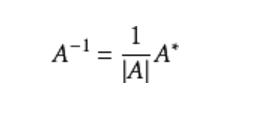
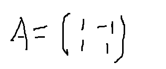
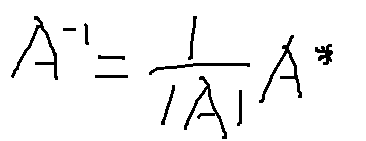
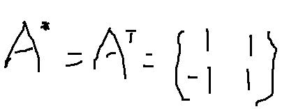
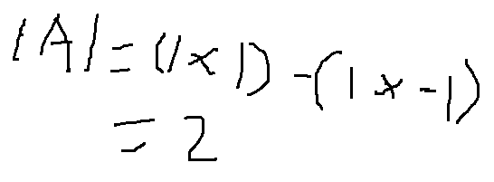
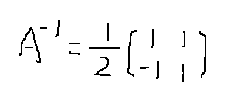

### 定义
一个n阶方阵A称为可逆的，或非奇异的，如果存在一个n阶方阵B，使得

**AB = BA = E**

并称B是A的一个逆矩阵。A的逆矩阵记作A^-1。

百度[逆矩阵](https://baike.baidu.com/item/%E9%80%86%E7%9F%A9%E9%98%B5)

### 特性

若|A|≠0，则矩阵A可逆，且



其中，A*为矩阵A的伴随矩阵。

### 求解

假定矩阵A为:



根据公式:



因A可逆，则有A的[伴随矩阵](https://baike.baidu.com/item/%E4%BC%B4%E9%9A%8F%E7%9F%A9%E9%98%B5)特性 A* = A^T 



根据[三阶行列式](https://baike.baidu.com/item/%E4%B8%89%E9%98%B6%E8%A1%8C%E5%88%97%E5%BC%8F)特性（对角线法）|A| = (1 x 1) - (-1 x 1)



代入公式：



### 用Numpy求矩阵的逆

numpy.linalg中的`inv()`函数就是用来求矩阵的逆。

```
>>> A = np.mat("1 -1; 1 1")
>>> A
matrix([[ 1, -1],
        [ 1,  1]])
>>> inverse = np.linalg.inv(A)
>>> inverse
matrix([[ 0.5,  0.5],
        [-0.5,  0.5]])
```

感觉是不是很简单。
