> 本文从向量的概念与运算扩展到矩阵运算的概念与代码实现，对机器学习或者是深度学习的入门者提供最基础，也是最实用的教程指导，为以后的机器学习模型开发打下基础。

在我们学习机器学习时，常常遇到需要使用矩阵提高计算效率的时候。如在使用批量梯度下降迭代求最优解时，正规方程会采用更简洁的矩阵形式提供权重的解析解法。而如果不了解矩阵的运算法则及意义，甚至我们都很难去理解一些如矩阵因子分解法和反向传播算法之类的基本概念。同时由于特征和权重都以向量储存，那如果我们不了解矩阵运算，代码实现将变得十分艰难。

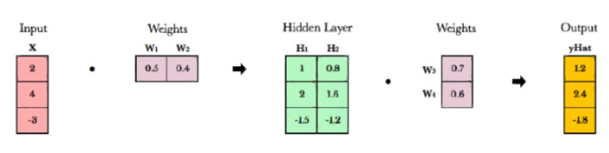

### 1、什么是线性代数？

在深度学习中，线性代数是一个强大的数学工具箱，它提供同时计算多维数组的方法。线性代数不仅会提供如同向量和矩阵那样的结构来储存这些数字，还会提供矩阵的加，减，乘，除和其他运算规则。

### 2、线性代数为什么如此实用？

线性代数将复杂问题转变为简单，直观和高效的计算问题。下面的例子可以表明实现同样的功能，线性代数的代码表达是如何的简洁与美观。

```
# Multiply two arrays 
>>> x = [1, 2, 3]
>>> y = [2, 3, 4]
>>> product = []
>>> for i in range(len(x)):
...     product.append(x[i] * y[i])
...
>>> product
[2, 6, 12]
```

```
# Linear algebra version
>>> import numpy as np
>>> x = np.array([1,2,3])
>>> y = np.array([2,3,4])
>>> x * y
array([ 2,  6, 12])
```

### 3、线性代数怎样应用到深度学习？

神经网络将权重储存在矩阵当中。而线性代数特别是在GPU上，可以对矩阵进行简单迅捷的计算处理。实际上，GPU的设计就是源于向量和矩阵计算处理的基本概念。像素块阵列构成，视频游戏使用巨量，连续展开的矩阵生成引人注目的游戏体验是一样的.GPU会并行地操作整个矩阵里元素，而不是一个接一个地处理。

### 4、向量

向量由数字或其它项组成的一维阵列。在几何学中，向量储存了空间中一个点潜在的改变方向。向量[3，-2]也就代表着原点向（3，-2）这一点运动的趋向。若向量所具有的维度超过一维，那么就称之为矩阵。

#### 4.1、向量的符号表示

有很多符号方式都能表示向量，下面是在本篇文章中你可能会遇到的：

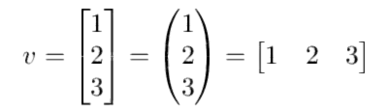

#### 4.2、几何学中的向量

向量一般表征着一个点的运动，一个向量同时储存其潜在变化的方向和大小。如下图所示，在平面空间中画出了向量[-2,5]，因为向量只储存了方向和大小，那么平移并不会改变向量的值，所以所有平移的向量（方向和大小不变）都是相等的。

![]imgs/20180610/3.jpg)

#### 4.3、标量运算

标量运算即为向量和数字间的运算，向量与数的运算就是向量内每一个元素与这一个数进行相应的运算如下图的一个标量运算：

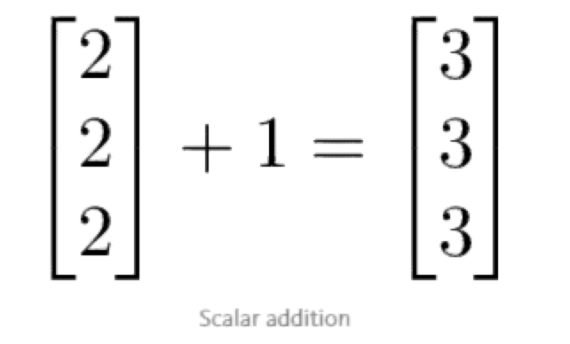

#### 4.4、向量间运算

在向量间的运算中，对应位置的值可以组合而产生一个新向量。第一个向量的第我个值只与第二个向量的第我个值相匹配。这也就意味着向量之间的维度必须相等才能进行运算。下图表明向量之间的加减法是对应元素之间的加减，代码表明了向量之间的加减和除法。

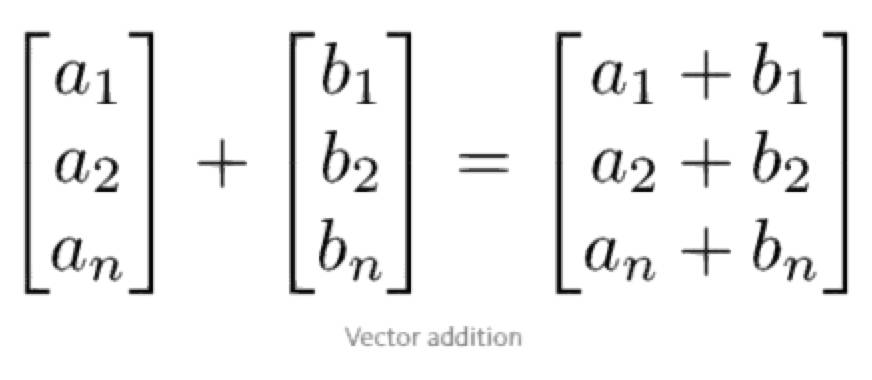

```
>>> x = np.array([1,2,3])
>>> y = np.array([2,3,4])
>>> x + y
array([3, 5, 7])
>>> x - y
array([-1, -1, -1])
>>> x / y
array([0.5       , 0.66666667, 0.75      ])
```

在Numpy中，如果向量是一维的，那么他就能看作是一个标量，与其他多维向量的运算就相当于一个数。

#### 4.5、向量乘法

向量的乘法有两种类型：一种是点积，另一种是哈达玛积(Hadamard)。

##### 4.5.1、点积

两个向量的点积结果是一个标量。向量和矩阵（矩阵乘法）的点积在深度学习中是最重要的运算之一。 

##### 4.5.2、哈达玛积(Hadamard)

哈达玛积是元素之间的乘积，并得出一个向量。从下图可以看出来阿达玛积就将是向量对应元素相乘。

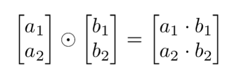

```
>>> x = np.array([1,2,3])
>>> y = np.array([4,5,6])
>>> x * y
array([ 4, 10, 18])
```

#### 4.6、向量场

向量场展示了如果我们运用一个向量函数（如向量加法或乘法等），其中任意点（X，Y）会有什么样的运动倾向。在空间中给定一点，向量场就是我们使用的向量运算在该点的方向和大小。

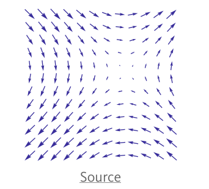

该向量场很有意思，因为根据不同的出发点，其都有不同的方向。出现这种情况是因为在该向量场中，向量背后储存的项不是一个5或2那样的实数，它是2倍或X对于图表中的每一个点，我们将坐标轴变换为2x或x ^ 2，然后将起始点画一个箭头到新的坐标点，这样就制成了上图机器学习算法（如梯度下降算法）的可视化十分重要。

### 5、矩阵

矩阵就是一个由数字或其它项组成的表格，只不过是该表格会有特定的加法，减法和乘法规则。

#### 5.1、矩阵的阶

我们描述矩阵的维度由阶来表达：即行数×列数（如3×2）阶矩阵。

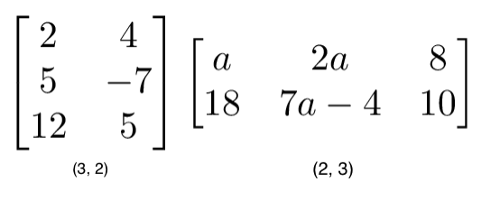


```
a = np.array([
 [1,2,3], 
 [4,5,6]
])
a.shape == (2,3)
```

```
b = np.array([
 [1,2,3]
])
b.shape == (1,3)
```

#### 5.2、矩阵的标量运算

矩阵的标量运算和向量的标量运算是一样的。可以简单地将标量和矩阵中的每一个元素做运算处理（如加，减，乘，除等）。

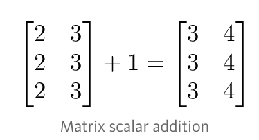

```
>>> a = np.array([[2, 3], [2, 3], [2, 3]])
>>> a + 1
array([[3, 4],
       [3, 4],
       [3, 4]])
```

#### 5.3、矩阵间的运算

为了能进行加减运算，两个矩阵的阶必须相等。然后我们可以对两个矩阵相应的元素进行运算处理。如下图就是两阶方阵的加法。

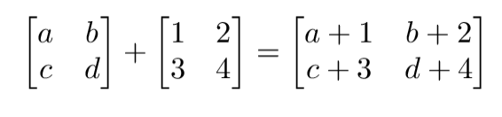

```
a = np.array([
 [1,2],
 [3,4]
])
b = np.array([
 [1,2],
 [3,4]
])
```

```
a + b
[[2, 4],
 [6, 8]]
```

```
a — b
[[0, 0],
 [0, 0]]
```

在Numpy中，矩阵之间运算所需要的阶相等可以通过一个称之为广播的机制变得不那么严格。如果两个矩阵相应的阶（行数×列数）满足下面两个要求，那么它们就是可以进行运算的：

- 两个矩阵的阶相等
- 矩阵的阶有一个维度是1

```
a = np.array([
 [1],
 [2]
])
b = np.array([
 [3,4],
 [5,6]
])
c = np.array([
 [1,2]
])
```

```
# Same no. of rows
# Different no. of columns
# but a has one column so this works
a * b
[[ 3, 4],
 [10, 12]]
```

```
# Same no. of columns
# Different no. of rows
# but c has one row so this works
b * c
[[ 3, 8],
 [5, 12]]
```

```
# Different no. of columns
# Different no. of rows
# but both a and c meet the 
# size 1 requirement rule
a + c
[[2, 3],
 [3, 4]]
```

而在高维（三维或四维等）矩阵的情况下，矩阵间运算更有意思，不过在深度学习里并不常见。

#### 5.4、矩阵Hadamard乘积

Hadamard乘积同样是矩阵间的运算，即两个矩阵间相同位置的元素相互乘积。

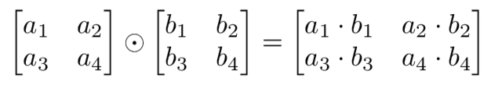

```
a = np.array(
[[2,3],
 [2,3]])
b = np.array(
[[3,4],
 [5,6]])
```

```
# Uses python's multiply operator
a * b
[[ 6, 12],
 [10, 18]]
```

在Numpy中，矩阵和向量的Hadamard乘要只需要两个矩阵满足广播机制的要求就行。

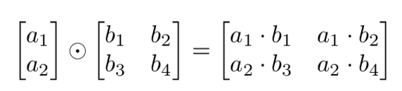

#### 5.5、矩阵的转置

把矩阵A的行和列互相交换所产生的矩阵称为A的转置矩阵，这一过程称为矩阵的转置。


神经网络在处理不同大小的权重或输入矩阵时，经常出现矩阵的阶不符合矩阵乘法的要求。矩阵的转置通过将矩阵旋转一下以满足矩阵乘法所需要的维度要求。下面，我们可以通过两步完成矩阵的转置。

- 旋转矩阵90度
- 将每一行的元素都反向写一遍

以下我们将矩阵M转置为矩阵T

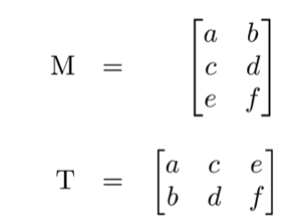

```
a = np.array([
   [1, 2], 
   [3, 4]])
```

```
a.T
[[1, 3],
 [2, 4]]
```

矩阵的转置满足以下运算规律：

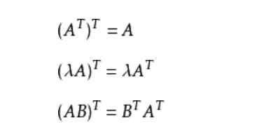

#### 5.6、矩阵乘法

矩阵乘法是由一组乘法法则组成，他们共同作用以乘得一个新矩阵。

##### 5.6.1、规则

并不是所有矩阵都能进行矩阵乘法运算的，如果两个矩阵能相乘，那么它需要满足以下条件：

- 第一个矩阵列的数量必须等于第二个矩阵行的数量
- m × n 阶矩阵左乘n×k阶矩阵的结果是 m × k 阶矩阵。新得出来矩阵就等于第一矩阵的行数 × 第二矩阵的列数。

##### 5.6.2、步骤

矩阵乘法的步骤和向量点积的过程是相似的，它们都是由对应位置的元素进行乘积并相加而得出。第一个矩阵每一行的维度和第二个矩阵每一列的维度相等，所以第一个矩阵第i行元素与第二个矩阵第j列对应元素的乘积和就等于新矩阵的第i行第j列的元素值。在下图中，A矩阵左乘B矩阵得到C矩阵A矩阵行向量与B矩阵列向量点积就等于C矩阵的元素，具体可以通过下图C矩阵内部元素的构成来了解。

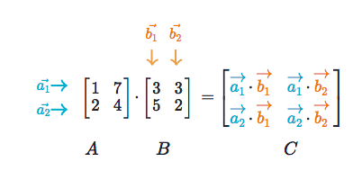

A矩阵行向量与B矩阵列向量b1的点积，即下图所示：

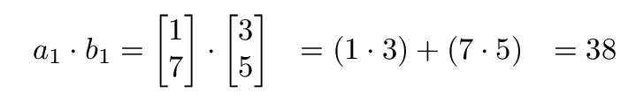

下面是另一个矩阵的乘积：

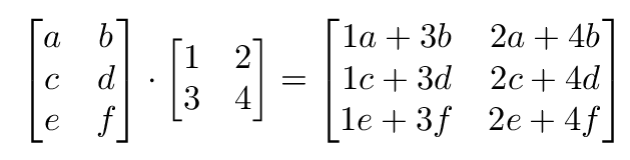

矩阵乘法是不可交换的（即AB≠BA）。因为不可能预期在改变向量的部分后还能得到相同的结果，而且第一个矩阵的列数必须要和第二个矩阵的行数相同，也可以看出为什么矩阵相乘的顺序会影响其结果。虽然矩阵乘法是人为的规则，但它确实大大简化了计算的表达，可以将巨大的计算量很简洁地表达出来，这一点对机器学习算法的开发和使用有重要的作用。

最后你可以用以下案例检测一下是否你已经掌握了矩阵运算的基本原理：

下面矩阵乘法的阶是多少？

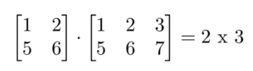

下面矩阵的乘法的阶是多少？
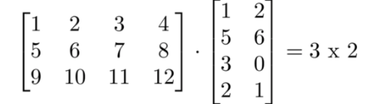

下面矩阵的乘法是多少？

```
[2*5 + 3*3, 2*4 + 3*5]
[1*5 + 4*3, 1*4 + 4*5]
```


下面矩阵的乘法是多少？

```
[3*1, 3*2, 3*3]
[5*1, 5*2, 5*3]
```

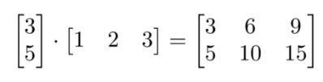

下面矩阵的乘法是多少？

```
[1*4 + 2*5 + 3*6]
```

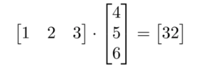

##### 5.6.3、使用Numpy进行矩阵乘法运算

在Numpy中，np.dot（a，b）函数可以进行向量和矩阵点积。并且该函数还有许多有意思的特征, 所以我建议你在使用该函数前先看看该函数的用法：[查看文档](https：//docs.scipy.org/doc/numpy/reference/generated/numpy.dot.html)

```
a = np.array([
 [1, 2]
 ])
a.shape == (1,2)
```

```
b = np.array([
 [3, 4],
 [5, 6]
 ])
b.shape == (2,2)
```

```
# Multiply
mm = np.dot(a,b)
mm == [13, 16]
mm.shape == (1,2)
```

深度学习通常会有巨大的计算量。从最开始的特征输入，我们会使用一个个高维向量将特征输入到神经网络中，而每一层的权重作为列向量组成一个权重矩阵。每一层的正向传播都需要使用矩阵乘法进行计算，而反向传播更需要理解矩阵运算才能对其运行原理有一个较为深入的理解。本文是矩阵运算的基础性文章，其不仅对概念的理解很是重要，同时在新手开始学着搭建机器学习系统时更为有用，因为矩阵运算的代码在实际操作中是我们看懂一段代码或写出一段代码的基础。并且采用矩阵运算代码实现也远比采用循环语句或条件语句代码实现的算法要简洁易读得多。


原文链接：https://www.jiqizhixin.com/articles/2017-08-07-2

英文链接：https://towardsdatascience.com/linear-algebra-cheat-sheet-for-deep-learning-cd67aba4526c

