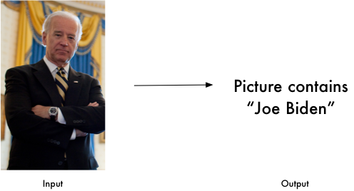

### 项目说明


该库使用 dlib 顶尖的深度学习人脸识别技术构建，在户外脸部检测数据库基准（Labeled Faces in the Wild benchmark）上的准确率高达 99.38%。
该项目是要构建一款免费、开源、实时、离线的网络 app，支持组织者使用人脸识别技术或二维码识别所有受邀人员。有了世界上最简单的人脸识别库，使用 Python 或命令行，即可识别和控制人脸。

项目地址：
https://github.com/ageitgey/face_recognition#face-recognition

### 使用说明

#### 1、从图片中识别出人脸


```python
import face_recognition
image = face_recognition.load_image_file("your_file.jpg")
face_locations = face_recognition.face_locations(image)
```

#### 2、从图片中识别面部特征，比如：眼睛, 鼻子, 嘴和下巴。

```python
import face_recognition
image = face_recognition.load_image_file("your_file.jpg")
face_landmarks_list = face_recognition.face_landmarks(image)
```

#### 3、可以对识别的面部特征进行处理，比如类似美图秀秀的功能


#### 4、从图片中识别出某个具体的人

```python
import face_recognition
known_image = face_recognition.load_image_file("biden.jpg")
unknown_image = face_recognition.load_image_file("unknown.jpg")

biden_encoding = face_recognition.face_encodings(known_image)[0]
unknown_encoding = face_recognition.face_encodings(unknown_image)[0]

results = face_recognition.compare_faces([biden_encoding], unknown_encoding)
```

更多请查看项目主页：

https://github.com/ageitgey/face_recognition#face-recognition