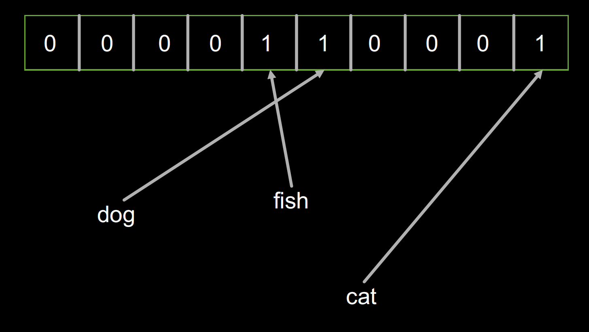
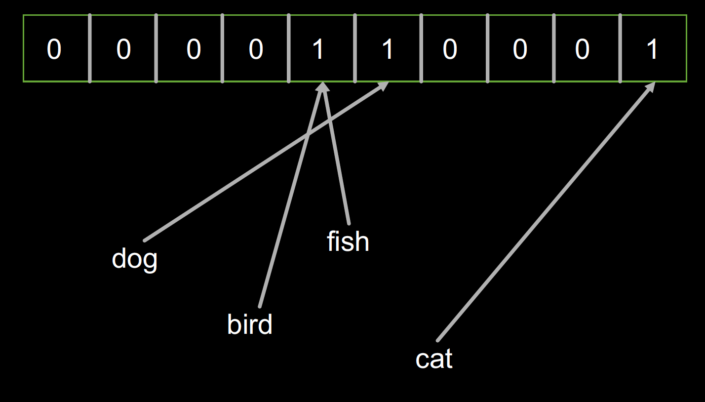
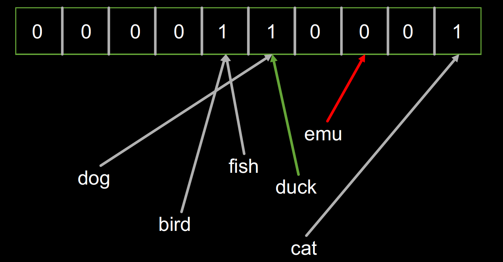

本文转自：https://my.oschina.net/taogang/blog/1579204


搜索是大数据领域里常见的需求。Splunk和ELK分别是该领域在非开源和开源领域里的领导者。本文利用很少的Python代码实现了一个基本的数据搜索功能，试图让大家理解大数据搜索的基本原理。

#### 1、布隆过滤器（Bloom Filter）

第一步我们先要实现一个[布隆过滤器](https://en.wikipedia.org/wiki/Bloom_filter)

布隆过滤器是大数据领域的一个常见算法，它的目的是过滤掉那些不是目标的元素。也就是说如果一个要搜索的词并不存在与我的数据中，那么它可以以很快的速度返回目标不存在。

让我们看看以下布隆过滤器的代码：

```
class Bloomfilter(object):
    """
    A Bloom filter is a probabilistic data-structure that trades space for accuracy
    when determining if a value is in a set.  It can tell you if a value was possibly
    added, or if it was definitely not added, but it can't tell you for certain that
    it was added.
    """
    def __init__(self, size):
        """Setup the BF with the appropriate size"""
        self.values = [False] * size
        self.size = size

    def hash_value(self, value):
        """Hash the value provided and scale it to fit the BF size"""
        return hash(value) % self.size

    def add_value(self, value):
        """Add a value to the BF"""
        h = self.hash_value(value)
        self.values[h] = True

    def might_contain(self, value):
        """Check if the value might be in the BF"""
        h = self.hash_value(value)
        return self.values[h]

    def print_contents(self):
        """Dump the contents of the BF for debugging purposes"""
        print(self.values)

```

- 基本的数据结构是个数组（实际上是个位图，用1/0来记录数据是否存在），初始化是没有任何内容，所以全部置False。实际的使用当中，该数组的长度是非常大的，以保证效率。
- 利用哈希算法来决定数据应该存在哪一位，也就是数组的索引
- 当一个数据被加入到布隆过滤器的时候，计算它的哈希值然后把相应的位置为True
- 当检查一个数据是否已经存在或者说被索引过的时候，只要检查对应的哈希值所在的位的True／Fasle

看到这里，大家应该可以看出，如果布隆过滤器返回False，那么数据一定是没有索引过的，然而如果返回True，那也不能说数据一定就已经被索引过。在搜索过程中使用布隆过滤器可以使得很多没有命中的搜索提前返回来提高效率。

我们看看这段 code是如何运行的：

```
bf = Bloomfilter(10)
bf.add_value('dog')
bf.add_value('fish')
bf.add_value('cat')
bf.print_contents()
bf.add_value('bird')
bf.print_contents()
# Note: contents are unchanged after adding bird - it collides
for term in ['dog', 'fish', 'cat', 'bird', 'duck', 'emu']:
    print('{}: {} {}'.format(term, bf.hash_value(term), bf.might_contain(term)))
```

```
[False, False, False, False, True, True, False, False, False, True]
[False, False, False, False, True, True, False, False, False, True]
dog: 5 True
fish: 4 True
cat: 9 True
bird: 9 True
duck: 5 True
emu: 8 False
```

##### 1.1、首先创建了一个容量为10的的布隆过滤器


##### 1.2、然后分别加入 ‘dog’，‘fish’，‘cat’三个对象，这时的布隆过滤器的内容如下：



##### 1.3、然后加入‘bird’对象，布隆过滤器的内容并没有改变，因为‘bird’和‘fish’恰好拥有相同的哈希。



##### 1.4、最后我们检查一堆对象（'dog', 'fish', 'cat', 'bird', 'duck', 'emu'）是不是已经被索引了。结果发现‘duck’返回True，2而‘emu’返回False。因为‘duck’的哈希恰好和‘dog’是一样的。




#### 2、分词

下面一步我们要实现分词。 分词的目的是要把我们的文本数据分割成可搜索的最小单元，也就是词。这里我们主要针对英语，因为中文的分词涉及到自然语言处理，比较复杂，而英文基本只要用标点符号就好了。

下面我们看看分词的代码：

```
def major_segments(s):
    """
    Perform major segmenting on a string.  Split the string by all of the major
    breaks, and return the set of everything found.  The breaks in this implementation
    are single characters, but in Splunk proper they can be multiple characters.
    A set is used because ordering doesn't matter, and duplicates are bad.
    """
    major_breaks = ' '
    last = -1
    results = set()

    # enumerate() will give us (0, s[0]), (1, s[1]), ...
    for idx, ch in enumerate(s):
        if ch in major_breaks:
            segment = s[last+1:idx]
            results.add(segment)

            last = idx

    # The last character may not be a break so always capture
    # the last segment (which may end up being "", but yolo)
    segment = s[last+1:]
    results.add(segment)

    return results
```

##### 2.1、主要分割

主要分割使用空格来分词，实际的分词逻辑中，还会有其它的分隔符。例如Splunk的缺省分割符包括以下这些，用户也可以定义自己的分割符。

] < > ( ) { } | ! ; , ' " * \n \r \s \t & ? + %21 %26 %2526 %3B %7C %20 %2B %3D -- %2520 %5D %5B %3A %0A %2C %28 %29

```
def minor_segments(s):
    """
    Perform minor segmenting on a string.  This is like major
    segmenting, except it also captures from the start of the
    input to each break.
    """
    minor_breaks = '_.'
    last = -1
    results = set()

    for idx, ch in enumerate(s):
        if ch in minor_breaks:
            segment = s[last+1:idx]
            results.add(segment)

            segment = s[:idx]
            results.add(segment)

            last = idx

    segment = s[last+1:]
    results.add(segment)
    results.add(s)

    return results
```

##### 2.2、次要分割

次要分割和主要分割的逻辑类似，只是还会把从开始部分到当前分割的结果加入。例如“1.2.3.4”的次要分割会有1，2，3，4，1.2，1.2.3

```
def segments(event):
    """Simple wrapper around major_segments / minor_segments"""
    results = set()
    for major in major_segments(event):
        for minor in minor_segments(major):
            results.add(minor)
    return results

```

分词的逻辑就是对文本先进行主要分割，对每一个主要分割在进行次要分割。然后把所有分出来的词返回。

我们看看这段 code是如何运行的：

```
for term in segments('src_ip = 1.2.3.4'):
	print(term)
```

结果：

```
src
1.2
1.2.3.4
src_ip
3
1
1.2.3
ip
2
=
4
```

#### 3、搜索

好了，有个分词和布隆过滤器这两个利器的支撑后，我们就可以来实现搜索的功能了。

上代码：

```

class Splunk(object):
    def __init__(self):
        self.bf = Bloomfilter(64)
        self.terms = {}  # Dictionary of term to set of events
        self.events = []

    def add_event(self, event):
        """Adds an event to this object"""

        # Generate a unique ID for the event, and save it
        event_id = len(self.events)
        self.events.append(event)

        # Add each term to the bloomfilter, and track the event by each term
        for term in segments(event):
            self.bf.add_value(term)

            if term not in self.terms:
                self.terms[term] = set()
            self.terms[term].add(event_id)

    def search(self, term):
        """Search for a single term, and yield all the events that contain it"""

        # In Splunk this runs in O(1), and is likely to be in filesystem cache (memory)
        if not self.bf.might_contain(term):
            return

        # In Splunk this probably runs in O(log N) where N is the number of terms in the tsidx
        if term not in self.terms:
            return

        for event_id in sorted(self.terms[term]):
            yield self.events[event_id]
```

- Splunk代表一个拥有搜索功能的索引集合
- 每一个集合中包含一个布隆过滤器，一个倒排词表（字典），和一个存储所有事件的数组
- 当一个事件被加入到索引的时候，会做以下的逻辑
	- 为每一个事件生成一个unqie id，这里就是序号
	- 对事件进行分词，把每一个词加入到倒排词表，也就是每一个词对应的事件的id的映射结构，注意，一个词可能对应多个事件，所以倒排表的的值是一个Set。倒排表是绝大部分搜索引擎的核心功能。
- 当一个词被搜索的时候，会做以下的逻辑
	- 检查布隆过滤器，如果为假，直接返回
	- 检查词表，如果被搜索单词不在词表中，直接返回
	- 在倒排表中找到所有对应的事件id，然后返回事件的内容

我们运行下看看吧：

```
s = Splunk()
s.add_event('src_ip = 1.2.3.4')
s.add_event('src_ip = 5.6.7.8')
s.add_event('dst_ip = 1.2.3.4')

for event in s.search('1.2.3.4'):
    print(event)
print('-')
for event in s.search('src_ip'):
    print(event)
print('-')
for event in s.search('ip'):
    print(event)
```

```
src_ip = 1.2.3.4
dst_ip = 1.2.3.4
-
src_ip = 1.2.3.4
src_ip = 5.6.7.8
-
src_ip = 1.2.3.4
src_ip = 5.6.7.8
dst_ip = 1.2.3.4
```

是不是很赞！


#### 4、更复杂的搜索

更进一步，在搜索过程中，我们想用And和Or来实现更复杂的搜索逻辑。

上代码：

```
class SplunkM(object):
    def __init__(self):
        self.bf = Bloomfilter(64)
        self.terms = {}  # Dictionary of term to set of events
        self.events = []

    def add_event(self, event):
        """Adds an event to this object"""

        # Generate a unique ID for the event, and save it
        event_id = len(self.events)
        self.events.append(event)

        # Add each term to the bloomfilter, and track the event by each term
        for term in segments(event):
            self.bf.add_value(term)
            if term not in self.terms:
                self.terms[term] = set()

            self.terms[term].add(event_id)

    def search_all(self, terms):
        """Search for an AND of all terms"""

        # Start with the universe of all events...
        results = set(range(len(self.events)))

        for term in terms:
            # If a term isn't present at all then we can stop looking
            if not self.bf.might_contain(term):
                return
            if term not in self.terms:
                return

            # Drop events that don't match from our results
            results = results.intersection(self.terms[term])

        for event_id in sorted(results):
            yield self.events[event_id]


    def search_any(self, terms):
        """Search for an OR of all terms"""
        results = set()

        for term in terms:
            # If a term isn't present, we skip it, but don't stop
            if not self.bf.might_contain(term):
                continue
            if term not in self.terms:
                continue

            # Add these events to our results
            results = results.union(self.terms[term])

        for event_id in sorted(results):
            yield self.events[event_id]
```

利用Python集合的intersection和union操作，可以很方便的支持And（求交集）和Or（求合集）的操作。

运行结果如下：

```
s = SplunkM()
s.add_event('src_ip = 1.2.3.4')
s.add_event('src_ip = 5.6.7.8')
s.add_event('dst_ip = 1.2.3.4')

for event in s.search_all(['src_ip', '5.6']):
    print(event)
print('-')
for event in s.search_any(['src_ip', 'dst_ip']):
    print(event)
```

```
src_ip = 5.6.7.8
-
src_ip = 1.2.3.4
src_ip = 5.6.7.8
dst_ip = 1.2.3.4
```

[完整源码地址](https://github.com/zhoujun/mydemos/tree/master/simple-bigdata-seach)

#### 5、总结


以上的代码只是为了说明大数据搜索的基本原理，包括布隆过滤器，分词和倒排表。如果大家真的想要利用这代码来实现真正的搜索功能，还差的太远。所有的内容来自于Splunk Conf2017。大家如果有兴趣可以去看网上的视频。

- [文档](https://conf.splunk.com/files/2017/slides/a-trip-through-the-splunk-data-ingestion-and-retrieval-pipeline.pdf)
- [视频](http://conf.splunk.com/files/2017/recordings/a-trip-through-the-splunk-data-ingestion-and-retrieval-pipeline.mp4)
