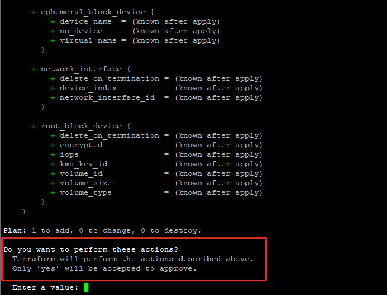
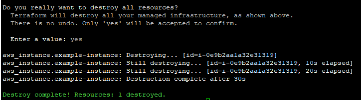

## 安装Terraform
```bash
# Step1, 下载适合您系统的Terraform安装包
wget https://releases.hashicorp.com/terraform/0.12.18/terraform_0.12.18_linux_amd64.zip

# Step2, 解压该包，是一个名为terraform的二进制文件，可以在当前目录直接运行命令: 
terraform
```


```bash
# Step3, 将terraform加到环境变量。
export PATH=$PATH:/home/ubuntu/terraform:$PATH
```

```
$ terraform version
Terraform v0.12.18
```

## 编写第一个Terraform例子

我们在aws的新加坡(ap-southeast-1)区域创建一台实例类型为t2.micro的EC2，并标记一下Tag。

```terraform
# main.tf
provider "aws" {
  region = "ap-southeast-1"
}


resource "aws_instance" "example-instance" {
  ami           = "ami-061eb2b23f9f8839c"
  instance_type = "t2.micro"

  tags = {
    Name = "Example by ChangSha DevOps Union "
    Terraform = true
  }
}
```

```

~/terraform-guide/example1$ tree
.
└── main.tf

0 directories, 1 file

```

## 执行Terraform命令
```
terraform init								
```
init 命令会初始化当前目录为执行目录。terraform因此会解析该目录下的*.tf后缀的文件，并会在该目录下生成 `.terraform`的隐藏目录。并在该隐藏目录下载相关插件。


```bash
terraform plan
```
plan 命令用于对terraform定义的资源预览。如果当前目录以及存在对应的state文件，那么将会以最新terraform脚本定义与state文件内容进行比较。如果存在变更，则会高亮显示出来。


```bash
terraform apply 
```
apply 命令用于实际资源的新建和变更操作，为了安全起见，该命令在运行过程中有二次确认，输入yes才会继续。当然也可以增加参数 --auto-approve来跳过二次确认。

```bash
terraform apply --auto-approve
```

apply 命令成功后会在当前目录生成 terraform.tfstate 文件。
```

~/terraform-guide/example1$ tree
.
├── main.tf
├── terraform.tfstate
└── terraform.tfstate.backup

0 directories, 3 files

```




登录AWS Consle上我们看到新建的EC2 Instance以及附加的Tag信息。


```bash
terraform destroy
```

destory 命令用于销毁terraform创建的资源，会列出销毁的资源列表。也会有二次确认。需要输入yes才会继续。





除了上述四个主要命令外，terraform还有其他命令，我们可以通过help命令查找：


## 总结

通过以上命令操作，我们知道terraform主要的工作流程是从init -> plan -> apply -> destroy。一般情况下init 和 destroy在同一个工作目录下只会执行一次，而plan和apply会因为我们修改terraform脚本而重复执行。


最后留个思考题：

apply命令后生成的terraform.tfstate文件内容是什么？如果删除这个文件会怎么样？