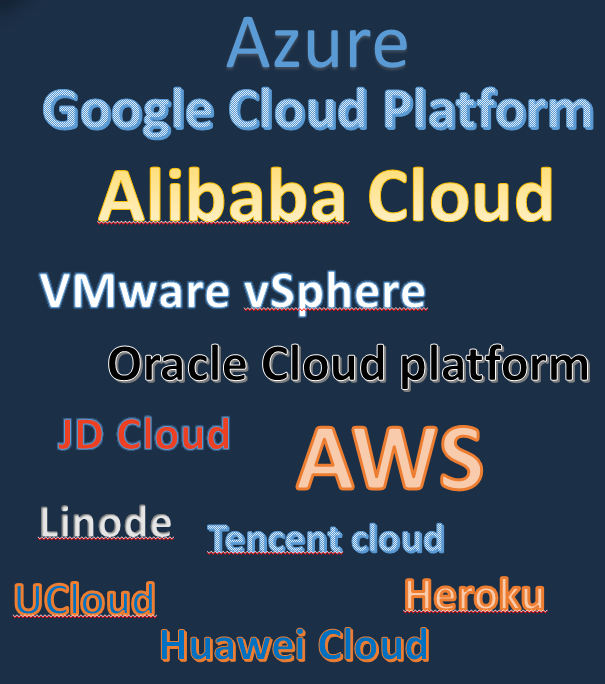
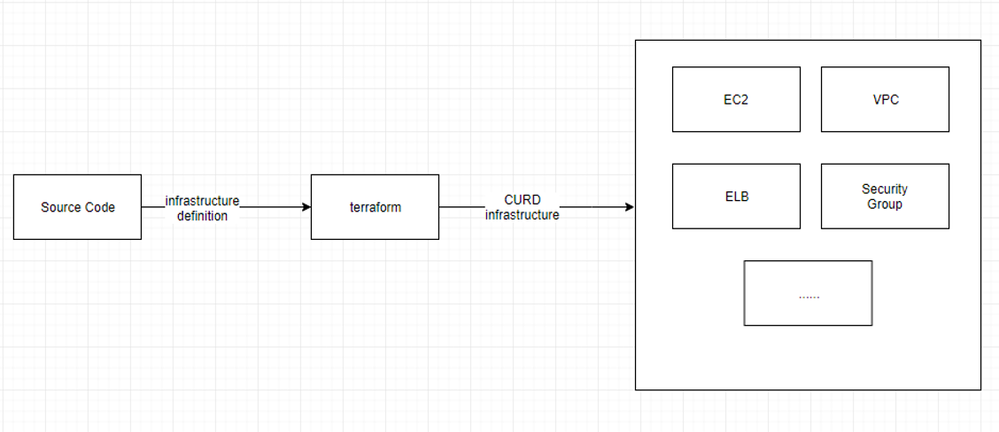
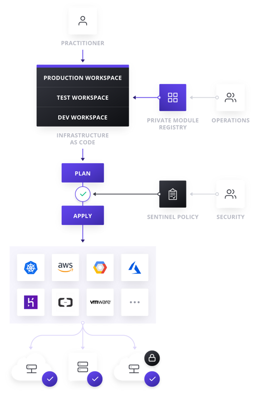
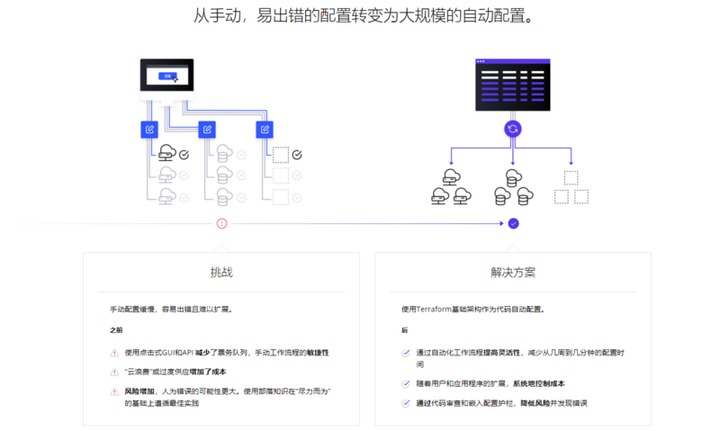

## 一、Terraform是什么？

Terraform是一个开源基础架构，是HashiCorp创建的代码软件工具。它使用户能够使用称为HCL(HashiCorp Configuration Language)配置语言或可选的JSON来定义和配置数据中心基础架构。 HCL是声明式的，也就是说，程序员用HCL来描述整个基础架构应该是什么样的，然后把具体的实施工作交给Terraform就可以了，程序员不需要了解实施的具体步骤和细节，不需要了解terraform如何与云服务商的API进行对接。Terraform会根据代码，自动下载相应的Provider和Provisioner来负责具体步骤和细节。于声明式对应的是命令式。命令式语言是按照步骤执行的，先后顺序很重要，对固定输入执行命令式语言会得到固定的输出。声明式和命令式并无高下之分，只是在云资源编排这一领域，声明式会比较方便实现。

Terraform 支持许多云基础架构提供商，国外云如 Amazon Web Services，IBM Cloud（以前的 Bluemix），Google Cloud Platform，Linode， Microsoft Azure， Oracle 云基础架构或 VMware vSphere 以及 OpenStack。 国内云包括阿里，腾讯，华为，京东等云服务商。

Terraform 是一种安全有效地构建、更改和版本控制基础设施的工具(基础架构自动化的编排工具)。 以用来管理多层次的资源。从上层的软件配置到底层的网络、系统配置都可以使用 Terraform 统一进行管理。 它的目标是 "Write, Plan, and create Infrastructure as Code", 基础架构即代码。

Terraform 几乎可以支持所有市面上能见到的云服务。具体的说就是可以用代码来管理维护 IT 资源，把之前需要手动操作的一部分任务通过程序来自动化的完成，这样的做的结果非常明显：高效、不易出错。

Terraform 提供了对资源和提供者的灵活抽象。该模型允许表示从物理硬件、虚拟机和容器到电子邮件和 DNS 提供者的所有内容。由于这种灵活性，Terraform 可以用来解决许多不同的问题。这意味着有许多现有的工具与Terraform 的功能重叠。但是需要注意的是，Terraform 与其他系统并不相互排斥。它可以用于管理小到单个应用程序或达到整个数据中心的不同对象。

Terraform 使用配置文件描述管理的组件(小到单个应用程序，达到整个数据中心)。Terraform 生成一个执行计划，描述它将做什么来达到所需的状态，然后执行它来构建所描述的基础结构。随着配置的变化，Terraform 能够确定发生了什么变化，并创建可应用的增量执行计划。

Terraform 通过插件机制管理不同的资源提供者，以此来接入各种资源，如虚拟机，存储，网络和各种应用服务。 

Terraform 是用 Go 语言开发的开源项目，你可以在 github 上访问到它的源代码。

## 二、Terraform 特点

2.1、基础架构即代码(Infrastructure as Code)
基础设施使用高级配置语法进行描述。这可以让你的数据中心蓝图像你其他代码一样进行版本控制和管理。此外基础设施可以被分享和重用。

2.2、执行计划(Execution Plans)

Terraform 有一个 plan 步骤，它生成一个执行计划。执行计划显示了当执行 apply 命令时 Terraform 将做什么。通过 plan 进行提前检查，可以使 Terraform 操作真正的基础结构时避免意外。

2.3、资源图(Resource Graph)

Terraform 构建的所有资源的图表，它能够并行地创建和修改任何没有相互依赖的资源。因此，Terraform 可以高效地构建基础设施，操作人员也可以通过图表深入地解其基础设施中的依赖关系。

2.4、自动化变更(Change Automation)

把复杂的变更集应用到基础设施中，而无需人工交互。通过前面提到的执行计划和资源图，我们可以确切地知道 Terraform 将会改变什么，以什么顺序改变，从而避免许多可能的人为错误。

## 三、Terraform 如何运作

Terraform Enterprise在基础架构之上提供协作，治理和自助服务工作流，作为来自开源的代码配置。Terraform Enterprise为团队合作构建基础架构提供工作空间，模块和其他强大的构造。运营商可以将基础架构作为代码打包成可重复使用的模块，使开发人员能够以自助服务的方式快速进行配置。同样，作为代码和日志记录的策略使组织能够保护，管理和审核其整个部署。

Terraform允许将基础架构表示为代码。期望的状态以简单的人类可读语言表达。Terraform使用此语言提供更改的执行计划，可以对其进行安全性审核，然后应用于更改。可扩展的提供商允许Terraform管理广泛的资源，包括硬件，IaaS，PaaS和SaaS服务。

## 四、Terraform 优点
4.1、快速和安全
利用代码进行创建资源的速度可以是人工点击的几倍甚至几十倍

4.2、任何人都可以随时建立起一个环境
只要拥有基础设施代码的访问权限，就可以自己完成环境的创建，而不需要其他团队的帮助。

4.3、避免雪花服务器
人工配置环境可能会导致出现雪花服务器，而使用 Terraform 自动配置则不容易出现。

4.4、所有的环境使用类似的代码
使用 Terraform 你可以轻松的控制副本的数量，方便创建一个小的开发/测试环境，或者一个大的生产环境。

4.5、像对待应用代码一样对待基础设施
方便不断的改进基础设施的代码。享受版本管理工具的历史查看、回滚、备份存储等功能。

4.6、在部署之前验证架构
对基础设施代码做静态分析，可以大大降低出错的可能性。追踪基础设施的变化。如果在部署当中发生了错误，可以快速恢复到上一个版本，审计人员也可以通过历史记录进行审计。

4.7、让人快乐
这是一个非常重要但是经常被忽视的优点。手动部署代码和管理基础架构是重复和乏味的。开发人员和系统管理员对这种工作感到不满，因为它不涉及创造力，没有挑战，也没有认可。

除非你部署失败了，不然没有人会关注你。

这造成了一个压力和不愉快的环境。Terraform 提供了一个更好的选择，允许计算机做他们最擅长的（自动化执行）和开发人员来做他们最擅长的（编码）。

## 参考

- https://www.terraform.io/intro/index.html
- http://dy.163.com/v2/article/detail/DA0BOFSK05119IE4.html
- https://segmentfault.com/a/1190000019693490