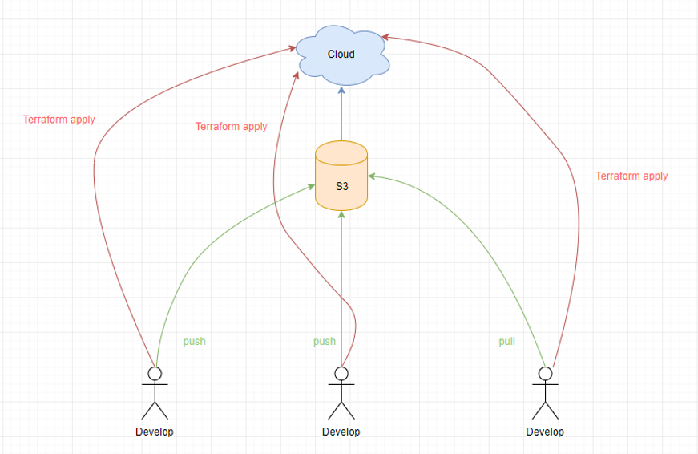
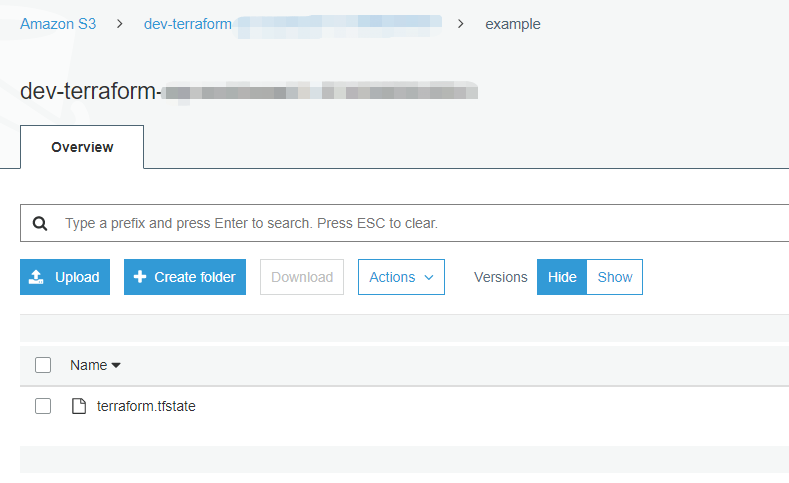
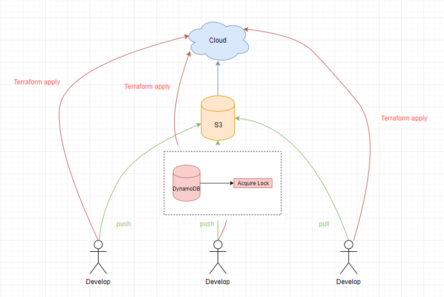
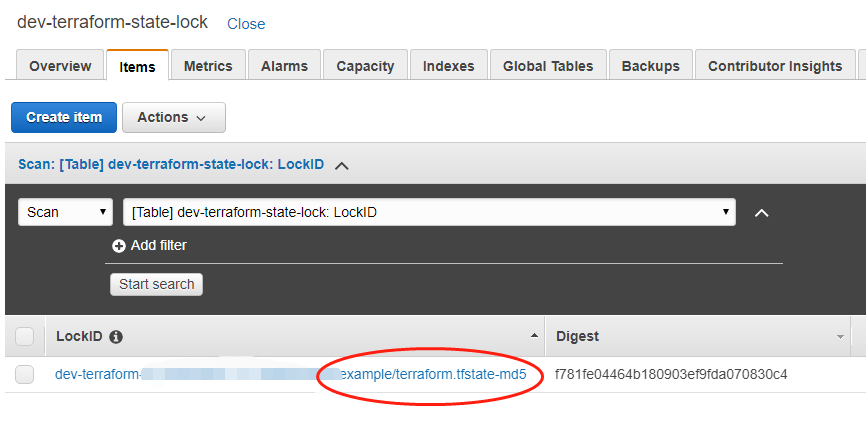
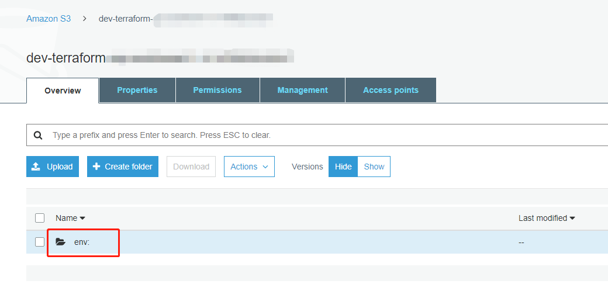
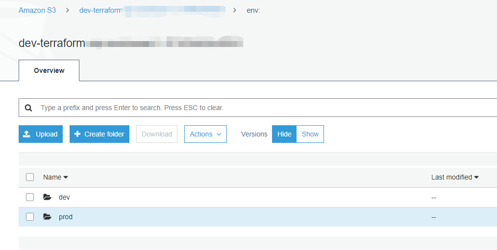

## 一、Terraform 状态文件

每次我们运行 Terraform 命令时，它都会在 Terraform 状态文件中记录关于它创建的基础设施的信息。默认情况下，会在您的当前工作目录下创建一个Terraform.tfstate文件。该文件内容是一个JSON字符串。它记录了从Terraform 模板资源定义到云平台实际资源的映射。

例如：我们用 Terraform 模板定义一个EC2实例。

```bash
resource "aws_instance" "example" {
  ami           = "ami-061eb2b23f9f8839c"
  instance_type = "t2.micro"

  tags = {
    Name = "Example by ChangSha DevOps Union"
    Terraform = true
  }
}
```

运行 Terraform apply 之后，查看Terraform.tfstate内容：

```bash
 "instances": [
  {
     "index_key": 0,
     "schema_version": 1,
     "attributes": {
         "ami": "ami-061eb2b23f9f8839c",
         "associate_public_ip_address": true,
         "availability_zone": "ap-southeast-1b",
         "cpu_core_count": 1,
         "cpu_threads_per_core": 1,
         "id": "i-088137f4282ab6167",
         "instance_state": "running",
         "instance_type": "t2.micro"
         ...
     }
}]
```

我们可以很清晰的从这个JSON字符串中了解到实际创建EC2的详细信息。例如："id" : "i-088137f4282ab6167"。Terraform 在AWS创建了实例ID为 i-088137f4282ab6167 的EC2虚拟机，它的实例类型是 t2.micro(1 vCPUs，1g RAM)。

每次运行 Terraform命令，它会从AWS获取到到EC2的最新信息。并将其与 Terraform模板定义内容进行比较。以确定是否需要更改。如果有更改执行apply plan命令会进行高亮显示。执行 Terraform apply则会将更改生效。

## 二、Terraform 状态文件存储

如果只是你一个人使用Terraform，可以将状态文件存在本地。但是如果是一个团队使用Terraform。你需要考虑以下几个问题：

1、如何共享状态

团队成员维护同一个基础设施资源。每个成员都可能需要更新基础设施。那么必定需要访问相同的 Terraform状态文件。否则会以每个成员的Terraform模板创建各自的资源，产生多份状态文件。

2、如何锁定状态文件

一旦状态文件被共享，如果团队中多个成员同时运行Terraform。就会遇到指令竞争。因为多个Terraform命令会对状态文件进行并发更新。从而导致冲突，造成数据丢失和状态文件损坏。

3、如何隔离状态文件

我们可能有多个基础设施环境(dev/stg/prod)。如果在同一个环境构建基础设施，由于人为的失误删除了状态文件或者Terraform的一个罕见Bug，造成Terraform状态文件损坏。则会给线上环境造成不可挽救的破坏。

接下来，我们将深入讨论这些问题，并展示 Terraform提供的解决办法。

### 2.1、共享状态文件

共享状态文件，最常见的做法就是使用Git进行版本控制，但是这样做还是会有以下问题：
1、团队成员本地很难同时保存最新的Terraform模板和状态文件，如果其中一个成员忘记Pull最新的更改或者运行了Terraform命令，忘记Push最新的状态文件到版本控制，都会造成资源混乱。

2、状态文件包含敏感信息。Terraform构建资源，可能需要存放敏感数据。例如创建数据库，会将数据库用户名和密码以明文存在状态文件。



关于共享状态文件，Terraform提供了对远程状态存储的支持。如：Amazon S3。
Amazon S3存储支持版本控制，回滚，文件加密，而且还便宜。

```terraform
resource "aws_s3_bucket" "terraform_state" {
  bucket = "terraform-state-store"

  versioning {
      enabled = true 
  }

  lifecycle {
      prevent_destroy = true
  }

  tags = {
      Name = "S3 Remote Terraform State Store"
  }
}
```

```terraform
terraform {
    backend "s3" {
        bucket          = "terraform-state-store"
        key             = "example/terraform.tfstate"
        region          = "ap-southeast-1"
        encrypt         = true
    }
}
```



### 2.2、锁定状态文件

使用远程状态存储(S3)可以解决多人共享状态文件的问题，但还是存在：
多人协作时在同一个状态文件同时执行terraform命令，产生指令竞争的情况。

Terraform支持Amazon DynamoDB锁定状态。DynamoDB会将Terraform状态存储路径和文件名称作为唯一主键ID进行锁定。每次在执行Terraform Apply 命令之前先从DynamoDB获取锁，执行完之后释放锁。

```terraform
terraform {
    backend "s3" {
        bucket          = "terraform-state-store"
        key             = "example/terraform.tfstate"
        region          = "ap-southeast-1"
		encrypt         = true
		
		# 使用DynamoDB锁定状态
        dynamodb_table  = "dev-terraform-state-lock"
    }
}
```





### 2.3、隔离状态文件

通过共享状态文件存储和状态文件锁定，多人协作不再是问题。但是，仍然存在另一个问题：环境隔离。你在dev环境做测试，但是不小心中断了操作或者Terraform某个Bug，损坏了状态文件。这将导致prod环境受到影响。

有两种方法可以隔离状态文件：
1、通过工作空间隔离
2、通过文件布局隔离

#### 2.3.1、通过工作空间隔离

Terraform默认工作空间为：default

```
$ terraform workspace show
default

```

创建新的工作空间：dev 和 prod

```
$ terraform workspace new dev
Created and switched to workspace "dev"!

You're now on a new, empty workspace. Workspaces isolate their state,
so if you run "terraform plan" Terraform will not see any existing state
for this configuration.

```

S3存储桶将会创建名为 env：的文件夹。env：文件夹里会分别创建dev和prod子目录





查询所有的工作空间

```bash
$ terraform workspace list
  default
  dev
* prod
```

通过 workspace select 命令来切换当前工作空间

```bash
$ terraform workspace select dev
Switched to workspace "dev".
$ terraform workspace list
  default
* dev
  prod
```

#### 2.3.2、通过文件布局隔离

```bash
.
├── dev
│   ├── ec2
│   │   ├── main.tf
│   │   ├── outputs.tf
│   │   └── variables.tf
│   └── vpc
│       ├── main.tf
│       ├── outputs.tf
│       └── variables.tf
├── prod
│   ├── data-storage
│   │   ├── mysql
│   │   └── redis
│   ├── ec2
│   └── vpc
└── stg
```
