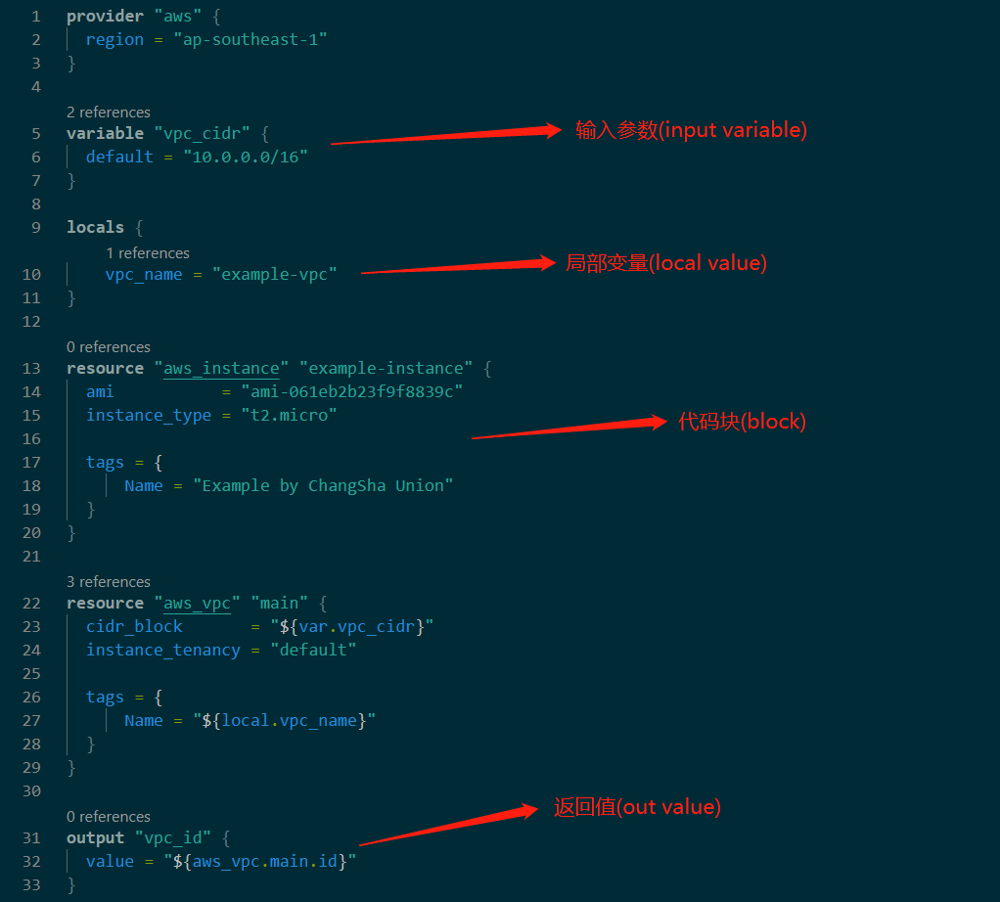
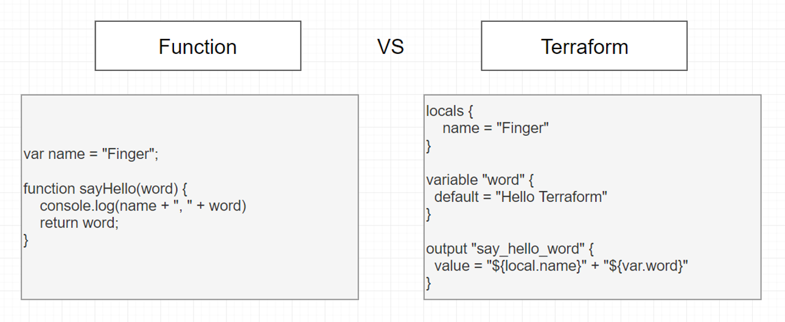

## 语法

Terraform语言也就是HCL(HashiCorp Configuration Language)，是一种丰富的语言。他的语法结构类似于JSON语法。主要由参数和块构成。

### 参数

```terraform
ami           = "ami-061eb2b23f9f8839c"
instance_type = "t2.micro"
```

等号前的标识符是参数名称，等号后的表达式是参数的值。

### 代码块

```terraform
resource "aws_instance" "example-instance" {
  ami           = "ami-061eb2b23f9f8839c"
  instance_type = "t2.micro"

  tags = {
      Name = "Example by ChangSha Union"
  }
}
```

块具有类型(resource)，每一个块类型定义后需要定义多个标签，上述例子定义了 aws_instance和 example-instance 两个标签。特定的块类型可以具有任意数量的标签或者不需要标签名。aws_instance为第三方云资源的关键字，example-instance为自定义资源变量名。

块主体由 { 和 } 字符(大括号)分隔。在块里面可以嵌套其他变量和块。从而创建块及其相关变量的层次结构。

块可以出现在其他外部的terraform文件中。例如：a.tf 定义了某个变量块可以被b.tf引用。

### 标识符

参数名，块类型名以及大多数特定于Terraform的结构(如资源，输入变量)的名称都是标识符。

标识符可以包含字母，数字，下划线（_）和连字符（-）。标识符的第一个字符不能为数字，这和编程语言规则相同。

### 注释

- `#` 单行或者结尾注释
- `//` 单行注释，以替代`#`
- `/* */` 多行注释

### Terraform VS 传统函数





将Terraform与传统函数(以JavaScript语法为例)比较。input variable相当于函数参数，local value类似于局部变量。而output类似于返回值。
