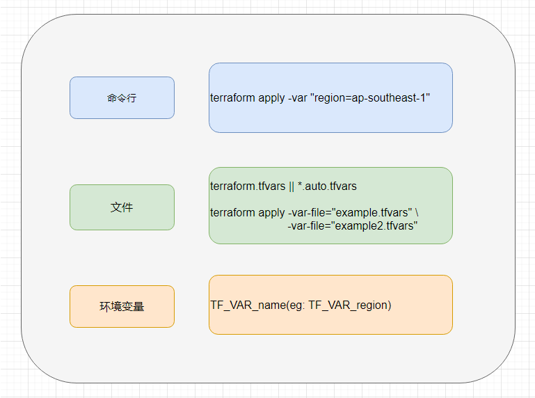

## 定义变量

创建 variables.tf文件，定义变量名为：aws_region。设置默认值：ap-southeast-1。默认值是可选的。如果未设置默认值，则该变量是必需的。

```terraform
# variables.tf

variable "aws_region" {
  default = "ap-southeast-1"
}
```

注意：该文件可以命名为任何名称，因为Terraform加载目录下以*.tf结尾的所有文件。

## 使用变量

通过使用占位符 ${}和var关键字引用定义的变量名。

```terraform
provider "aws" {
  region     = "${var.aws_region}"
}
```

## 分配变量

分配变量有多种方法。以变量的优先级考虑，从高到底的顺序主要的方法如下：



### 命令行

可以直接在命令行中使用-var标志设置变量 。在该Terraform检查配置的任何命令接受该标志，如apply 和 plan。

```bash
terraform apply \
  -var 'aws_region=ap-southeast-1'
```

*注意：以这种方式设置变量不会保存它们，并且在执行命令时必须重复输入它们。*

### *.tfvars 文件变量

如果想保留变量或者变量是一个固定的值，可以考虑创建后缀为 *.tfvars的文件。文件内容如下：

```terraform
# terraform.tfvars

aws_region = "ap-southeast-1"
```

对于当前目录中匹配 terraform.tfvars 或 *.auto.tfvars 存在的所有文件，Terraform会自动加载它们以填充变量。如果文件名为其他名称，则可以-var-file直接使用该标志指定文件。这些文件与Terraform配置文件的语法相同。与Terraform配置文件一样，这些文件也可以是JSON。

```bash
terraform apply -var-file="xxx.tfvars"
```

*注意：不建议将用户名和密码保存到版本控制中，但是可以创建一个本地秘钥变量文件用-var-file加载。*

-var-file 可以使用多次，指定不同的变量文件。例如：

```bash
terraform apply \
  -var-file="secret.tfvars" \
  -var-file="production.tfvars"
```

### 环境变量

Terraform将读取前缀为TF_VAR_*的环境变量。例如，TF_VAR_aws_region 可以将变量设置为设置aws_region变量。

*注意：环境变量只能填充字符串类型的变量。列表和映射类型变量必须通过其他机制之一进行填充。*

### 默认值

如果没有使用以上任何方法传入变量值，则会采用默认值。

最后，需要注意以下几点：

- 模块内命名唯一性
- 变量间可以引用
- 不能循环引用

## 变量的类型

### 列表(Lists)

```terraform
# 隐式的定义
variable "cidrs" { default = [] }

# 显示的定义
variable "cidrs" { type = list }
```

terraform.tfvars 文件内容：

```terraform
cidrs = [ "10.0.0.0/16", "10.1.0.0/16" ]
```

### 字典(Map)

为了合理分配资源，针对不同的运行环境，我们想创建不同类型的服务器实例。例如：dev环境我们只需要用t2.micro，prod环境我们可以配置高一点，使用t2.large。

```terraform
variable "instance_types" {
  type = "map"
  default = {
    "dev" = "t2.micro"
    "prod" = "t2.large"
  }
}
```

```terraform
variable "env" {
  default = "dev"
}

resource "aws_instance" "example" {
  ami           = "ami-061eb2b23f9f8839c"
  instance_type = "${var.instance_types[var.env]}" 
}
```

在命令行中传值

```bash
 terraform apply -var 'instance_types={ dev = "t2.micro", prod = "t2.large" }'
```

在terraform.tfvars 文件定义值：

```terraform
instance_types = {
  "dev"  = "t2.micro"
  "prod" = "t2.large"
}
```

完整示例：

```terraform
provider "aws" {
  region = "ap-southeast-1"
}

variable "instance_types" {
  type = "map"
  default = {
    "dev" = "t2.micro"
    "prod"= "t2.large"
  }
}

variable "env" {
  default = "dev"
}

resource "aws_instance" "example-instance" {
  ami           = "ami-061eb2b23f9f8839c"
  instance_type = "${var.instance_types[var.env]}" 

  tags = {
      Name = "Example by ChangSha Union"
  }
}

output "instance_type" {
  value = "${aws_instance.example-instance.instance_type}"
}
```

## 参考

- https://learn.hashicorp.com/terraform/getting-started/variables