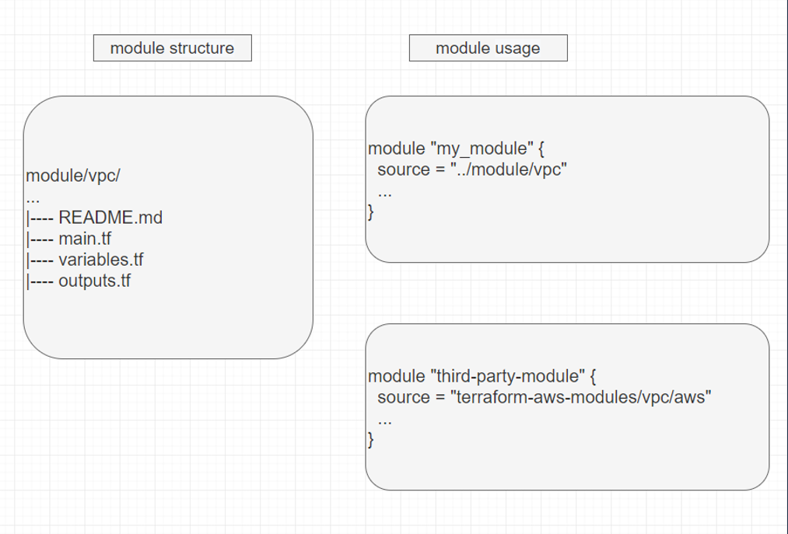

## 什么是Terraform Module

Module 是 Terraform 为了管理单元化资源而设计的，是子节点，子资源，子架构模板的整合和抽象。在实际复杂的技术架构中，涉及到的资源多种多样，资源与资源之间的关系错综复杂，资源模版的编写，扩展，维护等多个问题的成本都会不断增加。将多种可以复用的资源定义为一个module，通过对 module 的管理简化模板的架构，降低模板管理的复杂度，这就是module的作用。

除此之外，对开发者和用户而言，只需关心 module 的 input 参数即可，无需关心module中资源的定义，参数，语法等细节问题，抽出更多的时间和精力投入到架构设计和资源关系整合上。

## Module的标准结构

官方建议Module标准结构包含：main.tf，variables.tf，outputs.tf，README.md。这些是最小模块的建议文件名，即使它们为空。

- main.tf：资源的定义模板
- variables.tf：模板所依赖的参数定义和参数值
- outputs.tf：资源的输出值
- README.md：模板的简单介绍和使用说明以及该模块可用的许可证

对于一个简单的模块，main.tf 是主要入口点。包含了创建资源的主要内容。对于复杂的模块，可以将资源创建分为多个文件，但是任何嵌套的模块调用都应位于主文件中。variables.tf 并且outputs.tf应分别包含变量和输出的声明。

```bash
# 简单的模块
$ basic-module/
.
├── README.md
├── main.tf
├── variables.tf
├── outputs.tf


# 复杂的模块
$ complete-module/
.
├── README.md
├── main.tf
├── variables.tf
├── outputs.tf
├── ...
├── modules/
│   ├── nestedA/
│   │   ├── README.md
│   │   ├── variables.tf
│   │   ├── main.tf
│   │   ├── outputs.tf
│   ├── nestedB/
│   ├── .../
├── examples/
│   ├── exampleA/
│   │   ├── main.tf
│   ├── exampleB/
│   ├── .../
```

## 如何使用Module



## 调用子Module

```terraform
module "my_vpc" {
  source = "./module/vpc"

  # ...
}
```

## 访问Module的输出值

```terraform
output "vpc_id" {
  value = "${module.my_vpc.vpc_id}"
  ...
}
```

## Module 的版本

```terraform
module "vpc" {
  source  = "terraform-aws-modules/vpc/aws"
  version = "0.0.1"
}
```

该version属性值可以是单个显式版本，也可以是版本约束表达式。约束表达式使用以下语法来指定可接受的版本范围：

- `>= 1.2.0`：版本1.2.0或更高版本
- `<= 1.2.0`：1.2.0或更旧的版本
- `~> 1.2.0`：任何非beta版本>= 1.2.0和< 1.3.0，例如1.2.X
- `~> 1.2`：任何非beta版本>= 1.2.0和< 2.0.0，例如1.X.Y
- `>= 1.0.0, <= 2.0.0`：介于1.0.0和2.0.0之间的任何版本

## 开源Module

上文中，虽然已经实现了module，但是这个module只能在自己本地机器上实现，无法实现与他人的实时分享，无法实现团队内部的及时共享。

Terraform 提供了 Module 的注册地址(https://registry.terraform.io/)，将自己的module上传到Github，并注册为一个Terraform Module后，即可将远端的Module应用到我们自己的模板中。

Module 让资源模板架构更清楚，模板管理更简单；开源 Module 让资源模板更便捷，更分享。除此之外，开源 Module 可实现对模板的版本控制，基于不同的版本，实现不同架构不断升级的控制和完善。

我们可以在网址： https://registry.terraform.io/browse/modules 找到我们所使用的云服务商的各种terraform module。

- AWS Modules
https://github.com/terraform-aws-modules

- Alicloud Modules
https://github.com/terraform-alicloud-modules